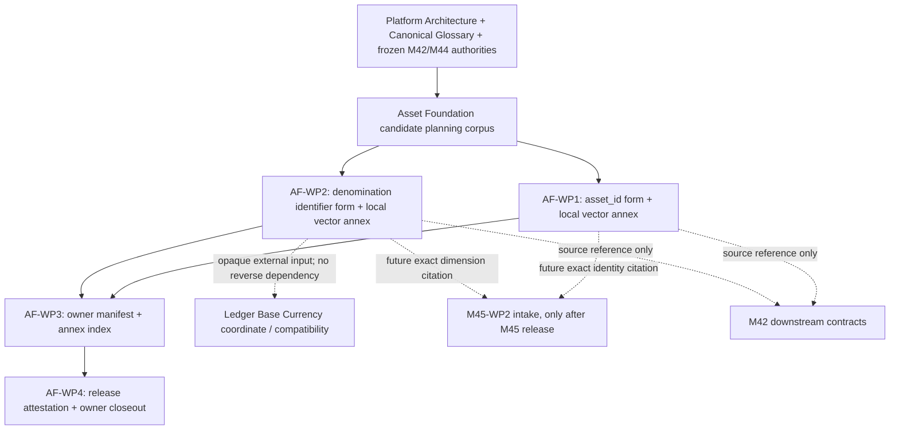

# Asset Foundation — Canonical Owner-Domain Architecture and Implementation Plan

**Artifact class:** Owner-domain planning candidate
**Status:** `PLANNING CANDIDATE — NOT RATIFIED`
**Revision:** `CANDIDATE-1`
**Paired roadmap:** [Asset Foundation Work-Package Decomposition and Roadmap](ASSET_FOUNDATION_CANONICAL_OWNER_DOMAIN_WORK_PACKAGE_DECOMPOSITION_AND_ROADMAP.md)
**Authority granted by this document:** `NONE`
**Implementation authority:** `NONE`
**Runtime authority:** `NONE`
**Source-code, persistence, schema, migration, API, provider, and production-method authority:** `NONE`
**Work-package allocation or authorization:** `NONE`
**Independent of M45:** `YES`
**No implementation authority:** `NONE`
**No work-package allocation or authorization:** `NONE`

This is an independent Asset Foundation owner-domain planning candidate. It
is not M45 planning, does not amend or activate the frozen M45 corpus, does
not allocate or authorize M45-WP2, and does not grant authority to Ledger &
Accounting or any other owner domain. M45 is named only as a future external
consumer subject to its own frozen entry conditions.

This document defines a bounded documentary route for producing Asset
Foundation-owned canonical evidence. It does not itself define a canonical
`asset_id` grammar, a denomination code list, a canonical byte sequence, an
implementation, or a release. Those are future work-package outputs only if
the required governance lifecycle is separately completed.

## 1. Planning purpose and present effect

The purpose of this candidate is to define the Asset Foundation owner-domain
scope needed to produce lifecycle-complete, immutable, independently citable
evidence for:

1. the canonical lexical form of `asset_id`; and
2. the Asset Foundation-owned denomination-identifier dimension required for
   the jointly evidenced single Portfolio Base Currency element.

The candidate also defines the supporting owner manifest, package-local
vector-annex discipline, release packaging, and owner-domain attestation
needed for a future external consumer to evaluate that supply without
interpreting or repairing it.

No review, correction, focused re-review, confirmation, content-identity
validation, ratification, freeze, allocation, authorization, implementation,
release attestation, or closeout is performed by this document.

The planning identifiers `AF-1` through `AF-4` and `AF-WP1` through `AF-WP4`
are local candidate artifact and work-package identifiers. They are not new
canonical platform vocabulary and acquire no authority from being named here.

## 2. Frozen authority and repository baseline

The following sources were read directly and are the controlling baseline for
this candidate. A lower-level repository artifact may refine within this
boundary but may not weaken, transfer, or invent authority.

| Source | Frozen meaning or boundary consumed here |
| --- | --- |
| [Platform Architecture](../architecture/platform_architecture.md) §§4–7, 11–12 | Asset Foundation is the root Identity domain; identity is permanent; domains have one owner; dependencies are acyclic; witnesses are not authorities; lower artifacts may refine but not weaken; canonical vocabulary has one term, one meaning, and one home. |
| [Canonical Glossary](../GLOSSARY.md) — `Asset`, `Asset Registry`, `Asset Classification`, `Unit Semantics`, `Portfolio Base Currency` | An Asset has a permanent `asset_id`; Asset Foundation owns identity and Asset Classification; Unit Semantics is how a kind is counted; Portfolio Base Currency is a Ledger & Accounting coordinate that uses Asset Foundation's currency vocabulary. |
| [M42-WP1 ownership register](M42_WP1_PORTFOLIO_CANONICAL_VOCABULARY_AND_OWNERSHIP_REGISTER.md) §§4, 6.1, 6.4 | Asset Foundation owns classification, capability, market, and currency vocabulary; Portfolio Base Currency is Ledger & Accounting-owned; Portfolio Intelligence may compose Asset Foundation references but does not own them. |
| [M42-WP2 contract](M42_WP2_PORTFOLIO_IDENTITY_ACCOUNTING_SCOPE_MEMBERSHIP_AND_BASE_CURRENCY_CONTRACT_SPECIFICATION.md) §§5–6 | The Base Currency coordinate is Ledger-owned and names one currency reference from Asset Foundation's currency-of-denomination Classification dimension. The frozen text expressly does not provide an exact enumeration or identifier format for that dimension. |
| [M42-WP3 Stage B](M42_WP3_STAGE_B_INVESTMENT_UNIVERSE_DECLARATION_CONTRACT_SPECIFICATION.md) §§2, 5–6 | Investment Universe may cite exact Asset Foundation Classification, Capability, Market, and Currency references; it may not invent their identifiers, taxonomy, normalization, or evaluation. Currency criteria are not Portfolio Base Currency. |
| [M42-WP5 Portfolio Benchmark Declaration](M42_WP5_PORTFOLIO_BENCHMARK_DECLARATION_CONTRACT_SPECIFICATION.md) §§4–5 | Canonical benchmark series use permanent opaque Asset Foundation identifiers while benchmark observation meaning remains Market Intelligence-owned; citation does not transfer ownership. |
| [M42-WP6 lifecycle and provenance contract](M42_WP6_PORTFOLIO_LIFECYCLE_STATE_REUSE_AND_PROVENANCE_CONTRACT_SPECIFICATION.md) §§4–6 | Citation and carriage preserve source ownership; composition does not create ownership or provenance authority. |
| [M42-WP7 Portfolio Composition contract](M42_WP7_PORTFOLIO_COMPOSITION_CONTRACT_SPECIFICATION.md) §§3–6 | Asset Foundation and Ledger coordinates are cited opaquely in a downstream composition; composition does not normalize, repair, or reassign them. |
| [M44 G-3 Closure and WP6-Entry Roadmap](M44_G3_CLOSURE_AND_WP6_ENTRY_ROADMAP.md) §§4–13 | Asset Foundation must supply the `asset_id` lexical form and the denomination-identifier dimension for the one joint Base Currency element. Owner forms require authoring, independent review, confirmation, and freeze before closure evidence. |
| [M44 G-3 Roadmap Freeze Record](M44_G3_CLOSURE_AND_WP6_ENTRY_ROADMAP_FREEZE_RECORD.md) §§1–5 | The G-3 roadmap is a frozen planning artifact; G-3 remains `OPEN — PARTIAL`; it creates no closure or WP6 authority. |
| [M45 Architecture and Implementation Plan](M45_ARCHITECTURE_AND_IMPLEMENTATION_PLAN.md) §§2–5, 8–13 | M45 receives already-authorized, independently confirmed, frozen external evidence; it cannot author, request, repair, or freeze Asset Foundation forms. |
| [M45 Work-Package Roadmap](M45_WORK_PACKAGE_DECOMPOSITION_AND_ROADMAP.md) §§1, 3, 9, 13 | Asset Foundation forms are external predecessor conditions, not M45 work packages; M45-WP2 requires qualifying artifacts to already exist. |
| [M45 Architecture Freeze Record](M45_ARCHITECTURE_FREEZE_RECORD.md) and [M45-WP1 Closeout](M45_WP1_CLOSEOUT_RECORD.md) | M45 planning is frozen and M45-WP1 is complete and closed; neither fact authorizes Asset Foundation work. |
| [M45 Milestone Status Record](M45_MILESTONE_STATUS_RECORD.md) and [M45-WP2 Allocation Record](M45_WP2_ALLOCATION_RECORD.md) | M45 is `ACTIVE — WAITING FOR EXTERNAL SUPPLY`; M45-WP2 is `NOT ALLOCATED`; external supply must arise independently. |
| [Ledger & Accounting planning pair](LEDGER_ACCOUNTING_CANONICAL_OWNER_DOMAIN_ARCHITECTURE_AND_IMPLEMENTATION_PLAN.md) and [Ledger roadmap](LEDGER_ACCOUNTING_CANONICAL_OWNER_DOMAIN_WORK_PACKAGE_DECOMPOSITION_AND_ROADMAP.md) | Asset Foundation's denomination form is a hard external input to Ledger-side Base Currency compatibility; Ledger owns the coordinate and cannot author the Asset form. |
| [Ledger LA-WP2 governance block](LEDGER_ACCOUNTING_LA_WP2_GOVERNANCE_BLOCK_RECORD.md) and [Ledger final-state record](../governance/LEDGER_ACCOUNTING_OWNER_DOMAIN_FINAL_STATE.md) | LA-WP2 does not provide canonical supply; its terminal governance state does not block independent Asset Foundation planning or grant Asset Foundation authority. |

Existing Asset Foundation architecture and registry documents, including
[`asset_foundation.md`](../architecture/asset_foundation.md) and
[`ASSET_REGISTRY.md`](../architecture/ASSET_REGISTRY.md), are repository
evidence and design context. They do not expand the frozen source-owner
boundary used by this candidate.

## 3. Constitutional scope and invariants

### 3.1 Asset Foundation position

Asset Foundation is the root Identity domain. It answers what an identified
thing is and supplies descriptive identity and classification references. It
does not depend on Ledger & Accounting, M45, Portfolio Intelligence,
Connectivity & Ingestion, or any other domain for the authority to define its
own representation.

The dependency direction is one-way:

```text
Asset Foundation-owned canonical reference
                    ↓ opaque citation
Ledger & Accounting / Portfolio Intelligence / M45 intake
```

The arrow is a downstream consumption edge, not an instruction or a request
back to Asset Foundation. A downstream need is not Asset Foundation
authority, and no downstream consumer may substitute a label, provider value,
implementation field, or roadmap specimen for an owner-supplied form.

### 3.2 Required owner-domain supply

The exact Asset Foundation supply required by the frozen G-3 boundary is:

| Candidate artifact | Bounded meaning | External consequence |
| --- | --- | --- |
| `AF-1` — Asset Identity Canonical Lexical Form | The exact owner-domain lexical and byte-determinacy contract for one permanent `asset_id` reference. | Makes Asset Foundation identity references citable without provider or display semantics. |
| `AF-2` — Denomination Identifier Dimension Canonical Form | The exact owner-domain reference form for one value of the Asset Foundation currency-of-denomination Classification dimension. | Supplies the Asset Foundation half of the single joint Portfolio Base Currency G-3 element. |
| `AF-3` — Owner Evidence Manifest and Conformance-Annex Index | Immutable citation and coverage index for `AF-1`, `AF-2`, their package-local annexes, and their lifecycle identities. | Makes source identity, version, field coverage, and vector completeness independently inspectable. |
| `AF-4` — Asset Foundation Release Attestation | Owner-domain verification that `AF-1` through `AF-3` satisfy the release profile. | Permits a future consumer to assess Asset Foundation supply; it does not close G-3 or authorize a consumer. |

`AF-3` and `AF-4` are governance and evidence artifacts. They do not create a
second semantic form and cannot substitute for `AF-1` or `AF-2`.

### 3.3 Constitutional invariants

Any future artifact under this candidate must preserve all of the following:

1. One permanent platform identity is represented by one exact `asset_id`;
   identity is not derived from, reassigned to, or replaced by an external
   identifier.
2. `asset_id` is opaque to consumers. Its lexical form carries no provider,
   venue, issuer, market, currency, lifecycle, classification, price, or
   accounting meaning.
3. Asset Foundation owns the denomination identifier dimension and its
   descriptive meaning. It does not own Portfolio Base Currency, Portfolio
   Identity, Accounting Scope, Membership, FX, NAV, or reporting arithmetic.
4. The Base Currency element remains one jointly evidenced element: Asset
   Foundation supplies its denomination identifier dimension, while Ledger &
   Accounting supplies the coordinate that references that dimension.
5. A cited reference is not a copied semantic definition. Opaque carriage,
   storage, adjacency, or composition never creates shared ownership.
6. Ambiguity, missing identity, invalid bytes, unresolved ownership, and
   incomplete lifecycle evidence fail closed. No default, lookup, inference,
   normalization, or provider substitution cures a missing form.
7. Identity facts are immutable; any time-varying classification or evidence
   fact remains distinct from the identity form and retains its own temporal
   and provenance meaning.
8. Every substantive form has one package-local vector annex governed with
   the form through the same lifecycle. An aggregate index may cite annexes
   but may not author or modify them.
9. No Asset Foundation artifact creates runtime behavior, persistence, APIs,
   schemas, migrations, provider behavior, executable validators, or
   production methods.
10. No Asset Foundation artifact closes G-3, releases M45-WP2, allocates or
    authorizes another domain, or determines downstream adequacy.

## 4. Semantic ownership and boundary matrix

| Matter | Established inherited semantics | Missing representation in the frozen corpus | Asset Foundation candidate boundary | External determination |
| --- | --- | --- | --- | --- |
| Permanent asset identity | Platform Architecture Law 5, Glossary `Asset`, and the Registry evidence establish permanent platform identity. | Exact `asset_id` lexical language, byte form, framing, invalid-state treatment, and citable identity version. | `AF-1` only. It does not define a whole asset record or provider resolution. | Consumers decide whether an exact reference is eligible for their own contract. |
| Asset Classification | Asset Foundation owns the descriptive classification vocabulary and values. | Exact canonical identifier/reference form for the required denomination dimension. | `AF-2` only for the currency-of-denomination dimension required by G-3. | Portfolio Intelligence may cite classification references under its own authority; it does not reclassify. |
| Currency of denomination | M42-WP2 names the Asset Foundation Classification dimension and expressly says its exact enumeration/format is not supplied by the frozen corpus. | Exact denomination identifier form and its immutable identity. | `AF-2`; no ISO, provider, or parallel code list is assumed by this candidate. | Ledger and later consumers test compatibility and coverage without taking ownership. |
| Portfolio Base Currency | One explicit Ledger & Accounting coordinate per Portfolio Identity; it names one Asset Foundation denomination reference and carries no rate or conversion. | Ledger-side coordinate form remains Ledger-owned and independent. | Asset Foundation supplies only the denominator/dimension reference. | Ledger owns the coordinate; M45 evaluates the joint G-3 element only under its own authority. |
| Portfolio Identity, Accounting Scope, Membership | Ledger-owned facts under frozen M42 authority. | Ledger representation is outside this candidate. | No Asset Foundation action. | Ledger and M42 consumers determine their own use. |
| Investment Universe | Portfolio Intelligence declaration composed from exact Asset Foundation references; no belonging predicate is authorized by M42. | Exact source references must be supplied by their owner. | Asset Foundation supplies references only; it does not define universe scope or eligibility. | Portfolio Intelligence owns the declaration and any future downstream determination. |
| Benchmark series identity | Asset Foundation supplies permanent opaque identities; Market Intelligence owns benchmark observation meaning and series maintenance. | No Asset Foundation benchmark semantics or series contract is required by this candidate. | `AF-1` is reusable for an opaque identity reference; no benchmark form is authored. | Market Intelligence and Portfolio Intelligence retain their separate authorities. |
| Provenance | Connectivity & Ingestion owns provenance meaning and capture. | No provenance representation is assigned here. | No capture, ranking, or confidence authority. | Connectivity & Ingestion supplies its own external form to M45 if separately authorized. |
| M45 intake and G-3 | M45 may receive only already-frozen qualifying external evidence. | The repository currently lacks lifecycle-complete Asset Foundation supply. | This candidate is not supply and cannot be treated as intake evidence. | M45-WP2 decides intake eligibility only after its own allocation and authority. |

## 5. Canonical-form determinacy requirements

The requirements in this section are acceptance predicates for future
work-package candidates. They are not the final grammar or canonical bytes.
The literal grammar, lexical token language, and byte encoding remain to be
authored and frozen by the owning work package. This explicit deferral is
required because frozen M42-WP2 records that the exact Asset Foundation
currency identifier format is not currently published.

### 5.1 Common form requirements

Each substantive form candidate must state, in one internally complete
documentary contract:

1. a fixed form tag and immutable form version;
2. the complete grammar, including delimiters, framing, token boundaries, and
   end-of-input behavior;
3. the lexical character or byte language, including case, permitted
   separators, and whether non-ASCII bytes are admitted;
4. the exact byte encoding and canonicality rule, including BOM, newline,
   whitespace, normalization, invalid-byte, and unused-bit treatment where
   applicable;
5. every required field, every forbidden field, field order, cardinality,
   and whether nested content is length-delimited;
6. the distinction between an omitted field, an invalid field, an unknown
   value, and an affirmative absence state;
7. deterministic invalid-state and rejection behavior;
8. the absence of live lookup, ambient context, wall-clock dependence,
   provider dependence, model output, and implicit defaults;
9. exact immutable content identity, version identity, and supersession
   treatment; and
10. positive, boundary, negative, and temporal documentary vectors sufficient
    for every rule and prohibited shortcut.

No future form may claim canonical bytes while leaving any of these decisions
to a parser, consumer, implementation library, provider, locale, database,
transport, or runtime.

### 5.2 `AF-1` — Asset Identity Canonical Lexical Form

The future `AF-1` package must determine a single representation of one
permanent `asset_id` reference. Its required semantic boundary is:

- exactly one platform-owned asset identity reference;
- one opaque identifier token with no embedded business meaning;
- a deterministic grammar and byte sequence that can be cited and compared
  independently of a registry lookup;
- no provider symbol, exchange identifier, ISIN, CUSIP, FIGI, broker code,
  canonical symbol, display label, classification, lifecycle state, price,
  portfolio, or timestamp as a substitute or hidden field; and
- no affirmative absence value: a missing or empty identity reference is
  invalid for this form and fails closed.

The package must distinguish the identity reference from the fact that a
consumer may later resolve that reference in its own already-bound authority.
The form itself must not consult a live Registry, map a provider symbol, mint
an identity, or decide whether an external claim is decisive.

The vector annex must include, at minimum:

- positive exact-reference cases;
- boundary cases for the shortest, longest, and delimiter-adjacent admitted
  forms under the chosen grammar;
- negative cases for empty, malformed, normalized, provider-derived,
  ambiguous, duplicated, and extra-field forms; and
- temporal cases proving that renames, recycled provider symbols, delistings,
  and related-but-distinct listings do not change the `asset_id` reference.

The annex must not turn those examples into executable fixtures or a registry
implementation.

### 5.3 `AF-2` — Denomination Identifier Dimension Canonical Form

The future `AF-2` package must determine one exact reference form for one
value of the Asset Foundation-owned currency-of-denomination Classification
dimension. It must:

- identify exactly one denomination value in the source-owned dimension;
- state how the dimension identifier is distinct from an asset-specific
  classification assertion, a Portfolio Base Currency coordinate, a live FX
  observation, a conversion amount, and a display label;
- define the exact lexical and byte form without assuming ISO 4217, a provider
  code, a Ledger code, or any other unstated enumeration;
- define required and forbidden fields, cardinality, order, framing, and
  invalid-state treatment; and
- provide no affirmative absence encoding for the Base Currency joint-
  evidence use. An absent, empty, ambiguous, or multiply-valued identifier
  cannot satisfy the required element.

The form must be reusable as an opaque Asset Foundation reference by the
Ledger-owned Base Currency coordinate. Reuse does not transfer ownership and
does not allow Ledger to define, normalize, or version the denomination form.

The vector annex must include, at minimum:

- positive single-denomination references;
- boundary cases for lexical and byte limits established by the chosen form;
- negative cases for provider aliases, parallel taxonomies, multiple values,
  missing values, defaults, FX rates, converted amounts, Portfolio Base
  Currency values, and runtime lookup results; and
- temporal/boundary cases distinguishing a stable dimension identifier from
  a later-dated classification assertion or source-evidence change.

The package must not author a currency code list or a portfolio reporting
rule. If the owning source vocabulary requires a separately governed
extension, this candidate does not authorize that extension.

### 5.4 Owner identity and evidence determinacy

Every `AF-1` and `AF-2` candidate and every later frozen revision must carry or
cite an immutable identity sufficient for an independent reader to determine:

- artifact class and exact path or immutable locator;
- form version and revision identity;
- canonical content bytes or a deterministic byte definition;
- Git or repository identity where available;
- owner and authority source;
- predecessor and supersession relation, if any;
- package-local vector-annex identity; and
- exact M44 G-3 field/facet coverage.

An owner manifest may index these facts but may not invent them. A hash is an
identity witness; it is never a replacement for the canonical content.

## 6. Package-local vector-annex lifecycle

Each substantive Asset Foundation form carries its own package-local vector
annex through the same lifecycle as its parent:

`DRAFT` → `INDEPENDENT REVIEW` → `CORRECTIONS / FOCUSED RE-REVIEW` (if needed)
→ `INDEPENDENT CONFIRMATION` → `CONTENT-IDENTITY VALIDATION` → `FROZEN`.

The annex rules are:

1. `AF-1` and its annex are one reviewable and confirmable package. `AF-2`
   and its annex are a separate package.
2. The annex is authored with the parent form, not after the form is frozen
   and not deferred to `AF-WP3` or `AF-WP4`.
3. The annex is documentation-only. It contains positive, boundary, negative,
   and applicable temporal vectors; it is not an executable test fixture,
   runtime validator, or production method.
4. The frozen annex bytes are the only lawful vector supply for the parent
   form. A new or changed vector is a change to that form and requires an
   additive successor lifecycle for the form and annex.
5. `AF-3` may aggregate only exact citations, indexes, and completeness checks
   over already-frozen annexes. It must not author, normalize, reorder,
   expand, repair, summarize, or substitute any vector content.
6. If an annex is missing, defective, incomplete, unfrozen, or detached from
   its parent identity, the affected package and any release attestation fail
   closed.

This preserves the source-owner boundary required by the M44 G-3 Roadmap:
labels, examples, implementation forms, and roadmap-authored specimens are
not canonical supply without the owning lifecycle.

## 7. Governance and authority lifecycle

### 7.1 Planning-corpus lifecycle

The paired candidates must remain non-ratified until a competent future
authority separately completes the planning lifecycle:

`PLANNING CANDIDATE` → `INDEPENDENT REVIEW` → corrections and focused
re-review, if required → `INDEPENDENT CONFIRMATION` → `RATIFICATION` → joint
content-identified `FREEZE`.

Ratification is not work-package allocation. A planning freeze is not
implementation authorization. This session performs none of those acts.

### 7.2 Substantive artifact lifecycle

Each future work package requires, in order:

1. separate allocation with competent scope;
2. separate authorization;
3. a reviewed and frozen predecessor where the roadmap requires one;
4. documentary authoring within the bounded package;
5. independent review;
6. additive correction and focused re-review when required;
7. independent confirmation by a person distinct from author and reviewer;
8. content-identity validation;
9. freeze of the exact confirmed bytes; and
10. release attestation or closeout only after the package-specific release
    conditions are satisfied.

Review, correction, focused re-review, confirmation, identity validation,
freeze, release attestation, and closeout are distinct acts. None is inferred
from the other, from repository cleanliness, from a downstream need, or from
silence.

### 7.3 Fail-closed governance

A missing allocation, authorization, reviewed predecessor, confirmation,
identity validation, or freeze produces a blocked or non-released result. A
blocked, rejected, or unconfirmed package is a valid terminal state for that
package but is never canonical supply. Frozen content is never edited in
place; a material change requires an additive successor revision and a new
identity chain.

## 8. Dependency model

The graph is acyclic. Asset Foundation depends on frozen semantic authorities
for planning context only and does not depend on Ledger-produced canonical
content merely because Ledger has a Base Currency need.



The lawful compatibility edge is:

`AF-2 frozen denomination form → Ledger-owned Base Currency coordinate`

Ledger may cite and test compatibility with the opaque `AF-2` form under its
own authority. It may not author, normalize, repair, version, or substitute
the Asset Foundation form. Asset Foundation does not wait for, consume, or
depend on a Ledger coordinate in order to author its own form. If `AF-2` is
absent, defective, superseded without a valid replacement, or not frozen,
Ledger-side compatibility and the joint Base Currency evidence must fail
closed at the external Asset Foundation boundary (for example,
`BLOCKED — EXTERNAL ASSET FORM`); Asset Foundation does not emit that Ledger
disposition or cure it.

The M45 edge is intake-only and conditional. The present M45 state is frozen
planning with WP2 `NOT ALLOCATED`; candidate documents created under this plan
are not M45 supply and do not release M45.

## 9. Release profile and owner-domain attestation

`AF-4` may state `RELEASE ATTESTED` only when all of the following are true:

1. `AF-1` and `AF-2` are exact owner-supplied forms with complete grammar,
   lexical, byte, ordering, cardinality, absence, invalid-state, and
   normalization determinations.
2. Each substantive form has its own complete package-local vector annex,
   and each form-plus-annex pair has completed independent review, required
   corrections and focused re-review, independent confirmation,
   content-identity validation, and freeze.
3. `AF-3` is independently reviewed, confirmed, content-identified, and
   frozen; it cites exact form and annex identities and proves complete
   coverage without authoring vector content.
4. The owner and authority source for every supplied form are explicit and
   the content identity remains resolvable at release.
5. No open finding defeats ownership, exactness, completeness, determinacy,
   immutability, or fail-closed behavior.
6. The release attestation states the exact Asset Foundation supply and its
   limits, including that `AF-2` is only the Asset Foundation half of the
   single Base Currency element.

If any condition fails, `AF-4` must state `NOT RELEASE ATTESTED` or a more
specific blocked disposition and identify the exact blocker. It must not
replace a missing form with an example, label, default, implementation
artifact, or downstream determination.

`AF-4` must not:

- declare G-3 closed;
- allocate or authorize M45-WP2 or any later M45 package;
- determine Ledger compatibility or Portfolio Intelligence adequacy;
- close, amend, or supersede M44;
- author a Ledger Base Currency coordinate;
- define Portfolio Identity, Accounting Scope, Membership, Provenance,
  Benchmark meaning, FX, NAV, or portfolio policy; or
- grant implementation, runtime, persistence, API, schema, migration,
  provider, or production authority.

## 10. Explicit exclusions

This candidate does not plan or authorize:

- Portfolio Identity, Accounting Scope, Portfolio Membership, or Portfolio
  Base Currency coordinate semantics;
- Ledger compatibility evidence, Ledger release attestation, or Ledger
  lifecycle work;
- Portfolio Intelligence Investment Universe, Benchmark Declaration, or
  Portfolio Composition forms;
- Connectivity & Ingestion Provenance capture, source sequence, or
  completeness rules;
- Market Intelligence prices, observations, FX, benchmark series, or
  provider behavior;
- Asset Foundation runtime behavior, source code, persistence, database
  schemas, APIs, migrations, providers, production methods, or executable
  validators;
- M45 allocation, authorization, work-package execution, G-3 closure,
  checkpoint disposition, WP6 entry, or downstream adequacy;
- glossary, Decision Log, Implementation INDEX, navigation, or roadmap
  synchronization; or
- successor planning outside this candidate pair.

## 11. Candidate acceptance and unresolved planning risks

If a future authority considers this candidate for ratification, acceptance
requires at least:

1. the two files remain one paired corpus and link to each other;
2. every required AF artifact has one bounded owner, one dependency direction,
   one independent freeze boundary, and one truthful fail-closed outcome;
3. the artifact inventory and roadmap packages are identical in scope;
4. the `asset_id`/denomination boundary remains separate from Ledger,
   Portfolio Intelligence, Connectivity & Ingestion, and M45 authority;
5. package-local vector annexes cannot be deferred to aggregation;
6. no statement treats a candidate as canonical supply or implementation;
7. the dependency graph remains acyclic; and
8. no repository synchronization outside these two candidates is implied.

The candidate leaves these planning risks explicitly unresolved for future
owner-domain authoring:

- the literal `asset_id` grammar, lexical language, and byte encoding are not
  yet selected by a frozen Asset Foundation form;
- the literal denomination identifier grammar and value vocabulary are not
  yet selected, and no ISO or provider code is assumed;
- the relationship between a denomination dimension identifier and any
  time-varying asset classification assertion must be made exact by `AF-2`;
- joint Base Currency compatibility cannot be established by Asset Foundation
  alone and remains dependent on a separate Ledger-owned coordinate; and
- the present repository has no lifecycle-complete Asset Foundation evidence
  that could satisfy the frozen M45-WP2 external-supply condition.

These are planning risks, not authority to act in this session.

## 12. Current candidate boundary

The present result is exactly two planning candidates, both
`PLANNING CANDIDATE — NOT RATIFIED`. No review, correction, focused
re-review, confirmation, identity validation, ratification, freeze,
allocation, authorization, release attestation, closeout, implementation, or
repository synchronization is performed by this document.

**Authority granted by this document: `NONE`.**
