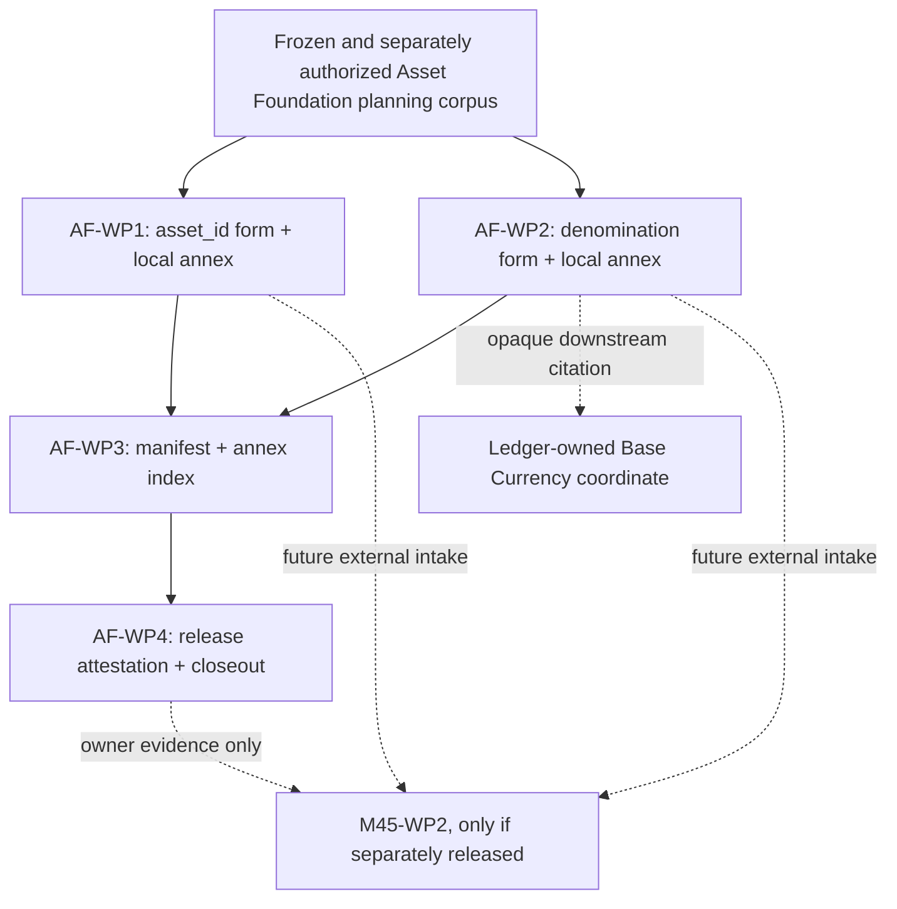

# Asset Foundation — Canonical Owner-Domain Work-Package Decomposition and Roadmap

**Artifact class:** Owner-domain roadmap planning candidate
**Status:** `PLANNING CANDIDATE — NOT RATIFIED`
**Revision:** `CANDIDATE-1`
**Paired plan:** [Asset Foundation Architecture and Implementation Plan](ASSET_FOUNDATION_CANONICAL_OWNER_DOMAIN_ARCHITECTURE_AND_IMPLEMENTATION_PLAN.md)
**Authority granted by this document:** `NONE`
**Implementation authority:** `NONE`
**Runtime authority:** `NONE`
**Work-package allocation or authorization:** `NONE`
**Independent of M45:** `YES`
**No implementation authority:** `NONE`
**No work-package allocation or authorization:** `NONE`

This roadmap is independent of M45. It creates no M45 work package, does not
allocate or authorize M45-WP2, does not alter the frozen M45 planning corpus,
and does not grant authority to Ledger & Accounting or any other owner domain.
It is documentary planning only.

The roadmap defines four independently governable Asset Foundation packages
for future canonical evidence. It does not execute any package, perform any
review or confirmation, freeze any artifact, issue a release attestation, or
create implementation artifacts.

## 1. Delivery objective and universal rules

The bounded objective is to produce exact, immutable, owner-supplied Asset
Foundation evidence that a future external consumer may independently
evaluate and cite:

1. the `asset_id` lexical form;
2. the denomination identifier dimension needed for the one joint Portfolio
   Base Currency G-3 element;
3. the exact identity and coverage manifest for those forms and their
   package-local vector annexes; and
4. the Asset Foundation release attestation.

The governing semantic and boundary detail is in the paired [architecture
plan](ASSET_FOUNDATION_CANONICAL_OWNER_DOMAIN_ARCHITECTURE_AND_IMPLEMENTATION_PLAN.md).
This roadmap cannot widen it.

Every substantive work package requires all of the following:

- a separate allocation;
- a separate authorization;
- a reviewed and frozen predecessor wherever the dependency table requires
  one;
- an exact bounded deliverable;
- independent review;
- additive correction and focused re-review if required;
- independent confirmation by a confirmer distinct from author and reviewer;
- content-identity validation;
- freeze of the exact confirmed bytes before downstream use; and
- a truthful fail-closed terminal disposition.

The lifecycle is:

`ALLOCATED` → `AUTHORIZED` → `DRAFT` → `INDEPENDENT REVIEW` →
`CORRECTIONS / FOCUSED RE-REVIEW` (if needed) → `INDEPENDENT CONFIRMATION` →
`CONTENT-IDENTITY VALIDATION` → `FROZEN` → package-specific release or
closeout.

Review approval is not confirmation. Confirmation is not content-identity
validation. Freeze is not release, downstream authorization, or runtime
authority.

## 2. Work-package inventory

| Work package | Bounded deliverable | Predecessor | Release / fail-closed boundary |
| --- | --- | --- | --- |
| `AF-WP1` | `AF-1` Asset Identity Canonical Lexical Form plus its package-local vector annex | Frozen and separately authorized Asset Foundation planning corpus | `FROZEN` form-and-annex pair, or blocked/non-confirmed result; no whole-asset record and no provider resolution |
| `AF-WP2` | `AF-2` Denomination Identifier Dimension Canonical Form plus its package-local vector annex | Frozen and separately authorized Asset Foundation planning corpus | `FROZEN` form-and-annex pair, or blocked/non-confirmed result; no Portfolio Base Currency coordinate and no currency code-list authority beyond the bounded form |
| `AF-WP3` | `AF-3` Owner Evidence Manifest and Conformance-Annex Index | Frozen `AF-WP1` and `AF-WP2` outputs | `FROZEN` manifest/index, or incomplete-supply determination; no vector authoring or repair |
| `AF-WP4` | `AF-4` Asset Foundation Release Attestation and owner-domain closeout | Frozen `AF-WP3` and revalidated `AF-WP1`/`AF-WP2` identities | `RELEASE ATTESTED` or `NOT RELEASE ATTESTED` with exact blocker; no G-3 closure or downstream authorization |

`AF-WP1` and `AF-WP2` may be scheduled in parallel only if their separate
allocation and authorization records expressly permit that ordering. Parallel
execution does not merge their ownership, review, confirmation, identity, or
freeze boundaries.

The planning identifiers above are local artifact identifiers. They are not
canonical platform terms and do not require a Glossary, Decision Log, or
Implementation INDEX change from this candidate.

## 3. AF-WP1 — Asset Identity Canonical Lexical Form

### Purpose

Produce the Asset Foundation-owned documentary form that makes one permanent
`asset_id` reference lexically and byte-wise determinate.

### Scope

AF-WP1 must determine, within the paired plan's boundary:

- the exact form tag and immutable form version;
- complete grammar, lexical language, byte encoding, framing, field order,
  cardinality, and end-of-input behavior;
- required and forbidden fields;
- opaque identity semantics and the no-live-lookup rule;
- missing, empty, malformed, ambiguous, duplicate, and unknown-state
  treatment;
- the distinction between `asset_id`, canonical symbol, display symbol,
  provider identifier, and evidence mapping; and
- the package-local positive, boundary, negative, and temporal vector annex.

The form must represent one platform identity reference only. It must not
mint identities, resolve claims, map providers, include a price, classify an
asset, or embed a Portfolio or Ledger coordinate.

### Deliverables

1. `AF-1` canonical lexical-form candidate.
2. One package-local vector annex attached to that exact candidate.
3. Owner, authority, predecessor, version, and content-identity metadata.
4. A field/facet coverage record for the `asset_id` G-3 requirement.
5. Independent review, correction/focused re-review, confirmation,
   content-identity validation, and freeze records as separate later acts.

### Exit criteria

AF-WP1 may freeze only when:

- one exact grammar and byte definition is stated with no parser or runtime
  discretion left open;
- every field, forbidden field, cardinality, absence rule, invalid state,
  normalization boundary, and temporal property is covered;
- the vector annex is complete, package-local, and identity-bound;
- no unresolved ownership or cross-domain authority finding remains;
- independent confirmation and content-identity validation are complete; and
- the exact form-and-annex identities are frozen together.

If any condition fails, the package records the exact failure and produces no
canonical `asset_id` supply.

### Dependencies and risks

The only predecessor dependency is the separately frozen and authorized Asset
Foundation planning corpus. AF-WP1 does not depend on Ledger-produced
content, M45 allocation, or Portfolio Intelligence output.

Principal risks are provider identifiers being promoted to identity, a
canonical symbol being confused with `asset_id`, a live lookup being hidden
inside interpretation, or a vector annex being deferred to aggregation.

### Independent freeze boundary

AF-WP1 freezes only `AF-1` and its own annex. It does not freeze `AF-2`,
`AF-3`, `AF-4`, Ledger compatibility, M45 intake, or any downstream artifact.

## 4. AF-WP2 — Denomination Identifier Dimension Canonical Form

### Purpose

Produce the Asset Foundation-owned documentary form for one exact value of
the currency-of-denomination Classification dimension used by the single
joint Portfolio Base Currency element.

### Scope

AF-WP2 must determine, within the paired plan's boundary:

- the exact form tag and immutable form version;
- the identifier's lexical and byte representation;
- required and forbidden fields, cardinality, ordering, framing, and
  end-of-input behavior;
- invalid, missing, empty, ambiguous, multiply-valued, and unknown-state
  treatment;
- the distinction between the denomination dimension, an asset-specific
  classification assertion, Portfolio Base Currency, FX, a conversion
  amount, and a display/provider code; and
- the package-local positive, boundary, negative, and applicable temporal
  vector annex.

AF-WP2 must not assume or create an ISO 4217 enumeration, a provider code, a
Ledger code, or an alternate currency taxonomy. It must not define the
Ledger-owned Base Currency coordinate, a rate, conversion, NAV, benchmark,
portfolio, or reporting rule.

### Deliverables

1. `AF-2` denomination identifier dimension form candidate.
2. One package-local vector annex attached to that exact candidate.
3. Owner, authority, predecessor, version, and content-identity metadata.
4. A field/facet coverage record for the Asset Foundation side of the joint
   Base Currency G-3 element.
5. Independent review, correction/focused re-review, confirmation,
   content-identity validation, and freeze records as separate later acts.

### Exit criteria

AF-WP2 may freeze only when:

- exactly one denomination identifier is formable under an exact, closed
  grammar with no ambient default or live lookup;
- the chosen representation is source-owned, immutable, and independently
  citable;
- the form does not overclaim an existing code list or migrate ownership;
- the vector annex covers all determinacy and boundary rules;
- independent confirmation and content-identity validation are complete; and
- the exact form-and-annex identities are frozen together.

If the underlying denomination vocabulary or representation cannot be made
deterministic within Asset Foundation authority, AF-WP2 records
`BLOCKED — REPRESENTATION` or `BLOCKED — GOVERNANCE` as applicable. It does
not invent a value or substitute a provider identifier.

### Dependencies and risks

AF-WP2 depends only on the separately frozen and authorized Asset Foundation
planning corpus. The Ledger-owned Base Currency coordinate is a downstream
compatibility edge, not a predecessor. LA-WP2's terminal governance block
does not prevent AF-WP2 planning or authoring, but it does prevent a current
claim that the joint Base Currency evidence is complete.

Principal risks are confusing a dimension identifier with a portfolio
coordinate, treating a missing frozen code list as permission to choose ISO or
provider semantics, and treating an asset-specific time-varying classification
fact as the immutable dimension identity.

### Independent freeze boundary

AF-WP2 freezes only `AF-2` and its own annex. It does not freeze `AF-1`,
Ledger's coordinate, Ledger compatibility, M45 intake, or the joint G-3
element.

## 5. AF-WP3 — Owner Evidence Manifest and Conformance-Annex Index

### Purpose

Assemble an independently reviewable manifest of already-frozen Asset
Foundation forms and their package-local annexes without creating semantic
content.

### Scope

AF-WP3 may only:

- cite exact `AF-1` and `AF-2` artifact identities;
- record owner, authority source, immutable version, content identity,
  predecessor/supersession relation, and exact G-3 coverage;
- cite each package-local annex identity and verify that each is present,
  complete, and frozen with its parent; and
- expose a deterministic index/order for the manifest itself.

AF-WP3 must not author, parse, normalize, repair, reorder, summarize,
expand, or substitute any vector or owner-form content. It cannot create a
missing form, settle an unresolved identity, or declare compatibility with
the Ledger coordinate.

### Deliverables

1. `AF-3` owner evidence manifest.
2. Conformance-annex index and completeness record consisting only of exact
   citations and deterministic checks.
3. G-3 field/facet coverage table for the two Asset Foundation contributions.
4. Independent review, correction/focused re-review, confirmation,
   content-identity validation, and freeze records as separate later acts.

### Exit criteria

AF-WP3 may freeze only when:

- both `AF-1` and `AF-2` are frozen and resolvable at their exact identities;
- each parent has exactly its own frozen package-local vector annex;
- every manifest field is deterministic and every G-3 coverage claim is
  traceable to an owner form;
- no manifest text supplies missing semantic content;
- independent confirmation and content-identity validation are complete; and
- the manifest and annex index are frozen as one exact evidence package.

If a required form or annex is missing, defective, or not frozen, AF-WP3
records `BLOCKED — INCOMPLETE OWNER SUPPLY` and does not release AF-WP4.

### Dependencies and risks

AF-WP3 requires frozen `AF-WP1` and `AF-WP2`. It has no dependency on Ledger,
M45, Portfolio Intelligence, or Connectivity & Ingestion forms. Its main
risks are aggregate-vector authorship, identity drift, and treating a
manifest or hash as a substitute for canonical content.

### Independent freeze boundary

AF-WP3 freezes only `AF-3`. It does not refreeze or amend `AF-1` or `AF-2`,
and it does not issue an external release or G-3 disposition.

## 6. AF-WP4 — Release Attestation and Owner-Domain Closeout

### Purpose

Determine whether the Asset Foundation evidence package is lifecycle-complete
and may be presented as owner-domain supply for independent external intake.

### Scope

AF-WP4 must revalidate the exact identities of `AF-1`, `AF-2`, and `AF-3`,
verify their lifecycle and coverage, and record one of the following narrow
owner-domain outcomes:

- `RELEASE ATTESTED`; or
- `NOT RELEASE ATTESTED`, with the exact blocker.

The package may also produce a truthful owner-domain closeout record after its
own review, confirmation, content-identity validation, and freeze. Closeout
does not close G-3, M45, Ledger, or any downstream package.

### Deliverables

1. `AF-4` Asset Foundation release attestation candidate.
2. Exact identity and lifecycle revalidation matrix.
3. Owner-domain terminal disposition and blocker record, if applicable.
4. Independent review, correction/focused re-review, confirmation,
   content-identity validation, freeze, and closeout records as separate later
   acts.

### Exit criteria

`RELEASE ATTESTED` is permitted only when:

- `AF-1`, `AF-2`, and `AF-3` are frozen and exact identities match;
- both package-local vector annexes are complete and still attached to their
  frozen parent forms;
- owner, authority, version, byte or byte-definition identity, and G-3
  coverage are independently traceable;
- no unresolved finding defeats exactness, immutability, completeness,
  ownership, or deterministic interpretation; and
- the attestation states its non-authority boundary in full.

Otherwise the truthful disposition is `NOT RELEASE ATTESTED` or a more
specific blocked state. A failed release does not authorize correction by
Ledger, M45, or any downstream consumer.

### Dependencies and risks

AF-WP4 requires frozen `AF-WP3` and revalidated frozen `AF-WP1`/`AF-WP2`
identities. It must not wait for or require a Ledger coordinate to attest
Asset Foundation's own supply, but it must expressly state that joint Base
Currency completeness remains outside the attestation's authority.

The primary risks are release language that claims G-3 closure, a manifest
that is mistaken for canonical form supply, or a downstream need being
converted into authorization.

### Independent freeze boundary

AF-WP4 freezes only the Asset Foundation release attestation and closeout
truth. It cannot freeze an external owner artifact, authorize M45-WP2,
complete Ledger's side of Base Currency, or determine downstream adequacy.

## 7. Roadmap dependency graph and sequence

The executable planning order, if and only if each stage is separately
authorized, is:

1. complete the planning-corpus lifecycle and joint freeze;
2. separately allocate and authorize `AF-WP1` and `AF-WP2`;
3. execute `AF-WP1` and `AF-WP2` independently, possibly in parallel;
4. freeze both form-and-annex packages;
5. separately allocate and authorize `AF-WP3`, then assemble only exact
   citations and verify annex completeness;
6. freeze `AF-WP3`;
7. separately allocate and authorize `AF-WP4`, revalidate identities, and
   issue the narrow release disposition; and
8. freeze the release attestation and owner-domain closeout.

No stage is calendar-promised. Missing authority, missing representation,
unresolved findings, or missing predecessor identity stops the affected
branch.

## 8. Terminal states and handoff

| Terminal state | Meaning | Handoff |
| --- | --- | --- |
| `FROZEN` | The package's exact confirmed content and required annex/manifest identity are frozen. | Only the specifically defined downstream package may cite it. |
| `BLOCKED — GOVERNANCE` | Allocation, authorization, review, confirmation, content-identity validation, or freeze is absent. | No canonical supply; exact governance blocker only. |
| `BLOCKED — REPRESENTATION` | The required grammar, byte determinacy, ownership boundary, or invalid-state rule cannot be established within package authority. | No canonical supply; no substitution or downstream repair. |
| `BLOCKED — INCOMPLETE OWNER SUPPLY` | A required frozen predecessor or package-local annex is missing, defective, or detached. | No `AF-WP4` release. |
| `NOT RELEASE ATTESTED` | The owner-domain release profile is not satisfied. | Exact blocker only; no M45 release. |
| `RELEASE ATTESTED` | `AF-1` through `AF-3` satisfy the Asset Foundation release profile and `AF-4` is frozen. | Future consumers may independently intake and evaluate the exact evidence under their own authority. |
| `SUPERSEDED` | A later frozen successor replaces a cited Asset Foundation revision. | Consumers must revalidate the applicable successor identity. |

No terminal state above authorizes runtime work, closes G-3, allocates
M45-WP2, or completes the joint Base Currency element. `RELEASE ATTESTED` is
an Asset Foundation supply statement only.

## 9. External dependency boundaries

### Ledger & Accounting

Asset Foundation's `AF-2` form is an upstream opaque input to the
Ledger-owned Base Currency coordinate and any Ledger compatibility attestation.
Ledger owns its coordinate, its event/history semantics, and its compatibility
finding. It may not author or repair `AF-2`. The terminal LA-WP2 governance
state means no current Ledger form is canonical supply; it does not prevent
an independently authorized Asset Foundation package from proceeding.
If `AF-2` is absent, defective, superseded without a valid replacement, or
not frozen, Ledger-side compatibility and the joint Base Currency evidence
must fail closed at the external Asset Foundation boundary; Asset Foundation
does not emit or cure that Ledger disposition.

### M45

M45's frozen roadmap treats Asset Foundation forms as external predecessor
conditions. M45-WP2 is presently `NOT ALLOCATED` and cannot intake these
candidates as qualifying supply. Only a later lifecycle-complete, immutable,
owner-supplied package, followed by M45's own allocation and authority, can
be considered by M45. This roadmap cannot request, commission, schedule,
review, confirm, freeze, or otherwise control M45 work.

### M42 and downstream domains

M42 contracts may cite exact Asset Foundation references under their own
authority. Portfolio Intelligence may compose or carry them without owning
them. Market Intelligence may own observations about identified assets.
Connectivity & Ingestion may carry source provenance. None of those facts
creates a reverse dependency or authorizes Asset Foundation to define their
forms.

## 10. Review and validation protocol

Future package review must test, independently and separately:

1. competent allocation and authorization;
2. exact predecessor identity and scope;
3. sole Asset Foundation ownership and non-amendment of M42–M45;
4. grammar, lexical, byte, ordering, cardinality, absence, invalid-state,
   normalization, and temporal determinacy;
5. package-local vector completeness and parent association;
6. opaque, non-substitutive cross-domain references;
7. acyclic dependencies and no downstream authority leakage; and
8. absence of implementation, runtime, persistence, API, provider, or
   production claims.

Corrections are additive before freeze. A post-freeze material defect
requires an additive successor revision with its own review, confirmation,
identity validation, and freeze. No package may repair a frozen external
artifact.

## 11. Explicit exclusions and repository boundary

This roadmap does not create:

- review records, correction responses, focused re-reviews, confirmations,
  identity validations, ratification, freeze, allocation, authorization,
  implementation artifacts, release attestations, or closeout records;
- M45-WP2 or any other M45 authority;
- Ledger forms, compatibility attestations, or joint Base Currency evidence;
- Portfolio Intelligence nested forms or downstream determinations;
- Connectivity & Ingestion, Market Intelligence, or Portfolio Intelligence
  authority;
- source code, runtime behavior, schemas, persistence, APIs, migrations,
  provider integrations, production methods, or executable tests;
- `DECISION_LOG.md`, the Implementation `INDEX.md`, navigation, Glossary, or
  Graphify updates; or
- successor planning.

The only authorized repository outputs under the attachment are this roadmap
candidate and its paired architecture candidate.

## 12. Candidate validation requirements and unresolved risks

Before any future planning ratification, the paired candidates must be
validated for:

- repository-relative links;
- identical artifact inventory and package boundaries;
- one-way, acyclic dependencies;
- exact separation of `asset_id`, denomination identifier, Portfolio Base
  Currency, Provenance, benchmark, and M45 boundaries;
- package-local vector-annex coverage;
- explicit independence from M45 and no Ledger authority leakage;
- no implementation or runtime claims; and
- no trailing whitespace or diff-check failures.

The current planning risks are:

- no literal `asset_id` or denomination grammar is yet frozen;
- no lifecycle-complete Asset Foundation external evidence currently exists
  for M45-WP2 intake;
- the joint Base Currency element remains dependent on a separate Ledger-owned
  coordinate and cannot be completed by `AF-WP2` alone; and
- the future relation between immutable denomination identifiers and
  time-varying classification assertions must be made exact by AF-WP2.

## 13. Current candidate boundary

Both this roadmap and its paired plan remain:

**`PLANNING CANDIDATE — NOT RATIFIED`**

They are independent of M45, grant no implementation authority, and allocate
or authorize no work package. No later lifecycle stage has been performed.

**Authority granted by this document: `NONE`.**
