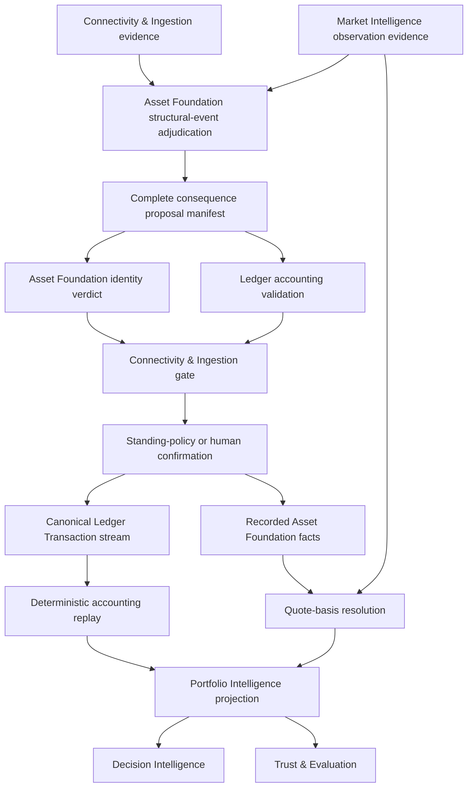
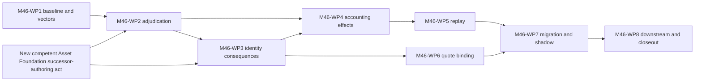

# M46 — Corporate Action Adjudication and Portfolio Accounting Correctness — Architecture and Implementation Plan

**Artifact class:** Architecture and implementation planning candidate
**Lifecycle stage:** Correction after Independent Planning Corpus Review
**Status:** `CORRECTED PLANNING CORPUS — PENDING FOCUSED INDEPENDENT RE-REVIEW`
**Planning mandate:** [M46 Planning Allocation / Commissioning Record](../governance/M46_CORPORATE_ACTION_PORTFOLIO_ACCOUNTING_PLANNING_ALLOCATION_RECORD.md)
**Correction author role:** M46 Planning Candidate Correction Author
**Correction record:** [M46 Architecture Corrections Response](M46_ARCHITECTURE_CORRECTIONS_RESPONSE.md)
**Paired roadmap candidate:** [M46 Work-Package Decomposition and Roadmap](M46_WORK_PACKAGE_DECOMPOSITION_AND_ROADMAP.md)
**Planning corpus correction response:** [M46 Planning Corpus Corrections Response](M46_PLANNING_CORPUS_CORRECTIONS_RESPONSE.md)
**Implementation authority:** `NONE`
**Work-package allocation or authorization:** `NONE`
**Migration, production-correction, cutover, release, and runtime authority:** `NONE`

This document is the corrected M46 architecture and implementation-planning
candidate following an independent review disposition of `REQUIRES
CORRECTION`. It defines a generic, multi-asset architecture and a proposed
delivery sequence. This correction does not declare any finding resolved. It
does not implement production code, allocate or authorize a work package,
amend a frozen artifact, adjudicate a real corporate action, correct BANPU or
any other portfolio, migrate data, rebuild a portfolio, or activate a runtime
path.

Every work package named below is a prospective decomposition only. Each remains
`UNALLOCATED` and `UNAUTHORIZED` unless a later competent act expressly says
otherwise.

---

## 0. Decision language and present effect

`MUST`, `MUST NOT`, `SHALL`, and `SHALL NOT` express requirements of this
candidate architecture. They do not become frozen or implementation-effective
merely because they appear here. This revision performs correction only.
Focused independent re-review, independent confirmation, ratification, and
freeze remain later, separate M46 planning acts under the [allocation
record](../governance/M46_CORPORATE_ACTION_PORTFOLIO_ACCOUNTING_PLANNING_ALLOCATION_RECORD.md#8-competent-lifecycle-roles).

Terms introduced by this document are **M46 candidate planning terms**. They do
not enter the [Canonical Glossary](../GLOSSARY.md), amend an existing definition,
or acquire runtime representation through this candidate. A later authorized
work package must perform source-owner vocabulary review before any new term is
relied upon normatively.

The present effect is limited to a reviewable proposal for:

1. domain and aggregate boundaries;
2. permanent identity and effective-dated identifier relationships;
3. immutable corporate-action adjudication and normalized accounting effects;
4. deterministic holding, quantity, cash, and total-cost-basis replay;
5. identity- and basis-aware quote selection and valuation;
6. fail-closed migration through shadow projections; and
7. prospective, independently allocatable work-package boundaries.

## 1. Objectives

M46 exists to make structural market events ordinary, auditable inputs to the
platform's permanent accounting architecture rather than exceptions patched
into holdings or quotes.

### 1.1 Primary objectives

The architecture MUST:

1. preserve a permanent, platform-owned `asset_id` while every external
   identifier remains effective-dated evidence;
2. preserve every historical transaction exactly as recorded;
3. preserve every announcement, adjudication, corporate-action consequence,
   correction, and supersession additively;
4. convert an approved corporate action into owner-domain consequences that
   are complete, exact, and replayable without interpreting the announcement;
5. make portfolio holdings a deterministic projection of immutable
   transactions plus admitted corporate-action accounting effects;
6. treat **total cost basis** as replay state and **average cost** as the
   derivation `total cost basis / quantity` when quantity is positive;
7. bind a valuation quote to the exact asset, listing, unit, currency,
   observation time, price kind, and adjustment basis required by the holding;
8. prevent a partial action from landing in identity without accounting, or in
   accounting without identity;
9. support stock and ETF splits, reverse splits, symbol changes, mergers,
   amalgamations, spin-offs, rights, bonus shares, cash and stock dividends,
   mutual-fund mergers, and future event stories without issuer-specific engine
   branches;
10. provide a shadow-migration path that proves correctness before any future
    cutover;
11. preserve performance continuity through structural events so that a split,
    merger, spin-off, redemption, or other restructuring cannot move a return
    number merely because its identity, quantity, or basis representation
    changed; and
12. require every externally derived consequence to pass the ingestion gate
    and the human-confirmation or explicit standing-policy discipline before
    it becomes immutable portfolio truth.

### 1.2 Success outcome

For any admitted portfolio event stream and canonical valuation input set, two
conforming implementations using the same frozen contract and method versions
must derive the same:

- position identity;
- quantity;
- total cost basis;
- derived average cost;
- cash and entitlement state;
- quote binding and valuation basis;
- realized and unrealized profit or loss inputs;
- structural-event performance-continuity result or an explicit fail-closed
  performance state; and
- downstream regeneration boundary.

The result must be reproducible without a live provider, mutable symbol map,
wall clock, model output, current holding row, or previously computed snapshot.

## 2. Constitutional scope

### 2.1 Governing architecture preserved

This candidate is subordinate to and preserves:

- the [Platform Architecture](../architecture/platform_architecture.md),
  especially Laws 1–15, the one-way domain dependencies, the ingestion gate,
  permanent identity, immutable history, derived holdings, deterministic replay,
  loud failure, and correctness over convenience;
- the [Corporate Action Domain](../architecture/CORPORATE_ACTION_DOMAIN.md),
  including announcement-as-claim, classification before consequence,
  both-authorities-or-neither recording, replay consumption of consequences,
  append-only correction, and visible uncertainty;
- the [Transaction Domain Model](../architecture/TRANSACTION_DOMAIN_MODEL.md),
  including one immutable portfolio-scoped event stream, two timelines,
  pre-admission identity resolution, and append-only repair;
- the [Asset Registry](../architecture/ASSET_REGISTRY.md) and
  [Asset Foundation](../architecture/asset_foundation.md), including permanent
  listing-level identity, external identifiers as evidence, explicit
  relationships between related identities, and source-owner adjudication;
- the [Market Data Platform](../architecture/MARKET_DATA_PLATFORM.md), including
  canonical provider-neutral observations, boundary normalization, explicit
  price kind and currency, immutable settled history, and loud data gaps;
- the [Portfolio Domain Model](../architecture/PORTFOLIO_DOMAIN_MODEL.md),
  including one portfolio as an accounting boundary, one declared Base
  Currency, and no cross-portfolio replay;
- the canonical [Accounting Scope](../GLOSSARY.md#accounting-scope) definition
  and its governing
  [M42-WP2 contract](M42_WP2_PORTFOLIO_IDENTITY_ACCOUNTING_SCOPE_MEMBERSHIP_AND_BASE_CURRENCY_CONTRACT_SPECIFICATION.md),
  which own the exact scope membership and Base Currency boundary used below;
- the frozen [Portfolio Calculation Rules](../investment/PORTFOLIO_CALCULATION_RULES.md),
  including fee-inclusive weighted-average cost, ledger-derived external cash
  flow, non-performance adjustment treatment, NAV conservation, and downstream
  reuse of owned return calculations;
- [ADR-001](../decisions/ADR-001_TRANSACTION_LEDGER_SINGLE_SOURCE_OF_TRUTH.md),
  [ADR-002](../decisions/ADR-002_NO_COMPENSATION_FOR_LEDGER_DEFECTS.md),
  [ADR-003](../decisions/ADR-003_TWO_TIMELINE_RULE.md), and
  [ADR-005](../decisions/ADR-005_REPLAY_CORRECTNESS_BASELINE.md);
- the [AI Rules](../handbook/AI_RULES.md),
  [Architecture Handbook](../handbook/ARCHITECTURE_HANDBOOK.md),
  [Governance Handbook](../handbook/GOVERNANCE_HANDBOOK.md), and
  [Review Handbook](../handbook/REVIEW_HANDBOOK.md), including their
  evidence, role-separation, authority, stop, review, and freeze disciplines;
  and
- the frozen Market Intelligence and Portfolio Intelligence contracts cited in
  Sections 8 and 11 below.

#### 2.1.1 Recorded ownership reconciliation and remaining governance residual

The repository already resolves structural-event adjudication ownership upward.
The [Platform Architecture](../architecture/platform_architecture.md) §5 defines
nine domains and no standalone Corporate Action domain; §6.1 assigns Asset
Foundation the adjudication of corporate restructurings into identity facts;
and §11 G2/G4 requires lower designs to conform and conflicts to be resolved
upward. The [Platform Roadmap](../architecture/ROADMAP.md) Phase 3 likewise
places Corporate Actions under Asset Foundation.

The [Asset Foundation](../architecture/asset_foundation.md) §3 expressly homes
structural-event interpretation in Asset Foundation, exports consequences
through two boundary crossings, and states that only the address of the
level-4 Corporate Action design changes. Its §9 records the alignment rather
than hiding it: the level-4 document's standalone "bridge domain"
self-description is superseded by that homing while its interior discipline
remains binding. The constitutional determination is therefore that Asset
Foundation owns structural-event interpretation and the both-or-neither
guarantee; Connectivity & Ingestion owns proposal admission and confirmation;
and Ledger & Accounting owns accounting consequences.

The remaining condition is narrower than ownership reconciliation. The Asset
Foundation document is still marked draft pending ratification, and the
[Corporate Action Domain](../architecture/CORPORATE_ACTION_DOMAIN.md) still
contains its pre-alignment bridge wording. M46-WP1 MUST verify and cite
ratification of the recorded alignment and/or textual conformance of the
level-4 design before WP2–WP4 may proceed. Until that residual is closed,
WP2–WP4 remain blocked from authoring against an unratified or textually
misaligned owner contract; M46 does not request a fresh ownership decision.

### 2.2 Frozen predecessor state preserved

M46 neither reopens nor silently completes the predecessor lifecycles:

- the Ledger & Accounting planning pair remains the exact corpus frozen by the
  [Ledger Planning Freeze](LEDGER_ACCOUNTING_PLANNING_FREEZE.md); LA-WP2 remains
  terminally governance-blocked and LA-WP3 through LA-WP7 remain unauthorized
  under the [Ledger Owner-Domain Final State](../governance/LEDGER_ACCOUNTING_OWNER_DOMAIN_FINAL_STATE.md);
- the Asset Foundation planning corpus and AF-WP1 through AF-WP4 are complete,
  frozen, and closed. AF-WP1 and AF-WP2 supply their exact form-and-annex
  contracts under the [AF-WP1](../governance/ASSET_FOUNDATION_AF_WP1_FREEZE_RECORD.md)
  and [AF-WP2](../governance/ASSET_FOUNDATION_AF_WP2_FREEZE_RECORD.md) records.
  AF-WP3 supplies the frozen AF-3 Owner Evidence Manifest and Conformance-Annex
  Index under its [freeze](../governance/ASSET_FOUNDATION_AF_WP3_FREEZE_RECORD.md)
  and [closeout](../governance/ASSET_FOUNDATION_AF_WP3_CLOSEOUT_RECORD.md)
  records. AF-WP4 supplies frozen release-profile evidence under its
  [freeze](../governance/ASSET_FOUNDATION_AF_WP4_FREEZE_RECORD.md),
  [release attestation](../governance/ASSET_FOUNDATION_AF_WP4_RELEASE_ATTESTATION.md),
  and [closeout](../governance/ASSET_FOUNDATION_AF_WP4_CLOSEOUT_RECORD.md).
  AF-WP3/AF-WP4 supply evidence and frozen contracts only: their closeouts
  create no downstream, intake, runtime, or successor authority; and
- M42 through M45 retain their recorded status and authority boundaries. M46
  does not supply missing M45 evidence, alter a Portfolio Intelligence method,
  or inherit authority from any predecessor closeout.

The frozen [AF-1 Asset Identity Canonical Lexical Form](ASSET_FOUNDATION_AF_WP1_AF_1_CANONICAL_LEXICAL_FORM.md)
is the exact documentary reference form for permanent asset identity at a
future governed contract boundary. M46 does not redefine its grammar or infer
that current runtime identifiers already implement it.

### 2.3 Bounded M46 responsibility

M46 coordinates an architecture across existing owner domains. It is not a
new constitutional domain and does not take ownership from any domain. Its
bounded responsibility is to make the complete consequence path explicit:

```text
outside evidence
    -> Connectivity & Ingestion normalized claim and provenance
    -> Asset Foundation structural-event adjudication
    -> complete proposed identity and accounting consequence manifest
    -> Connectivity & Ingestion admission pipeline
       (identity resolution, attribution, validation, review)
    -> confirmation decision
       (explicit standing policy, or human confirmation when required)
    -> atomic both-or-neither release as
       Asset Foundation identity facts + canonical Ledger Transactions
    -> deterministic holding replay of the one admitted Transaction stream
    -> Market Intelligence quote-basis resolution
    -> Portfolio Intelligence valuation and downstream regeneration
```

The arrows are dependency and handoff edges. They are not permission for one
domain to write another domain's facts. Connectivity & Ingestion owns the
ingestion pipeline for externally derived facts; Asset Foundation and Ledger &
Accounting retain their semantic authorities. Decisive, well-corroborated,
routine actions MAY be confirmed only by an explicit, specific, versioned,
auditable, and revocable standing policy. Ambiguous, unusual, first-of-kind, or
high-impact actions, and any consequence outside that delegation, MUST surface
to a human before the irreversible admission decision. No machine silently
writes portfolio truth.

## 3. Explicit non-goals

This candidate does not:

1. implement production code, tests, schemas, APIs, services, migrations,
   providers, jobs, feature flags, or UI;
2. allocate or authorize any M46 work package;
3. adjudicate BANPU terms, identity, ratio, dates, entitlements, consideration,
   or cost-basis instructions;
4. create an issuer-, market-, jurisdiction-, broker-, provider-, or
   symbol-specific action type or branch;
5. rewrite a Transaction, announcement, Observation, Asset, snapshot, holding,
   analysis, signal, recommendation, evaluation, or frozen document;
6. infer a corporate action from a price jump, share-count discrepancy,
   provider symbol change, broker position, or P/L anomaly;
7. make Market Intelligence a ledger authority or Ledger & Accounting a quote
   provider;
8. define tax-lot selection, jurisdictional tax basis, withholding liability,
   or legal tax treatment; those remain future Tax Engine concerns;
9. redefine Portfolio Base Currency, FX conversion, NAV, return, benchmark,
   Portfolio Composition, or Portfolio Analytics method semantics;
10. treat a split-adjusted provider series as permission to rewrite historical
    transactions or holdings;
11. promise atomic database technology, storage layout, wire format, or
    deployment topology; or
12. perform shadow replay, correction, cutover, rollback, regeneration, release,
    or production activation.

## 4. Architectural principles

### P1 — Facts before projections

Transactions, admitted Corporate Action Cases, and their admitted identity and
accounting consequences are immutable facts. Corporate actions therefore have
immutable admitted representations; later corrections append and compensate.
Holdings, average cost, valuation, performance, signals, and evaluations are
rebuildable projections.

### P2 — Identity is permanent; identifiers are temporal

An `asset_id` never changes or transfers. Symbols, names, ISINs, provider
symbols, broker codes, and venue codes have effective intervals and provenance.
Historical resolution is performed against the identifier state effective for
the fact's economic time, never against the current display symbol.

### P3 — Adjudication precedes accounting

An announcement is never replay input. Only a complete approved adjudication
may generate identity proposals and accounting-effect proposals. Approval does
not admit them: externally derived proposals still pass the Connectivity &
Ingestion gate and its confirmation discipline before recording.

### P4 — Dual-authority consequences are one admission decision

Where an action has both identity and accounting consequences, the admission
outcome is complete only when both owner domains accept compatible consequence
sets and the ingestion gate releases them under one confirmed decision. Partial
landing is a blocking split-brain state. Ownership of the guarantee remains
homed in Asset Foundation under Section 2.1.1; executable authoring remains
blocked only by the recorded alignment's ratification/textual-conformance
residual and the applicable successor-authority conditions.

### P5 — Replay consumes a small effect algebra

Replay understands platform-owned accounting effects, not market names such as
"Thai amalgamation" or provider taxonomies. New action stories normalize into
existing effects; a genuinely new accounting dimension requires a governed
extension at its owner.

### P6 — Total cost basis is state; average cost is presentation

Replay carries exact quantity and total cost basis. Average cost is derived
only at a read boundary and is never independently mutated after a structural
event.

### P7 — Quote identity is richer than symbol equality

A usable valuation observation must match the exact asset/listing and the
holding's unit, currency, time, price-kind, and adjustment-basis requirements.
A symbol match alone proves none of these.

### P8 — Two timelines remain explicit

Economic time states when an event takes effect. Knowledge time states when the
platform learned and admitted it. Current-truth and historical-knowledge
projections are different queries over the same immutable record, not different
ledgers.

### P9 — Corrections append and compensate

A corrected action never edits a prior adjudication or effect bundle. It appends
an attributable reversal or compensation and a corrected successor bundle at
the governed economic boundary.

### P10 — Precision and ordering are contract data

Ratios, allocation weights, quantities, amounts, rounding points, event order,
and method versions are explicit. Floating-point convenience, implicit
same-day order, or provider convention may not determine financial truth.

### P11 — Failure is localized, visible, and inert

Ambiguous or incomplete action state is quarantined. It cannot affect replay,
quotes, valuation, P/L, or downstream intelligence. The affected subject is
marked uncomputable rather than guessed.

### P12 — Migration proves, then promotes

The target projection runs in shadow against immutable inputs. Unaffected
portfolios require parity; affected portfolios require explicitly explained
and invariant-conforming differences. Production promotion is a separate,
later act.

### P13 — Structural events are performance-transparent

A split, merger, spin-off, redemption, conversion, or other restructuring does
not create investment return merely because identity, quantity, or basis was
re-expressed. Value continuity through the structural event is mandatory. If
the frozen return contract cannot represent that continuity, authoritative
performance fails closed until its owner supplies a governed additive contract;
M46 does not invent a local stripping term.

## 5. Domain boundaries and aggregate model

### 5.1 Ownership matrix

| Concern | Sole owner | M46 handoff boundary | Forbidden crossing |
| --- | --- | --- | --- |
| Announcement and broker evidence capture | Connectivity & Ingestion | Provenance-bearing claim supplied to structural-event adjudication | Evidence source becoming truth or identity authority |
| Structural-event interpretation and both-or-neither guarantee | Asset Foundation, as recorded by Platform Architecture §6.1 and Asset Foundation §§3/9 | Asset Foundation-homed Corporate Action Case and complete proposed consequence manifest, subject to the Section 2.1.1 ratification/textual-conformance residual | M46 or another domain treating Corporate Action as a tenth domain, bypassing the ingestion gate, or assuming the residual is closed without evidence |
| Permanent asset identity and effective identifier facts | Asset Foundation | Accepted identity verdict returned to the gated admission decision; facts become visible only in the atomic release | Corporate Action, Connectivity & Ingestion, or Ledger minting, merging, renaming, or retiring identity |
| External-fact admission and confirmation | Connectivity & Ingestion owns the admission pipeline; the human owns every non-delegated irreversible decision | Normalized, provenance-tagged, identity-resolved, attributed, validated, reviewed proposal admitted under explicit standing policy or human confirmation | Any owner domain using a privileged pen; a machine silently admitting outside an explicit, specific, revocable delegation |
| Portfolio-scoped accounting truth | Ledger & Accounting | Proposed normalized effect bundle validated by Ledger and, after gated confirmation, represented as canonical Transactions in one Accounting Scope | Corporate Action, Asset Foundation, Market Intelligence, or Portfolio Intelligence writing ledger truth; Connectivity & Ingestion inventing accounting meaning |
| Market observation and quote-basis resolution | Market Intelligence | Exact canonical quote/measure evidence bound to an asset and basis | Symbol-only lookup or live provider call inside replay |
| Holdings, valuation, performance, exposure, and downstream intelligence | Portfolio Intelligence | Derived projection and explicit degraded state | Patching truth, identity, or market observations from a derived symptom |

### 5.2 Candidate aggregate boundaries

The following are conceptual aggregate boundaries, not schemas or newly
admitted canonical vocabulary.

#### A. Corporate Action Case

The Corporate Action Case is an implementation-neutral adjudication aggregate
homed in Asset Foundation under Section 2.1.1. It is not a constitutional
domain. It protects the rule that one real-world action is interpreted once as
a complete case. Its conceptual content is:

- permanent case reference;
- immutable evidence references and provenance;
- action family classification;
- predecessor, successor, distributed, and entitlement asset roles;
- announcement, ex/entitlement, effective, election, settlement, and payment
  time roles where applicable;
- exact ratios, consideration legs, fractional treatment, and conditions;
- immutable adjudication revisions;
- validation findings, conflicts, quarantine reason, and proposed approval
  decision;
- applicable standing-policy identity and version, or required human
  confirmation state;
- proposed Asset Foundation consequence set;
- proposed Ledger & Accounting effect-bundle templates; and
- linkage among superseded, cancelled, corrected, and successor cases.

The aggregate does not own an `asset_id`, a Transaction, a holding, a quote, a
tax opinion, a portfolio result, or admission authority. Approval produces a
claim for confirmation, not recorded truth.

#### B. Asset Identity Consequence Set

Asset Foundation owns this aggregate or owner-equivalent record. It contains
only accepted identity consequences required by the adjudication:

- continuity of one permanent asset through a rename or quantity restructure;
- effective-dated identifier binding, retirement, or replacement;
- lifecycle transition of an existing asset;
- nomination and later adjudication of a genuinely new asset;
- explicit predecessor/successor, converted-into, spun-off-from, wraps, or
  other governed relationship; and
- the exact corporate-action evidence and adjudication reference supporting
  each fact.

It never aliases two distinct listings into one identity and never redirects
historical ledger references.

#### C. Portfolio Accounting Effect Bundle

Ledger & Accounting owns the accounting semantics of one proposed bundle per
affected Accounting Scope. Before admission, the bundle is a complete proposal
and has no ledger effect. After gated confirmation, its consequences are
represented in the one canonical Transaction stream; bundle identity remains
immutable lineage and atomic-grouping metadata, not a second replay stream. It
conceptually binds:

- portfolio identity and exactly one Accounting Scope;
- source corporate-action case and approved adjudication revision;
- exact economic time, knowledge time, and deterministic order key;
- exact Asset Foundation references used by every leg;
- eligibility or entitlement evidence fixed before admission;
- an ordered set of normalized accounting effects;
- exact quantity, amount, ratio, allocation, unit, currency, and rounding
  instructions;
- correction, reversal, supersession, and idempotency references; and
- complete provenance and admission decision.

No proper subset of a required bundle is independently admissible. A bundle
that cannot be applied completely is rejected or quarantined before ledger
admission. Connectivity & Ingestion may admit only the Ledger-validated
canonical Transaction representation; it may not invent, alter, or interpret
the accounting semantics.

#### D. Portfolio Accounting Projection

The replay projection is disposable state for one Accounting Scope. At a
minimum it contains, per permanent asset identity:

- quantity in the asset's exact quantity unit;
- total platform book cost basis and its denomination;
- derived average cost when quantity is positive;
- pending entitlement state where an admitted entitlement exists;
- realized P/L inputs produced by admitted disposal effects;
- complete contributing event/effect lineage; and
- projection contract and method versions.

Cash follows the frozen single-scalar-per-portfolio model unless and until a
separate governed owner contract authorizes a multi-denomination accounting
representation. Denomination remains explicit evidence on cash-affecting
events, but an event that cannot be represented under the current cash and Base
Currency contract fails closed. This candidate does not redefine Portfolio
Base Currency or authorize FX.

#### E. Valuation Binding

Market Intelligence supplies, and Portfolio Intelligence consumes, an immutable
binding between one holding projection and one canonical market observation or
measure result. It proves compatibility across the quote dimensions in Section
11. It is not a quote itself, a provider response, or a ledger event.

### 5.3 Aggregate consistency rule

The consistency boundary is:

```text
Approved Corporate Action Case
          |
          +--> proposed Asset Identity Consequence Set --+
          |                                              |
          +--> proposed Portfolio Accounting Bundle(s) --+
                                                         |
                    Connectivity & Ingestion gate
                    + confirmation decision
                                                         |
                    atomic both-or-neither release
          +----------------------------------------------+
          |                                              |
          +--> recorded Asset Foundation facts           |
          +--> canonical Ledger Transactions <-----------+
```

Where an action requires both branches, the case is not `Recorded` until both
owner-domain verdicts are compatible, the ingestion gate has completed
normalization, provenance, identity resolution, attribution, validation, and
review, and the applicable confirmation decision has been recorded. The two
branches MUST carry the same adjudication identity and compatible assets,
dates, ratios, and relationship roles. Cross-domain technical transactions may
be implemented in many ways, but the semantic outcome MUST be both or neither.

The technical atomicity mechanism remains open. Section 2.1.1 records Asset
Foundation ownership of the both-or-neither guarantee while preserving the
ratification/textual-conformance residual and the prohibition on inventing an
implementation mechanism or successor authority in this candidate.

## 6. Identity model

### 6.1 Permanent asset identity

The permanent identity is the Asset Foundation-owned `asset_id`. Per the
[Asset Registry](../architecture/ASSET_REGISTRY.md#3-identity-model), it is
opaque, minted once, never reused, and at listed-instrument granularity: venue,
currency, calendar, and price-series differences require distinct identities.
Related securities are connected by explicit relationships, not record merge.

At a governed documentary boundary, an exact permanent reference MUST use the
frozen AF-1 form. A future implementation must reconcile that contract with
the current runtime representation without changing AF-1 or treating an
implementation key as authority over the owner form.

### 6.2 Effective-dated identifier binding

A candidate **Effective Identifier Binding** records that one external
identifier denoted one permanent asset for a bounded interval and context. Its
minimum semantics are:

- permanent `asset_id` reference;
- identifier namespace and type;
- exact external value as witnessed;
- venue, market, listing, and denomination context required to disambiguate;
- inclusive effective start and exclusive effective end, or an exact governed
  alternative interval convention;
- knowledge/recording time;
- source evidence and provenance;
- current, superseded, disputed, or quarantined evidence disposition; and
- predecessor/successor binding linkage where the namespace changed.

The exact interval convention, serialization, and vocabulary remain future
Asset Foundation contract work. The invariant is fixed here: identifier
resolution for an event at time `t` may use only a unique, decisive binding
whose effective interval contains `t`. A current symbol cannot retrospectively
identify an old event.

### 6.3 Symbol-change rule

A pure symbol or name change:

- preserves the same `asset_id`;
- closes or supersedes the former identifier binding at the exact effective
  boundary;
- adds the new binding with provenance;
- changes display information only as Asset Foundation permits; and
- creates no quantity, cash, total-cost-basis, realized-P/L, or performance
  effect.

Any design that creates a sale, purchase, disposal, or new asset solely because
a symbol changed is non-conforming.

### 6.4 Security transformation rule

A merger, amalgamation, spin-off, fund merge, class conversion, or other legal
transformation is not a symbol substitution. Adjudication determines whether:

1. one identity continues;
2. a predecessor ends and one or more distinct successors exist;
3. a new distributed asset is created while the parent continues; or
4. only descriptive evidence changed.

Asset Foundation records the corresponding identity facts. Ledger effects then
move quantity and cost basis among the already-adjudicated permanent identities.
The original transaction continues to reference its original asset forever.

### 6.5 Identity failure behavior

Overlapping contradictory bindings, missing venue context, recycled symbols,
multiple plausible successors, unverified successor identity, or a mismatch
between action participants and Registry facts produce `identity unresolved`
at the M46 planning level. The action and its dependent quotes remain inert.
No fallback to canonical symbol, current display symbol, provider preference,
or most-recent binding is permitted.

## 7. Accounting model

### 7.1 State dimensions

The canonical M46 accounting projection carries exact state in dimensions, not
one mutable holding row:

| Dimension | Meaning | Owner |
| --- | --- | --- |
| Quantity | Units held for one permanent asset in its exact unit semantics | Ledger & Accounting replay |
| Total cost basis | Fee-inclusive platform book cost still attached to the open quantity | Ledger & Accounting replay |
| Average cost | `total cost basis / quantity` when quantity is positive | Derived read value |
| Cash | Frozen single scalar per portfolio; event denomination retained as evidence, with any multi-denomination projection conditional on a future governed cash/FX contract | Ledger & Accounting replay under the current Portfolio Base Currency boundary |
| Entitlement | Admitted right or election state before exercise, sale, lapse, or settlement | Ledger & Accounting truth derived from approved action and holder facts |
| Identity relationship | Continuity, predecessor/successor, distribution, or conversion relation | Asset Foundation |
| Quote/valuation | Market worth at a stated basis and time | Market Intelligence / Portfolio Intelligence |

Total cost basis means the existing platform book-cost concept governed by the
frozen fee-inclusive weighted-average rule. It is not a jurisdictional tax
basis, fair value, market value, or price observation.

### 7.2 Normalized accounting-effect algebra

Approved corporate actions normalize into a small, closed candidate algebra.
Names below are planning labels, not admitted Transaction types:

1. **Quantity delta** — add or remove an exact quantity of one asset.
2. **Quantity rescale** — multiply an existing quantity by an exact rational
   factor at an effective boundary.
3. **Position conversion** — remove an exact predecessor quantity and create
   exact successor quantities under one linked effect group.
4. **Cash movement** — add or remove an exact amount in one denomination with
   explicit income, capital, consideration, fee, tax, or cash-in-lieu fact
   classification supplied by the owning contract.
5. **Cost-basis transfer** — move an exact amount of total cost basis from one
   asset state to one or more asset states.
6. **Cost-basis adjustment** — increase or reduce total cost basis only when an
   explicit approved accounting instruction supplies the amount and meaning.
7. **Entitlement grant** — create an exact right tied to an asset, portfolio,
   quantity, terms, and election window.
8. **Entitlement disposition** — exercise, sell, transfer, expire, or cancel an
   existing entitlement with explicit linked consequences.
9. **Reversal/compensation** — negate an earlier effect by exact reference;
   never delete or mutate it.

Every action family maps to an ordered composition of these effects. Replay
does not branch on the action's market name after normalization.

### 7.3 Cost-basis invariants

For each asset state with quantity `Q` and total cost basis `C`:

- if `Q > 0`, derived average cost is `C / Q` under the exact declared
  quantization boundary;
- if `Q = 0`, no residual cost basis may remain unless an explicit, separately
  governed pending/disposed state owns it;
- a pure quantity rescale changes `Q` and preserves `C`;
- a pure symbol change changes neither `Q` nor `C`;
- a conversion removes the predecessor's allocated basis exactly once and
  assigns it among successor and disposed legs exactly as instructed;
- a spin-off or multi-successor event requires allocation weights or exact
  basis amounts whose sum accounts for the source basis plus any explicit
  basis adjustment;
- a cash distribution leaves basis unchanged unless the approved action
  explicitly classifies an amount as a basis adjustment rather than income;
- a stock or bonus distribution does not assume zero or preserved per-share
  cost; its exact quantity and total-basis instruction controls;
- a structural event changes no return number merely because it re-expresses
  identity, quantity, or basis; value continuity must be supplied by the
  owner-domain performance contract before authoritative performance resumes;
  and
- rounding residue is assigned only by an explicit deterministic rule and is
  never silently discarded.

An absent, ambiguous, conflicting, tax-dependent, or provider-inferred basis
instruction blocks the affected effect bundle. M46 never guesses an allocation
from post-event prices or from a desired average-cost result.

### 7.4 Action-family normalization matrix

| Event story | Identity consequence | Minimum accounting effects | Cost-basis rule |
| --- | --- | --- | --- |
| Stock / ETF split | Same asset | Quantity rescale; possible fractional disposition | Preserve total basis except explicitly allocated fractional disposition |
| Reverse split | Same asset | Quantity rescale; optional cash-in-lieu disposal | Preserve retained plus disposed basis exactly |
| Symbol / name change | Same asset; effective identifier update | None | Quantity and total basis unchanged |
| Bonus shares / stock dividend | Usually same asset; another asset only if adjudicated | Quantity delta or distribution; optional cash leg | Apply explicit total-basis instruction; no inferred per-share default |
| Cash dividend | Same asset | Cash movement | Basis unchanged unless explicitly classified return of capital |
| Rights issue | Entitlement asset or governed right relation | Entitlement grant, then exercise/sale/lapse effects | Preserve and transfer entitlement/subscription basis under exact terms |
| Merger / amalgamation | Predecessor-to-successor relationship(s) | Position conversion; cash/fee/fractional legs as applicable | Allocate predecessor basis across all consideration legs exactly once |
| Spin-off | Parent continues; child identity and relationship | Quantity delta in child; possible cash/fractional legs | Allocate source basis between parent and child using approved instruction |
| Mutual-fund merge / class conversion | Distinct predecessor and successor unless Asset Foundation adjudicates continuity | Position conversion | Transfer or allocate total basis under approved terms |
| Future action | Adjudicated by answer-pattern | Composition of existing effects, or governed algebra extension | Exact source-owned instruction; fail closed if no conforming mapping |

This matrix is illustrative normalization guidance. It is not an issuer or
jurisdictional rulebook.

Every structural row in the matrix is performance-transparent: the structural
event by itself produces zero investment return, while an independently
classified economic leg such as dividend income, fee, or taxable cash
consideration retains the meaning supplied by its owning accounting contract.
The frozen [Portfolio Calculation Rules](../investment/PORTFOLIO_CALCULATION_RULES.md#9-nav-definition)
currently strip `net_external_cash_flow`, `imported_asset_value`, and
`manual_adjustment_value`; they define no corporate-action continuity term.
M46 MUST NOT route a structural effect through one of those unrelated terms or
create a second return formula. Until Portfolio Intelligence and Ledger &
Accounting govern an explicit composition that preserves value continuity for
quantity-changing actions, the affected performance path is `UNCOMPUTABLE` and
fails closed even when holdings and valuation can otherwise be projected.

### 7.5 Fractional and elective outcomes

Fractional shares, cash in lieu, odd-lot treatment, elections, rights
subscriptions, and optional consideration are holder-specific facts. The
action case supplies terms; the portfolio effect bundle supplies the admitted
holder outcome. A platform-wide default election, automatic rounding to whole
shares, or assumption that broker-delivered cash represents the full action is
forbidden.

## 8. Event and dependency model

### 8.1 Immutable event layers

M46 preserves four distinct event layers:

1. **Evidence event** — what a witness reported, owned at the ingestion or
   Market Intelligence boundary.
2. **Adjudication revision** — the Corporate Action Domain's immutable reading
   of a case at one knowledge time.
3. **Identity fact** — Asset Foundation's accepted permanent-identity,
   identifier, relationship, or lifecycle consequence.
4. **Accounting consequence** — Ledger & Accounting's portfolio-scoped
   semantics, admitted through Connectivity & Ingestion and represented as
   canonical Transactions in the one ledger stream.

These layers link by immutable references. No layer is copied into another as
replacement authority.

### 8.2 Required event coordinates

Every admitted accounting effect bundle must close, at planning level:

- immutable bundle and effect identities;
- exact portfolio identity and Accounting Scope;
- exact source action case and approved adjudication revision;
- exact permanent asset reference for every leg;
- economic effective time;
- knowledge/recording time;
- entitlement, election, settlement, or payment time roles where relevant;
- deterministic intra-bundle order and ledger tie-break order;
- effect type, exact values, units, denominations, bases, and method versions;
- correction, reversal, and supersession references;
- provenance, ingestion-gate admission identity, approval authority, and the
  exact standing-policy delegation or human confirmation record; and
- idempotency identity.

Missing required coordinates cannot be filled during replay.

### 8.3 Dependency direction



No reverse edge is authorized. The `CA` node records the owner alignment in
Section 2.1.1; executable authoring still waits for its ratification or
textual-conformance residual and the applicable successor authority. The
ingestion gate is the only path from externally derived proposals to the
canonical ledger stream. Portfolio symptoms may create a diagnostic finding or
evidence request, but they cannot manufacture an upstream fact.

### 8.4 Atomic admission protocol

At architecture level, dual-authority admission follows:

1. verify the Section 2.1.1 recorded ownership alignment, close its
   ratification/textual-conformance residual, and freeze one approved
   adjudication revision as a proposal for admission under competent Asset
   Foundation successor authority;
2. obtain Asset Foundation verdicts for every proposed identity consequence;
3. construct Ledger accounting-bundle proposals only from accepted permanent
   references and validate their canonical Transaction representation;
4. submit the complete manifest to the Connectivity & Ingestion admission
   pipeline for normalization, provenance, identity resolution, portfolio and
   Accounting Scope attribution, validation, deduplication, conflict handling,
   and review;
5. determine the confirmation path: a decisive, well-corroborated, routine
   action may use only an explicit, specific, versioned, auditable, and
   revocable standing policy; every ambiguous, unusual, first-of-kind,
   high-impact, or non-delegated action MUST surface to a human;
6. record the confirmation actor or delegation identity, policy version,
   evidence reviewed, decision time, and exact proposed manifest identity;
7. obtain the Ledger & Accounting admission verdict without allowing the
   admission pipeline to create or alter accounting meaning;
8. record one admission decision referencing the confirmation and both
   owner-domain verdicts, then make recorded identity facts and canonical
   Ledger Transactions visible together; and
9. if any prerequisite fails, quarantine the proposal and expose neither
   consequence set as a complete recorded action.

The storage and transaction mechanism is intentionally open. Semantic atomicity
is required; a specific distributed transaction technology is not selected.
No Corporate Action, Asset Foundation, or Ledger process has a privileged pen
around the ingestion gate.

## 9. Replay model and holding projection algorithm

### 9.1 Replay inputs

A current-truth replay consumes only:

1. the complete immutable canonical Transaction stream for one Accounting
   Scope, including admitted structural-event consequences that are
   indistinguishable at the replay boundary from other Transactions;
2. frozen portfolio/accounting rules and exact method/dependency versions; and
3. an explicit economic cutoff and, where requested, knowledge-time cutoff.

Replay never consumes current holdings, snapshots, announcements, broker
balances, provider APIs, mutable symbol maps, quote observations, or model
output. A Corporate Action Case, proposed effect bundle, admission manifest, or
separate corporate-action effect stream is not a replay input.

### 9.2 Canonical ordering

The single canonical Transaction stream is ordered by a contract-defined tuple
containing:

1. economic effective instant;
2. governed event-time role and intra-event sequence;
3. immutable ledger/admission sequence; and
4. immutable event identity as final deterministic tie-breaker.

No universal "corporate action before trade" or "trade before corporate
action" same-day assumption is permitted. If exchange terms do not determine
the entitlement/effective relationship precisely enough to construct the
order tuple, the action remains quarantined.

Knowledge time does not change economic order. It controls which immutable
records were available to a historical-knowledge projection.

### 9.3 Projection algorithm

For one Accounting Scope and requested cutoffs, a conforming replay performs
these architecture-level steps:

1. select canonical Transactions eligible under the economic and optional
   knowledge cutoffs;
2. reject cross-scope, unresolved-identity, duplicate-idempotency, orphaned
   correction, incomplete-atomic-group, or non-canonical events;
3. order the single stream by Section 9.2;
4. initialize empty cash, position, entitlement, realized-result, and lineage
   state;
5. apply each Transaction under the frozen accounting rules and the semantics
   of its governed canonical Transaction family, without consulting action
   classification, announcement data, or source taxonomy;
6. apply every linked structural consequence as the atomic Transaction group
   admitted by the ledger contract; and
7. after every Transaction or atomic group, validate non-negative quantity,
   total-basis closure, performance-continuity eligibility,
   entitlement cardinality, cash denomination, and reference integrity;
8. derive average cost only for output, never as independent mutable state;
9. emit an immutable projection result with exact input identities, method
   versions, cutoffs, and diagnostics; and
10. compare any persisted holding or snapshot only after replay, treating the
    persisted object as a disposable derivation.

### 9.4 Ledger semantic postconditions

The following are postconditions that the future Ledger contract and its
canonical Transaction representation must satisfy. They do not define a second
event stream, require replay to recognize a Corporate Action Case, or settle
whether existing Transaction families or additive Transaction vocabulary carry
the semantics. That vocabulary decision remains Open Question 6.

- Quantity delta changes quantity by the exact signed amount and applies its
  linked basis consequence, if any, in the same admitted atomic group.
- Quantity rescale multiplies by an exact rational factor and preserves total
  basis unless the same admitted atomic group explicitly disposes of a
  fractional leg.
- Position conversion removes predecessor quantity and its allocated total
  basis before adding successor quantities and basis; partial application is
  prohibited.
- Cash movement changes only the named denomination balance and carries its
  admitted economic classification.
- Cost-basis transfer conserves the declared source amount across targets.
- Entitlement disposition requires an existing matching entitlement and cannot
  be inferred from a successor holding.
- Reversal/compensation references and negates an earlier exact effect before a
  corrected successor effect is applied.

### 9.5 Replay invariants

For identical eligible input identities, rules, dependency versions, and
cutoffs:

- independent runs produce byte-identical canonical projection output once a
  future canonical representation is governed;
- transaction insertion order outside the canonical order has no effect;
- current symbol, provider availability, current date, locale, and host
  timezone have no effect;
- every open quantity and total-basis amount traces to admitted events;
- no event affects another Accounting Scope;
- replaying an already-replayed stream produces the same result;
- reversing and replacing an effect by exact reference produces the explicitly
  corrected truth without erasing the earlier knowledge record; and
- any invariant failure prevents authoritative downstream valuation.

## 10. Cost-basis adjustment algorithm

### 10.1 Required instruction

Every action affecting more than quantity on one continuing identity must carry
an approved **basis instruction** at planning level. The instruction identifies:

- source total cost basis subject(s);
- target asset or disposed-leg subjects;
- exact allocation amounts or exact rational weights;
- treatment of cash, fees, taxes, fractions, and return-of-capital amounts;
- denomination and unit qualifications;
- effective boundary;
- quantization and residue assignment;
- accounting method and dependency versions; and
- evidence and adjudication provenance.

The basis instruction is an accounting input derived from approved facts. It is
not a provider-adjusted price, post-event market-value guess, or tax opinion.

### 10.2 Deterministic allocation

Let source total basis be `C`, explicit additive/reductive basis adjustment be
`A`, and target allocation weights be exact rationals `w1 ... wn`.

The contract must require:

- every `wi` is non-negative;
- `sum(wi) = 1` for a complete allocation;
- unrounded target basis `Bi = (C + A) × wi`;
- quantization occurs only at the declared output boundary; and
- any quantization residue is assigned by one explicit deterministic rule.

When exact target amounts are supplied instead of weights, their sum must equal
`C + A`. A disposed cash leg receives its allocated basis before realized P/L
inputs are derived. Market value may participate only when an approved
accounting method expressly requires exact, basis-qualified observations and
their identities; replay may not retrieve or select them live.

### 10.3 Weighted-average continuity

After effect application for target asset `i`:

```text
target_total_basis_i = prior_target_total_basis_i + allocated_basis_i + new_paid_cost_i
target_quantity_i    = prior_target_quantity_i + received_quantity_i
target_average_cost_i = target_total_basis_i / target_quantity_i
```

The last line is a derivation. It is never independently supplied by a
corporate action and never copied from a predecessor per-share average.

### 10.4 Failure boundary

The algorithm fails closed when:

- basis instruction is missing or ambiguous;
- allocation does not close exactly;
- required quote basis or dependency is unresolved;
- a currency conversion would be required but is not separately authorized;
- a target identity is unresolved;
- a quantity or denominator is invalid;
- a residue rule is absent; or
- applying the instruction would leave unexplained residual basis.

No downstream P/L or average cost is authoritative for the affected holding
until the failure is resolved by an appended, governed fact.

## 11. Quote model and identity-aware valuation

### 11.1 Frozen Market Intelligence boundaries

M46 consumes without redefining:

- M39's provider-neutral immutable Observation Event identity, including the
  distinction between Observation Identity and Asset Foundation subject
  identity in the [M39-WP6 Observation Identity Specification](M39_WP6_market_observation_identity_specification.md);
- the M41 subject and immutable observation-manifest boundary in the
  [M41-WP2 Subject and Manifest Contract](M41_WP2_STAGE_B_SUBJECT_AND_MANIFEST_CONTRACT_SPECIFICATION.md); and
- M41's explicit time, unit, currency, raw/source-adjusted/calculation-normalized
  basis distinctions, governed adjustment dependencies, exact arithmetic, and
  fail-closed outcomes in the
  [M41-WP3 Temporal, Unit, Adjustment, and Arithmetic Contract](M41_WP3_STAGE_B_TEMPORAL_UNIT_ADJUSTMENT_ARITHMETIC_CONTRACT_SPECIFICATION.md).

M46 does not make an Observation Identity equal to an `asset_id`. The
Observation is an immutable market event; its subject is the permanent asset.

### 11.2 Valuation request dimensions

A valuation request produced from a holding projection must state:

1. exact permanent asset/listing identity;
2. valuation instant and market-calendar context;
3. required price kind or governed market-measure definition/method version;
4. holding quantity unit and required quote unit expression/scale;
5. quote currency or separately governed conversion dependency;
6. required adjustment basis (`raw`, `source_adjusted`, or an exact
   calculation-normalized basis);
7. freshness, finality, and observation-time requirements; and
8. acceptable canonical evidence contract and identity.

Provider symbol is a routing coordinate at the Market Intelligence boundary,
not a valuation subject.

### 11.3 Quote-binding predicate

A quote is usable only if all are true:

- its semantic subject resolves exactly to the holding's `asset_id` and
  listing, not merely a related predecessor, successor, underlying, wrapper, or
  same-entity asset;
- its observation time satisfies the requested cutoff and calendar semantics;
- its price kind is admitted for the valuation purpose;
- its unit, scale, and currency are exact or an exact separately governed
  normalization dependency is supplied;
- its adjustment basis is compatible with the replayed holding basis;
- its identity, provenance, quality, and version are complete; and
- it is canonical evidence, not a live provider response or cache key.

A quote for an economically related security is not a fallback. A DR, ordinary
share, fund class, predecessor, successor, and underlying remain distinct
valuation subjects unless a separately governed measure explicitly performs a
relationship-aware transformation.

### 11.4 Double-adjustment prohibition

When replay has already applied a split, conversion, or distribution to
quantity and total basis, valuation must not apply the same structural event a
second time through an adjusted quote series. Raw and adjusted observations
remain distinct. Any transformation between them must cite the exact admitted
structural-event evidence, factor, applicability boundary, and method version
required by M41. A price discontinuity or provider label may not supply the
factor.

### 11.5 Valuation result

Portfolio Intelligence derives market value only after quote binding:

```text
market value = replayed quantity × compatible canonical quote
unrealized P/L input = market value − replayed total cost basis
```

FX, multi-currency aggregation, return, and Portfolio Analytics results remain
owned by their existing contracts. A structural-event valuation may feed
authoritative return only when the value-continuity contract required by P13
exists and passes; the current frozen return formula has no corporate-action
continuity term, so affected performance otherwise remains explicitly
`UNCOMPUTABLE`. Missing or incompatible quote evidence produces an explicit
unvalued/degraded result, never zero, predecessor price, average-cost fallback,
or symbol substitution.

## 12. Failure model

### 12.1 Planning-level failure classes

| Failure class | Example | Required behavior |
| --- | --- | --- |
| Governance alignment residual | Recorded Asset Foundation homing is not yet ratified and the level-4 design retains pre-alignment bridge wording | Block WP2–WP4 authoring until ratification and/or textual conformance is competently evidenced; do not request a fresh ownership decision |
| Evidence conflict | Witnesses disagree on ratio, dates, consideration, or cancellation | Preserve all claims; quarantine adjudication |
| Identity unresolved | Symbol interval overlaps, successor is ambiguous, listing context is absent | No identity fact, ledger bundle, or quote substitution |
| Terms incomplete | Missing effective date, allocation, election, fractional, or settlement terms | Remain pending; no partial effect bundle |
| Entitlement unresolved | Record-date holding or holder election cannot be established | Block only the affected portfolio bundle |
| Basis unresolved | Allocation weights, return-of-capital classification, or residue rule is absent | Quantity/accounting bundle remains inadmissible where atomicity requires basis |
| Unit/currency/basis mismatch | Quote or effect has incompatible unit, denomination, or adjustment basis | Mark valuation or effect insufficient; never normalize implicitly |
| Atomic admission failure | Registry accepts a relationship but Ledger bundle fails, or converse | Expose neither branch as a complete recorded action; reconcile explicitly |
| Admission or confirmation failure | Proposal bypasses ingestion review, standing policy is absent/out of scope, or required human confirmation is missing | Admit nothing; quarantine the complete manifest with the failed gate coordinate |
| Replay invariant failure | Negative quantity, residual basis, orphan reversal, duplicate idempotency key | Abort authoritative projection for the scope and emit diagnostics |
| Performance continuity unresolved | Quantity-changing action has no governed way to preserve the frozen return invariant | Holdings may remain a non-performance projection, but authoritative performance and its downstream consumers fail closed |
| Quote unavailable/incompatible | No exact asset/listing/basis observation | Holding remains unvalued; no related-security fallback |
| Shadow divergence | Unaffected portfolio differs or affected difference lacks accepted explanation | Block promotion and record exact divergence |
| Downstream stale state | Snapshot, analysis, or signal predates admitted effect | Mark stale; regenerate only under later authority |

### 12.2 Failure containment

Failures are contained at the smallest truthful boundary:

- an unadjudicated claim is outside both permanent authorities;
- an unresolved holder entitlement blocks only that portfolio's bundle when
  the global action can otherwise remain validated;
- one unvalued holding does not acquire a fabricated price, while the portfolio
  reports incomplete valuation coverage;
- an invariant failure blocks authoritative replay for its Accounting Scope;
  and
- a downstream artifact whose inputs changed is stale, not silently current.

Every failure carries subject, stage, reason, source identities, observed
conflicts, first/last observation times, and required resolution evidence.
Retries are idempotent and may advance only when new evidence or a competent
decision arrives.

## 13. Validation rules

### 13.1 Corporate-action case validation

A case cannot advance to approved consequence generation unless:

1. action identity and duplicate/co-reference disposition are decisive;
2. every evidence item has source, origin, observation/receipt time, and
   immutable reference;
3. action family and participant roles are exactly one conforming answer-pattern;
4. required timeline roles are complete and coherent;
5. ratios, quantities, amounts, weights, and denominators are valid exact
   numbers and all required values are positive or signed only where their
   semantics permit;
6. cancellation, revision, supersession, and correction lineage is explicit;
7. holder choice and fractional rules are explicit where applicable;
8. identity and accounting consequence sets are internally compatible;
9. the applicable confirmation route is known: exact standing-policy
   delegation or mandatory human review; and
10. no term is inferred from a portfolio symptom or price discontinuity.

### 13.2 Identity validation

- every consequence uses exact permanent asset references;
- identifier intervals cannot create two decisive mappings for the same
  namespace/value/context/time;
- a pure rename preserves identity;
- predecessor and successor identities remain distinct where accounting facts
  differ;
- related listings are linked, never collapsed;
- unresolved or unverified successor identity blocks dependent effects; and
- historical transactions retain their original identity and evidence.

### 13.3 Accounting-bundle validation

- one bundle belongs to exactly one Accounting Scope;
- bundle identity and idempotency key are unique;
- every effect references the same approved adjudication revision;
- intra-bundle order is total and deterministic;
- quantity and basis effects close as one complete outcome;
- allocation amounts or weights close exactly;
- currency, unit, scale, basis, and rounding instructions are explicit;
- entitlements exist before exercise, sale, transfer, lapse, or cancellation;
- reversal/compensation references an existing exact effect and does not
  over-reverse it;
- no final open position has negative quantity or unexplained residual basis;
- a zero-quantity position has no unexplained open basis; and
- no effect crosses an Accounting Scope.

Bundle validation produces a proposal only. Admission additionally requires a
Connectivity & Ingestion gate record with normalization, provenance, identity
resolution, attribution, deduplication/conflict disposition, review, exact
standing-policy delegation or human confirmation, and an atomic release
decision. Absence of any coordinate blocks the whole manifest.

### 13.4 Replay and valuation validation

- repeated replay is deterministic and idempotent;
- economic and knowledge cutoffs produce their specified views;
- no live lookup or mutable current identifier participates;
- all persisted holdings and snapshots reconcile to replay or are marked
  divergent/stale;
- quote subject, listing, time, kind, unit, currency, and basis all match;
- adjusted and raw price paths cannot double-apply an action;
- pure structural-event vectors preserve value continuity and move no return
  number by themselves; if the governed performance composition is absent,
  performance is `UNCOMPUTABLE` rather than fabricated;
- missing quotes are not replaced by average cost or a related asset's quote;
- total value and P/L inputs trace to exact projection and observation
  identities; and
- downstream manifests preserve exact Ledger, Market, and Asset Foundation
  ownership as required by the frozen
  [M43 Portfolio Analytics Input Manifest](M43_WP3_PORTFOLIO_ANALYTICS_INPUT_MANIFEST_CONTRACT_SPECIFICATION.md).

## 14. Migration and shadow-adoption strategy

This section is a future implementation plan only. It authorizes no migration
or data change.

### 14.1 Phase A — immutable baseline and inventory

Before migration work could be authorized, a future package must inventory:

- legacy transactions and their original symbols/nullable identity references;
- current asset identities, external identifier evidence, relationships, and
  lifecycle state;
- portfolios using symbol-keyed versus permanent-identity replay paths;
- current holding shares, average cost, cash, snapshots, quote routes, and
  downstream consumers;
- known action incidents and unresolved identity/ledger findings; and
- current price-series raw/adjusted behavior.

Known correctness defects must be resolved or explicitly waived before a golden
baseline is cut, as required by ADR-005. A baseline is evidence, never authority
to correct production.

### 14.2 Phase B — additive identity attachment

Historical transaction content remains unchanged. Where a transaction lacks a
decisive permanent identity, a future migration records an additive immutable
identity-resolution association, preserving the original symbol and evidence.
Ambiguous, recycled, or context-free identifiers are quarantined. No current
symbol is back-projected across its effective start.

This candidate deliberately does not choose whether the implementation vehicle
is an existing additive identity field, a separate association record, or
another owner-approved representation.

### 14.3 Phase C — action backfill through ordinary adjudication

Historical corporate actions enter through the same evidence, adjudication,
ingestion-gate confirmation, identity, and canonical Transaction admission path
as future actions. There is no migration shortcut and no incident-specific
insertion. Each accepted action appends canonical consequence Transactions; no
historical Transaction is rescaled or rewritten.

### 14.4 Phase D — shadow replay

The target engine replays the one canonical Transaction stream, including
admitted structural-event consequences, beside the existing engine without
becoming an authoritative read path. Comparison is
partitioned:

- **unaffected portfolios:** holdings, cash, basis, snapshots, and valuation
  inputs must meet the declared parity profile;
- **affected portfolios:** every difference must trace to an admitted action
  effect and satisfy exact quantity, total-basis, average-cost, quote-binding,
  value-continuity, and P/L invariants; and
- **unresolved portfolios:** remain visibly quarantined and cannot be promoted.

"Different from legacy" is not automatically failure when the legacy result is
the known defect being corrected. The expected difference must be specified
before comparison and proved from admitted facts.

### 14.5 Phase E — downstream shadow regeneration

Snapshots, performance, attribution, risk, optimization inputs, signals, and
Trust & Evaluation outputs are regenerated only in an isolated shadow lineage.
Every result records the exact replay and quote input identities. No shadow
artifact overwrites its production counterpart.

### 14.6 Phase F — future cutover and rollback boundary

Cutover requires a separate competent authorization after all applicable work
packages are complete, reviewed, confirmed, frozen where required, and released
under their own gates. Promotion is per Accounting Scope or another explicitly
governed cohort; a global flag is not presumed.

A rollback restores the prior read path. It never deletes admitted events,
identity facts, evidence, or shadow results. A failed cutover is recorded as an
operational event and investigated from immutable lineage.

## 15. Work-package decomposition

All packages below are **proposed, unallocated, and unauthorized**. Naming them
does not appoint an owner-domain actor or permit work.

| Proposed package | Bounded purpose | Principal dependencies | Candidate exit evidence |
| --- | --- | --- | --- |
| M46-WP1 — Baseline, constitutional reconciliation, vocabulary, and acceptance-vector contract | Reconcile current state; verify the recorded Section 2.1.1 owner alignment and close or truthfully block on its ratification/textual-conformance residual; register or reject candidate terms; lock generic positive/negative vectors and BANPU acceptance parameters without adjudicating them | Frozen M46 planning corpus; complete AF-WP1–AF-WP4 inventory; current repository evidence; competent ratification/textual-conformance supply | Reviewed documentary baseline and verified alignment residual disposition, or explicit fail-closed block |
| M46-WP2 — Corporate Action Case and adjudication contract | After the Section 2.1.1 residual closes, specify action identity, evidence, lifecycle, timeline roles, family classification, revisions, approvals, complete consequence manifest, ingestion-gate proposal boundary, and standing-policy/human confirmation discipline | WP1 residual disposition; reconciled owner architecture; a new competent Asset Foundation successor-authoring act; Connectivity & Ingestion and M39 evidence boundaries | Exact Asset Foundation-owned adjudication and gated-confirmation contract and vectors under the new act, or explicit block |
| M46-WP3 — Asset identity consequence and effective-identifier contract | Specify effective-dated identifier bindings, continuity/replacement rules, relationships, successor nomination, and historical resolution | WP1–WP2; frozen AF-WP1–AF-WP4 supply; a new competent Asset Foundation successor-authoring act | Asset Foundation-owned contract under that new act, or explicit owner-domain block |
| M46-WP4 — Ledger accounting-effect and total-cost-basis contract | Specify the normalized effect algebra, canonical Transaction representation, atomic grouping, entitlement facts, cost-basis allocation, correction, conservation, and performance-continuity handoff | WP1–WP3; frozen Ledger/accounting semantics; a new competent governance act establishing a successor Ledger authoring path, because the recorded owner-domain final state grants no obligation or authority | Ledger-owned documentary contract and conformance vectors under that new act, or explicit block if no act exists |
| M46-WP5 — Deterministic replay and holding-projection implementation | Realize single-Transaction-stream ordering, exact canonical Transaction semantics, total-basis state, derived average cost, diagnostics, and parity interfaces without Corporate Action interpretation | Frozen/authorized WP3–WP4 outputs; separate implementation authority | Pure replay implementation, tests, and deterministic golden vectors |
| M46-WP6 — Quote identity and valuation-basis integration | Realize asset/listing/unit/currency/time/kind/basis-aware quote binding without provider leakage or double adjustment | Frozen and authorized WP3 output; M39/M41 frozen contracts; Market Intelligence authority | Quote-binding contract/implementation and mismatch vectors |
| M46-WP7 — Migration, shadow replay, and reconciliation | Produce additive identity/action migration, shadow projections, cohort gates, divergence manifests, and rollback plan | WP5–WP6; explicit migration authorization | No-write rehearsal, accepted shadow evidence, then separately authorized migration evidence |
| M46-WP8 — Downstream regeneration and milestone closeout | Regenerate derived Portfolio Intelligence and Trust inputs under exact lineage; reconcile documentation and close the milestone | Accepted WP7 cutover evidence; downstream owner authority | Reconciled downstream evidence and separate closeout disposition |

Cross-domain packages must receive authority from the applicable owner. M46
coordination cannot substitute for Asset Foundation, Ledger & Accounting,
Market Intelligence, Portfolio Intelligence, Connectivity & Ingestion, or
Trust & Evaluation authority. If an owner domain is closed or terminal and its
final state supplies no successor authority, the dependent M46 package has no
present authoring path; a new competent governance act must establish the
successor owner, role, scope, and documentary authority before allocation or
authorization.

The [Asset Foundation AF-WP4 Closeout Record](../governance/ASSET_FOUNDATION_AF_WP4_CLOSEOUT_RECORD.md)
records Asset Foundation as complete, frozen, release attested, and closed,
with downstream and successor authority `NONE`. M46-WP2 and M46-WP3 therefore
have no present Asset Foundation authoring path. A new competent Asset
Foundation successor-authoring act is required; without it WP2 and WP3 remain
blocked, and WP4/WP6 cannot consume a missing WP3 contract.

The [Ledger Owner-Domain Final State](../governance/LEDGER_ACCOUNTING_OWNER_DOMAIN_FINAL_STATE.md)
records no remaining governance obligation and grants no implementation
authority. M46-WP4 therefore has no present authoring path. A future competent
governance act must establish the successor owner, role, scope, and documentary
authority before WP4 can be allocated or authorized; otherwise WP4 remains
blocked.

## 16. Implementation roadmap

### 16.0 Planning-corpus completeness

The M46 allocation §7 identifies an intended candidate pair. A later competent
candidate-authoring act has now created the separately named
[M46 Work-Package Decomposition and Roadmap](M46_WORK_PACKAGE_DECOMPOSITION_AND_ROADMAP.md).
The two candidate artifacts are therefore present. Independent Planning Corpus
Review is complete with disposition `REQUIRES CORRECTION`, and this revision
performs the bounded author correction. It does not approve the roadmap,
declare any finding resolved, or complete focused re-review, confirmation,
ratification, content-identity validation, or freeze. M46-G0 remains open
pending those separate lifecycle acts.

### 16.1 Planning lifecycle first

This corrected candidate and its paired roadmap may proceed only through the
lifecycle established by the M46 allocation:

```text
review candidate
    -> independent architecture review
    -> additive correction (this revision)
    -> second planning-candidate authoring
    -> independent planning corpus review
    -> additive planning-corpus correction (this revision)
    -> focused independent planning-corpus re-review
    -> independent planning confirmation
    -> planning ratification
    -> content-identified planning freeze
```

No proposed work package may be allocated or authorized by completing this
planning lifecycle alone.

### 16.2 Proposed dependency sequence

After a future planning freeze and separate competent acts:



WP3 and early WP4 documentary work may overlap only if their separate future
authorizations define stable handoff contracts and neither authors the other's
facts. Runtime work must wait for frozen or otherwise expressly approved
owner-domain contracts required by its authorization. WP4 and WP6 remain
unreachable until WP3 is authored under a new competent Asset Foundation
successor act; WP5 remains unreachable until WP4 is authored under a new
competent Ledger successor act.

### 16.3 Gates

1. **M46-G0 — Planning gate:** complete M46 candidate corpus independently
   reviewed, corrected where required, focused re-reviewed, confirmed,
   ratified, content-identified, and frozen. The candidate pair is present, but
   those lifecycle acts remain incomplete.
2. **M46-G1 — Constitutional alignment, vocabulary, and baseline gate:** the
   Section 2.1.1 recorded alignment's ratification/textual-conformance residual
   is competently closed; the AF-WP1–AF-WP4 inventory is exact; and no private
   dialect, issuer-specific rule, unidentified frozen dependency, or unresolved
   current-state defect remains.
3. **M46-G2 — Adjudication and ingestion gate:** under a new competent Asset
   Foundation successor-authoring act, the action/evidence/timeline/consequence
   contract is exact and owner-preserving; admission passes Connectivity &
   Ingestion review and the standing-policy/human-confirmation discipline.
4. **M46-G3 — Identity/accounting gate:** contracts authored under competent
   Asset Foundation and Ledger successor acts agree on assets, dates, ratios,
   effect closure, and atomic admission.
5. **M46-G4 — Replay/quote/performance gate:** deterministic single-stream
   projection, exact quote binding, and structural-event performance continuity
   pass positive, negative, property, and golden-vector suites; absent governed
   performance composition blocks authoritative performance.
6. **M46-G5 — Shadow gate:** unaffected parity and affected explained-difference
   requirements pass with no unresolved high-severity finding.
7. **M46-G6 — Cutover gate:** separate operational authorization, cohort plan,
   backup/rollback evidence, observability, and downstream regeneration plan.
8. **M46-G7 — Closeout gate:** production evidence, repository reconciliation, and
   independent closeout under separately granted authority.

Failure at any gate is a truthful stop, not authority to bypass it.

## 17. Unit and conformance testing strategy

No tests are implemented by this candidate. A future authorized implementation
must provide at least the following test layers.

### 17.1 Pure domain vectors

Table-driven positive and negative vectors cover:

- stock and ETF splits;
- reverse splits with and without fractional cash in lieu;
- pure symbol/name change;
- all-stock, cash, and mixed-consideration merger or amalgamation;
- one- and multi-child spin-offs;
- rights grant, exercise, sale, transfer, lapse, and cancellation;
- bonus shares and stock dividends;
- ordinary cash dividend and explicitly classified return of capital;
- mutual-fund merger and class conversion;
- corrected, postponed, and cancelled actions; and
- a future event story that maps into the existing effect algebra without a
  new engine branch.

Each vector fixes evidence, participant identities, timeline, exact terms,
entitlement, normalized effects, total-basis instruction, expected state, and
expected performance-continuity result or fail-closed performance state, exact
admission/confirmation path, and expected failure where applicable.

### 17.2 Property and invariant tests

Property-based tests vary exact rational ratios, quantities, allocations,
ordering permutations, and multi-portfolio scopes to prove:

- split rescale preserves total basis;
- average cost is always derived from total basis and quantity;
- complete conversion/allocation closes exactly;
- a split, merger, spin-off, redemption, conversion, or other pure structural
  leg moves no return number by itself and preserves total value across the
  effective boundary, subject only to separately classified economic legs;
- event order outside the canonical tuple is irrelevant;
- applying the same idempotency identity twice cannot double-apply;
- reversal plus corrected successor is deterministic;
- no effect crosses an Accounting Scope;
- symbol changes have zero accounting effect;
- no Corporate Action Case, announcement, proposal bundle, or second effect
  stream is consulted during replay;
- a missing or out-of-scope standing policy and a missing required human
  confirmation both prevent admission;
- ambiguous input always fails closed; and
- unrelated future action labels cannot enter replay behavior.

### 17.3 Identity and quote tests

- identifier resolution before, at, and after effective boundaries;
- recycled symbol and overlapping-binding rejection;
- same entity but different listing rejection;
- predecessor/successor and DR/underlying quote-substitution rejection;
- unit, currency, price-kind, freshness, and adjustment-basis mismatches;
- raw versus adjusted series and double-adjustment prevention; and
- provider replacement with unchanged canonical subject and valuation result.

### 17.4 Replay and migration tests

- full-history deterministic replay and canonical-output equality;
- single canonical Transaction-stream replay with structural consequences
  indistinguishable from other admitted Transactions at the replay boundary;
- economic-time versus knowledge-time projections;
- legacy transaction preservation;
- no-live-lookup and host-timezone independence;
- unaffected-portfolio parity;
- affected-portfolio explained differences;
- interrupted shadow run and idempotent resume;
- cutover cohort isolation and rollback-read-path behavior; and
- stale downstream artifact detection and exact-lineage regeneration.

### 17.5 BANPU acceptance case

BANPU is one parameterized real-incident vector, not a type or code path. The
test fixture must obtain its participant identities, action family, effective
timeline, conversion ratio, consideration, fractional treatment, and
cost-basis instruction from approved evidence and adjudication fixtures.

Given those fixtures, acceptance requires:

1. every original BANPU transaction remains unchanged and traceable;
2. predecessor and successor identity treatment matches Asset Foundation's
   adjudication, never a symbol substitution heuristic;
3. resulting quantity equals the exact admitted conversion effects;
4. predecessor total basis is allocated exactly once under the approved
   instruction;
5. successor average cost equals successor total basis divided by successor
   quantity;
6. the selected quote belongs to the exact successor listing and compatible
   unit, currency, time, kind, and basis;
7. valuation and P/L contain no identity, ratio, or double-adjustment artifact;
8. the structural transition by itself produces zero investment return, or
   affected performance fails closed until the governed continuity contract is
   available;
9. the complete consequence manifest passes the ingestion gate and carries the
   exact standing-policy delegation or human confirmation record required by
   its risk and novelty;
10. replay is deterministic across repeated runs and historical cutoffs; and
11. no source code or configuration contains a `BANPU` conditional, ratio,
   exception, or provider-specific alias.

## 18. Acceptance criteria

### 18.1 Candidate-plan acceptance

This architecture candidate is reviewable only if:

1. it cites the M46 allocation as its sole M46 planning authority;
2. status is `CORRECTED PLANNING CORPUS — PENDING FOCUSED INDEPENDENT
   RE-REVIEW` and implementation/work-package authority is `NONE`;
3. every frozen predecessor is preserved and no ownership transfer is implied;
4. permanent identity, temporal identifiers, immutable facts, normalized
   effects, total cost basis, replay, quote basis, migration, and failure
   behavior are each explicit;
5. BANPU remains only a parameterized acceptance case;
6. work packages are decomposed but not allocated or authorized;
7. open questions are visible and cannot be silently defaulted during
   implementation;
8. repository validation reports no broken local link, malformed structure,
   or unintended file modification; and
9. the separately authored roadmap preserves exact package parity,
   dependencies, gates, and authority boundaries, and the complete candidate
   pair remains blocked from confirmation until focused independent re-review
   accepts or otherwise disposes every correction.

### 18.2 Future system acceptance

A future implementation cannot be considered complete until:

- all supported event stories normalize without issuer-specific replay logic;
- original transactions and prior corporate-action records remain immutable;
- permanent identities and effective identifier intervals resolve decisively;
- dual-authority consequences are atomically complete;
- every externally derived consequence passes the ingestion gate and carries
  exact standing-policy or human-confirmation evidence;
- replay consumes one canonical Transaction stream, derives exact quantity and
  total basis, and derives average cost without Corporate Action interpretation;
- quote binding prevents related-security and adjustment-basis mismatches;
- pure structural events preserve value and create no return by themselves;
- correction and rerun are idempotent;
- unaffected migration cohorts meet parity and affected cohorts meet accepted
  explained-difference vectors;
- fail-closed states are observable and block authoritative downstream use;
- downstream artifacts are regenerated from exact lineage only under authority;
  and
- independent review finds no unresolved correctness, ownership, migration, or
  failure-containment defect.

## 19. Risks and controls

| Risk | Consequence | Architectural control |
| --- | --- | --- |
| Symbol treated as identity | Wrong security, quantity, quote, and P/L | Permanent `asset_id`; effective-dated contextual bindings; no current-symbol fallback |
| Half-applied action | Registry/ledger split brain | One approved case, compatible consequence sets, semantic atomic admission |
| Privileged corporate-action pen | Machine-created ledger truth bypasses owner review | Connectivity & Ingestion gate; exact delegation or human confirmation; both-or-neither atomic release |
| Recorded Asset Foundation alignment is treated as either absent or fully effective without evidence | WP2–WP4 start from a false governance status | Verify Platform Architecture G4 reconciliation; close the narrower ratification/textual-conformance residual at M46-G1 |
| Closed owner-domain lifecycle is reused | WP2/WP3 or WP4 authoring proceeds without a competent owner path | New Asset Foundation and Ledger successor-authoring acts required at package entry |
| Average cost stored as primary state | Structural event corrupts basis | Replay total cost basis; derive average cost |
| Double adjustment | Split or conversion applied in quantity and price | Explicit quote basis; M41-governed transformations only |
| Basis allocation guessed | Persistent P/L and tax/accounting distortion | Exact instruction and closure; fail closed |
| Same-day ordering ambiguity | Incorrect entitlement or converted quantity | Explicit timeline roles and canonical order tuple |
| Provider taxonomy leaks inward | New provider/action forces engine branches | Boundary normalization to effect algebra |
| Separate corporate-action replay stream | Replay distinguishes source story and diverges from canonical ledger | One canonical Transaction stream; bundle retained only as lineage/atomic-group metadata |
| Structural event creates phantom return | Quantity/value appears without a compatible continuity term | P13 zero-return invariant; governed performance composition or fail closed |
| Tax opinion enters Ledger fact | Jurisdictional interpretation frozen as universal truth | Separate platform book basis from future tax views |
| Fractional residue lost | Basis/value conservation drift | Exact fractional leg and deterministic residue rule |
| Backfill rewrites history | Audit and replay invalidated | Additive identity associations and effect events only |
| Legacy parity preserves a defect | Wrong result becomes baseline | ADR-005 corrected baseline and predeclared affected differences |
| Shadow output contaminates production | Unreviewed truth path | Isolated lineage; no-write shadow; separate cutover authority |
| Downstream stale caches look current | Signals and evaluations use old holdings | Input identity manifests and explicit stale state |
| Cross-domain vocabulary ownership creep | Conflicting canonical terms | WP1 vocabulary gate and owner-specific contracts |
| Exact arithmetic implemented with floating point | Non-deterministic residue and basis | Exact rationals/decimals and declared quantization points |
| Event volume harms replay performance | Pressure to trust checkpoints as truth | Disposable acceleration only; full stream remains authority |

## 20. Open questions and required future determinations

Open questions are not implementation discretion. The named future package or
source owner must resolve them explicitly, or the affected path fails closed.

1. **Candidate vocabulary admission:** Which M46 planning terms should become
   canonical nouns, and which should remain implementation-neutral descriptions?
   Proposed owner: M46-WP1 with each semantic owner.
2. **Action identity and co-reference:** What exact semantic and documentary
   identity distinguishes one corporate action from duplicate reports,
   amendments, and separate related actions? Proposed owner: M46-WP2, preserving
   M39 Observation Identity.
3. **Dual-authority atomicity mechanism:** What implementation pattern makes
   compatible Registry and Ledger consequences visible together without
   transferring ownership, after Connectivity & Ingestion review and the exact
   standing-policy or human confirmation? Proposed resolution: later technical
   design after the Section 2.1.1 alignment residual closes and the WP2–WP4
   contracts are competently authored.
4. **Effective identifier interval convention:** Inclusive/exclusive endpoints,
   timezone/calendar authority, overlap rules, and exact canonical form remain
   Asset Foundation determinations in M46-WP3.
5. **Runtime identity representation:** How current integer `asset_id` values,
   nullable historical identity fields, and the frozen AF-1 reference form
   interoperate without redefining AF-1 remains open to M46-WP3 technical design.
6. **Accounting-effect canonical vocabulary:** Replay's one canonical
   Transaction-stream boundary is fixed. Whether the candidate effect algebra
   maps to existing Transaction families, additive canonical Transaction
   vocabulary, or another Ledger-owned representation that is observationally
   indistinguishable at that boundary remains a Ledger & Accounting
   determination in M46-WP4. No answer may create a second replay stream or
   expose Corporate Action classification to replay.
7. **Book-basis allocation authority:** Which evidence and method are sufficient
   for spin-offs, mixed consideration, rights, return of capital, and fund
   conversions without importing tax opinions? M46-WP4 must decide per generic
   method class and fail closed otherwise.
8. **Fractional precision:** Asset quantity precision, cash-in-lieu valuation,
   residue assignment, and rounding boundaries require Asset Foundation,
   Ledger, and Market Intelligence agreement.
9. **Same-session ordering:** Markets expose ex-date, record date, effective
   time, and trading-session conventions differently. WP2/WP4 must define the
   exact admitted order inputs without market-specific replay branches.
10. **Entitlement evidence:** The authoritative record-date holding and holder
    election evidence contract remains to be defined across Ledger and
    Connectivity & Ingestion.
11. **Historical quote basis:** The exact raw/source-adjusted policy for each
    valuation and performance use, and the inventory of provider series that
    silently rewrite history, remain Market Intelligence work in M46-WP6.
12. **Multi-currency cash, basis, and valuation:** The current projection
    retains the frozen single cash scalar per portfolio. M46 does not resolve
    the existing FX and Portfolio Base Currency calculation boundary. A
    multi-denomination cash projection is conditional on a separately governed
    Ledger/Portfolio contract; any action requiring it fails closed until that
    contract and any required canonical conversion inputs and methods exist.
13. **Current replay time attribution:** The existing incremental/full-rebuild
    `created_at` versus `transaction_date` window behavior must be preserved or
    deliberately superseded through its own governed decision. The controlling
    sources are [Portfolio Calculation Rules §2](../investment/PORTFOLIO_CALCULATION_RULES.md#2-time-attribution-policy)
    and [ADR-003](../decisions/ADR-003_TWO_TIMELINE_RULE.md), under which
    `transaction_date` governs replay order while incremental window membership
    retains its separately stated `created_at` rule. M46 cannot change either
    silently.
14. **Scoped degraded valuation:** The product and analytics contract for one
    unvalued holding versus a whole unvalued portfolio requires Portfolio
    Intelligence determination while preserving truthful coverage.
15. **Production incident containment:** Any urgent BANPU containment or manual
    correction remains a separate operationally authorized act and cannot use
    this candidate as production authority.
16. **Structural-event performance composition:** The frozen return formula has
    no corporate-action continuity term. Portfolio Intelligence and Ledger &
    Accounting must govern how admitted structural classifications preserve
    value continuity without misusing external-flow, imported-position, or
    manual-correction strips and without creating a second return formula. The
    affected performance path fails closed until that contract exists.

## 21. Repository impact boundary

### 21.1 File created by this act

- `docs/implementation/M46_ARCHITECTURE_AND_IMPLEMENTATION_PLAN.md`

### 21.2 Files intentionally not modified

This candidate does not modify:

- the M46 allocation record;
- any frozen architecture, planning, implementation, governance, ADR,
  handbook, Decision Log, roadmap, glossary, or Implementation Index artifact;
- source code, tests, schemas, migrations, configuration, generated graph
  output, or production data.

### 21.3 Separately authored paired roadmap

The [M46 Work-Package Decomposition and Roadmap](M46_WORK_PACKAGE_DECOMPOSITION_AND_ROADMAP.md)
was created by a later competent second-candidate authoring act. This
cross-reference records candidate-corpus membership only. It does not make the
roadmap part of the earlier correction act, approve either artifact, or close
M46-G0.

## 22. Present conclusion

The corrected M46 architecture makes corporate actions a gated source of
immutable, owner-domain consequences. Structural-event interpretation and the
both-or-neither guarantee are recorded as Asset Foundation responsibilities;
WP2–WP4 remain blocked only until the recorded alignment's ratification or
textual-conformance residual and the applicable successor-authority conditions
are satisfied. Connectivity & Ingestion admits
complete proposals only through review and exact standing-policy or human
confirmation. Asset Foundation keeps permanent identity and temporal
identifiers. Ledger & Accounting represents normalized consequences in one
canonical Transaction stream and replay derives exact quantity and total cost
basis. Market Intelligence binds quotes by identity and basis. Portfolio
Intelligence derives valuation and, only with a governed continuity contract,
performance and downstream meaning.

The architecture is generic: action stories change, but identity, effect,
replay, basis, quote, and failure boundaries remain stable. BANPU is one test
of those boundaries and supplies no special behavior.

**Current disposition:** `CORRECTED PLANNING CORPUS — PENDING FOCUSED INDEPENDENT RE-REVIEW`; Independent Planning Corpus Review `COMPLETE — REQUIRES CORRECTION`
**Implementation authority:** `NONE`
**Work-package allocation or authorization:** `NONE`
**Next constitutional act:** Focused Independent Planning Corpus Re-review by a
competent actor independent of candidate and correction authorship, limited to
findings `M46-IPCR-F1` through `M46-IPCR-F6` and their propagated corrections.
This candidate does not perform that re-review, confirmation, ratification,
freeze, allocation, or authorization.
