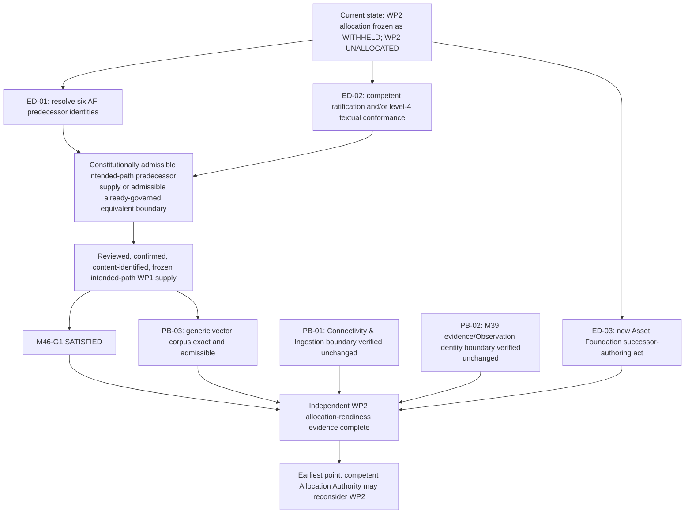

# M46 External Dependency Resolution Plan

**Artifact class:** Additive architecture and governance planning artifact

**Planning date:** 2026-08-05

**Subject:** External constitutional prerequisites for reconsideration of
`M46-WP2 — Corporate Action Case and adjudication contract` allocation

**Current disposition:** `PLANNED — EXTERNAL PREREQUISITES OPEN`

**Authority created:** `NONE`

**Allocation, authorization, and implementation performed:** `NONE`

---

## 1. Executive summary

The [frozen M46-WP2 allocation corpus](M46_WP2_ALLOCATION_FREEZE_RECORD.md)
records a valid withheld-allocation result: successful allocation has not
occurred, WP2 remains `UNALLOCATED`, authorization has not been performed, and
implementation has not been reached. This plan does not reopen that corpus and
does not reconsider its disposition.

The frozen records identify four current readiness failures:

1. `M46-G1` remains `OPEN`;
2. the recorded Asset Foundation alignment residual remains `OPEN`;
3. frozen intended-path M46-WP1 supply is `ABSENT`; and
4. a competent Asset Foundation successor-authoring act is `ABSENT`.

Those four failures resolve to three external owner/governance supply streams
and one M46 integration requirement:

- Asset Foundation predecessor identity must be made constitutionally exact by
  an authority competent either to restore the six freeze-recorded byte
  identities or to govern an additive successor lifecycle;
- competent architecture governance must close the recorded alignment residual
  through the frozen-plan-permitted ratification and/or textual-conformance
  route, without making a fresh ownership decision;
- competent Asset Foundation governance must create a new successor-authoring
  path with an explicit owner, role, scope, documentary authority, and
  exclusions for WP2/WP3; and
- constitutionally admissible intended-path predecessor supply must consume the
  exact external supply and support competent satisfaction of `M46-G1`, or an
  already-governed equivalent boundary must be cited where constitutionally
  admissible. The existing frozen blocked WP1 corpus must not be edited or
  relabelled.

The Connectivity & Ingestion admission boundary and the M39
evidence/Observation Identity boundary are required predecessor boundaries,
but the repository records them as present and unchanged. No new constitutional
act is currently missing for either boundary. The generic vector corpus also
exists; its present defect is admissibility, because it is frozen inside a WP1
result that expressly is not intended-path predecessor supply.

Only after all of the above evidence is exact, independently verified, and
repository-linked may a future competent M46-WP2 Allocation Authority
reconsider allocation. Reconsideration is not successful allocation, and any
later allocation would still not perform authorization or implementation.

## 2. External dependency inventory

### 2.1 Current blocking prerequisites

| ID | Prerequisite | Current repository state | Governing artifact | Why allocation remains unavailable | Direct unblocking effect |
| --- | --- | --- | --- | --- | --- |
| `ED-01` | Exact and admissible AF-WP1–AF-WP4 predecessor identities | `OPEN` — all six raw working-tree identities differ from the freeze-recorded identities | [WP1 Baseline Register §5](M46_WP1_BASELINE_REGISTER.md), [WP1 Risk and Open-Dependency Register `BLK-01`](M46_WP1_RISK_AND_DEPENDENCY_REGISTER.md), and the applicable AF-WP1–AF-WP4 freeze records | Universal entry criteria prohibit an unresolved identity mismatch, and blocked WP1 cannot become intended-path supply | Enables exact intake for constitutionally admissible intended-path predecessor supply or an already-governed equivalent boundary where constitutionally admissible; necessary for `ED-04` and `M46-G1` |
| `ED-02` | Competently closed recorded owner-alignment residual | `OPEN` — `asset_foundation.md` remains draft and the level-4 Corporate Action design retains superseded bridge-domain wording | [Frozen Architecture §2.1.1](M46_ARCHITECTURE_AND_IMPLEMENTATION_PLAN.md), [WP1 Alignment-Residual Disposition](M46_WP1_ALIGNMENT_RESIDUAL_DISPOSITION.md), and [Frozen Roadmap §§5, 7, 8.2, 15](M46_WORK_PACKAGE_DECOMPOSITION_AND_ROADMAP.md) | The frozen plan bars WP2–WP4 allocation readiness until competent ratification and/or textual conformance closes the residual | Enables `M46-G1` closure and intended-path WP1 supply; directly removes the architecture-readiness hard stop |
| `ED-03` | New competent Asset Foundation successor-authoring path | `ABSENT` — AF-WP4 closeout grants successor authority `NONE` | [AF-WP4 Closeout Record](../governance/ASSET_FOUNDATION_AF_WP4_CLOSEOUT_RECORD.md), [Frozen Architecture §§15–16](M46_ARCHITECTURE_AND_IMPLEMENTATION_PLAN.md), and [Frozen Roadmap §§4, 5, 7, 8.2, 15](M46_WORK_PACKAGE_DECOMPOSITION_AND_ROADMAP.md) | WP2 is Asset Foundation-homed and cannot be allocated into a closed owner lifecycle with no successor owner or documentary authority | Directly removes the owner-authority hard stop for WP2 allocation readiness; also establishes the future WP3 owner path |
| `ED-04` | Constitutionally admissible intended-path M46-WP1 predecessor supply, or an already-governed equivalent boundary where constitutionally admissible, with `M46-G1` satisfied | `ABSENT` — existing WP1 is frozen as `FAIL-CLOSED BLOCK — RESIDUAL OPEN`, and the generic vectors inside it are therefore not admissible intended-path predecessor supply | [WP1 Freeze Record](M46_WP1_FREEZE_RECORD.md), [WP1 Alignment-Residual Disposition](M46_WP1_ALIGNMENT_RESIDUAL_DISPOSITION.md), [WP1 Risk and Open-Dependency Register](M46_WP1_RISK_AND_DEPENDENCY_REGISTER.md), and [Frozen Roadmap §§6–10](M46_WORK_PACKAGE_DECOMPOSITION_AND_ROADMAP.md) | WP2's direct M46 predecessor must be exact, frozen, admissible, and on the intended path; freezing a truthful blocked result did not satisfy `M46-G1` | Supplies WP2's exact direct predecessor, makes the generic vector corpus admissible, and removes the `M46-G1` hard stop |

`ED-04` is not independent external owner supply. It is the required M46
constitutional intake result after `ED-01` and `ED-02` are
supplied. It is listed because successful WP2 allocation remains unavailable
until that integration result exists.

### 2.2 Required boundaries that are not currently missing acts

| ID | Required boundary | Owner domain | Present evidence | Current treatment |
| --- | --- | --- | --- | --- |
| `PB-01` | Connectivity & Ingestion admission, review, delegation, and human-confirmation boundary | Connectivity & Ingestion, with the human retaining every non-delegated irreversible decision | [Platform Architecture §12](../architecture/platform_architecture.md), [Corporate Action Domain §§2, 5, 7](../architecture/CORPORATE_ACTION_DOMAIN.md), and [Frozen Architecture §§3, 5, 8](M46_ARCHITECTURE_AND_IMPLEMENTATION_PLAN.md) | `PRESENT AND UNCHANGED`; verify and cite at readiness reconsideration. WP2 may specify its owner-preserving handoff only after allocation/authorization; no pre-allocation owner act is currently identified as absent. |
| `PB-02` | M39 evidence and Observation Identity boundary | Market Intelligence, while Connectivity & Ingestion retains external-fact ingestion ownership | [M39 Epic Closeout](M39_EPIC_CLOSEOUT.md) and [M39-WP6 Observation Identity Specification](M39_WP6_market_observation_identity_specification.md) | `PRESENT AND GOVERNED`; verify exact canonical paths and unchanged boundary at readiness reconsideration. No M39 reopening is required or permitted. |
| `PB-03` | Generic vector corpus | M46-WP1 as a documentary contract, with every semantic fact still owned externally | [WP1 Acceptance-Vector Contract](M46_WP1_ACCEPTANCE_VECTOR_CONTRACT.md) and [WP1 Freeze Record](M46_WP1_FREEZE_RECORD.md) | `PRESENT BUT NOT ADMISSIBLE AS INTENDED-PATH PREDECESSOR SUPPLY`; admissibility is resolved through `ED-04`, not by rewriting the frozen vector contract or inventing fixtures. |

Ledger successor authority, WP3 identity consequences, WP4 accounting
semantics, production fixtures, quote-basis policy, migration, and downstream
authority are not WP2 allocation prerequisites under the frozen dependency
matrix. They remain later-package dependencies and are deliberately excluded
from this resolution plan.

## 3. Owner-domain mapping

| Prerequisite | Owner domain / governance plane | Repository artifact currently governing ownership | Competent actor | Authority boundary |
| --- | --- | --- | --- | --- |
| `ED-01` predecessor identity | Asset Foundation artifact governance | The six AF artifact freeze records identified in [WP1 Baseline Register §5](M46_WP1_BASELINE_REGISTER.md); [AF-WP4 Closeout](../governance/ASSET_FOUNDATION_AF_WP4_CLOSEOUT_RECORD.md) preserves successor authority `NONE` | An explicitly vested Asset Foundation predecessor-restoration authority, or a competent Asset Foundation successor-lifecycle governance authority | May restore exact recorded bytes or establish and complete an additive successor lifecycle; may not silently normalize, edit, reinterpret, or relabel frozen artifacts |
| `ED-02` domain-constitution route | Platform/Asset Foundation constitutional governance | [Platform Architecture §§5, 6.1, 11](../architecture/platform_architecture.md), [Asset Foundation](../architecture/asset_foundation.md), and Frozen Architecture §2.1.1 | A competent constitutional ratifying authority explicitly empowered to ratify the level-2 Asset Foundation Domain Constitution | May ratify the exact constitution and its recorded alignment; may not allocate WP2 or manufacture implementation authority |
| `ED-02` textual-conformance route | Asset Foundation technical-architecture governance, subordinate to Platform Architecture | [Asset Foundation §§3 and 9](../architecture/asset_foundation.md) and [Corporate Action Domain](../architecture/CORPORATE_ACTION_DOMAIN.md) | A competent architecture governance authority empowered to approve a conforming revision or additive successor to the level-4 design | May conform the level-4 address to the already recorded homing; may not reopen ownership or create a tenth domain |
| `ED-03` successor-authoring path | Asset Foundation owner-domain governance | [AF-WP4 Closeout](../governance/ASSET_FOUNDATION_AF_WP4_CLOSEOUT_RECORD.md) and the frozen M46 plan | A competent Asset Foundation governance authority able to create successor owner, role, scope, and documentary authority | May establish a future owner-domain authoring path for WP2/WP3; does not itself allocate, authorize, author, review, freeze, or implement WP2 |
| `ED-04` intended-path WP1 intake | M46 work-package governance | [WP1 Freeze Record](M46_WP1_FREEZE_RECORD.md), [WP1 Alignment-Residual Disposition](M46_WP1_ALIGNMENT_RESIDUAL_DISPOSITION.md), and the frozen M46 plan | A competent M46 governance authority able to establish constitutionally admissible intended-path predecessor supply or cite an already-governed equivalent boundary where constitutionally admissible; with the applicable author, independent reviewer, confirmer, content-identity validator, and freeze authority | Must preserve the existing frozen blocked WP1 corpus and establish exact intended-path evidence without prescribing its mechanism; no role may infer WP2 allocation or authorization |
| `PB-01` preserved admission boundary | Connectivity & Ingestion / human sovereignty | [Platform Architecture §12](../architecture/platform_architecture.md) and Frozen Architecture §§3, 5, 8 | Existing competent owner authorities; no missing pre-allocation act identified | Boundary verification only before allocation reconsideration |
| `PB-02` preserved evidence identity | Market Intelligence, with Connectivity & Ingestion at intake | [M39 Epic Closeout](M39_EPIC_CLOSEOUT.md) and [M39-WP6](M39_WP6_market_observation_identity_specification.md) | Existing competent M39/Market Intelligence authority; no missing pre-allocation act identified | Exact citation and non-reinterpretation only |

No current repository artifact appoints this planning advisor, the frozen WP2
allocation actors, or M46 itself to perform any missing owner-domain act.

## 4. Missing constitutional acts

### Act A — Resolve the six AF frozen-predecessor identities

The competent owner-governance actor must choose one constitutionally valid
route already admitted by the frozen WP1 record:

1. restore each artifact to its exact freeze-recorded bytes; or
2. govern an additive successor lifecycle that identifies the superseding
   artifacts, their relationship to the frozen predecessors, their exact
   content identities, and their admissibility for M46 intake.

The act must cover all six artifacts listed in [WP1 Baseline Register §5](M46_WP1_BASELINE_REGISTER.md).
Changing line endings without authority, relying only on normalized Git-blob
equality, or editing the WP1 observation does not complete this act.

### Act B — Close the recorded alignment residual

A competent actor must supply the frozen-plan-permitted closure evidence:

- explicit constitutional ratification of the exact
  [Asset Foundation Domain Constitution](../architecture/asset_foundation.md);
  and/or
- competent approval of a textually conforming revision or additive successor
  for the [level-4 Corporate Action design](../architecture/CORPORATE_ACTION_DOMAIN.md).

The closure must preserve the already recorded determination: Asset Foundation
owns structural-event interpretation and the both-or-neither guarantee;
Connectivity & Ingestion owns admission and confirmation; Ledger & Accounting
owns accounting consequences. The competent closure record—not this plan—must
determine and state that the supplied ratification and/or conformance route is
sufficient under Frozen Architecture §2.1.1. The existing
[Asset Foundation Planning Ratification](../governance/ASSET_FOUNDATION_PLANNING_RATIFICATION.md)
is not sufficient because it ratifies only its two identified planning
documents.

### Act C — Establish Asset Foundation successor-authoring authority

A new competent Asset Foundation governance act must explicitly identify:

- the successor owner and accountable role;
- the bounded WP2/WP3 documentary subject and scope;
- permitted artifact classes or exact paths;
- the relationship to the closed AF-WP1–AF-WP4 lifecycle;
- review, correction, confirmation, content-identity, and freeze role
  separation; and
- explicit exclusions for runtime, schema, identity minting, Ledger semantics,
  admission, production correction, allocation, authorization, implementation,
  migration, cutover, and release unless separately granted by a later
  competent act.

This successor act is prerequisite evidence for allocation readiness. It does
not itself perform M46-WP2 allocation or authorization.

### Act D — Supply an admissible intended-path WP1 predecessor and satisfy `M46-G1`

The existing WP1 corpus is frozen with a truthful blocked disposition and must
remain unchanged. A future competent governing record must establish
constitutionally admissible intended-path predecessor supply. The governing
record may use any mechanism permitted by the frozen roadmap, including exact
citation of an already-governed equivalent boundary; this plan does not require
a new M46-WP1 successor or reconsideration lifecycle and does not prescribe a
document name, repository layout, or implementation mechanism.

The supplied predecessor must:

1. consume the exact `ED-01` identity-resolution evidence;
2. cite the exact `ED-02` alignment-closure evidence;
3. verify the full AF-WP1–AF-WP4 inventory and every current predecessor
   identity;
4. identify the exact reviewed, confirmed, content-identified, and frozen
   predecessor identity accepted for the intended path;
5. include or exactly cite the generic vector corpus within an admissible
   dependency boundary, preserving owner-mapped vocabulary without converting
   descriptive terms into an M46 private dialect;
6. record any supersession, if applicable, without modifying, relabelling, or
   otherwise altering the frozen WP1 corpus; and
7. competently record `M46-G1` as `SATISFIED` on the basis of that exact
   admissible predecessor supply.

Completion of `ED-04` creates predecessor evidence only. This correction and
the future governing record described here do not allocate or authorize WP2.
Until that supply is competently established and verified, `M46-G1` remains
`OPEN` and WP2 remains `ALLOCATION WITHHELD`.

## 5. Required repository evidence

| Completion proof | Minimum repository evidence | Acceptance test for later readiness review |
| --- | --- | --- |
| `ED-01` complete | Additive owner-governance record naming the chosen restoration/successor route; a six-row identity manifest; exact SHA-256, byte count, path, and governing freeze/successor reference for every artifact; independent identity validation and freeze where the chosen route requires them | Every accepted artifact is byte-exact to its governing identity; zero unexplained mismatch; no frozen predecessor was silently changed |
| `ED-02` complete | Ratification record for the exact Domain Constitution identity and/or approved conformance/successor record for the exact level-4 design; an explicit closure statement tied to Frozen Architecture §2.1.1; independent review and content identity appropriate to the governing lifecycle | Repository text no longer depends on an unratified or textually misaligned owner contract; the record preserves the existing owner determination and declares the residual closed under competent authority |
| `ED-03` complete | New Asset Foundation successor-governance record naming owner, actor role, scope, documentary authority, corpus/path boundary, lifecycle roles, exclusions, and relation to AF-WP4 closeout | Successor authority is explicit and non-`NONE`; it covers WP2/WP3 documentary authoring without performing M46 allocation, authorization, or implementation |
| `ED-04` complete | Governing record establishing constitutionally admissible intended-path predecessor supply or citing an already-governed equivalent boundary where constitutionally admissible; exact intended-path predecessor identity; applicable independent review/correction evidence; confirmation; content-identity validation; freeze evidence; explicit `M46-G1: SATISFIED` evidence | Exact frozen intended-path WP1 identity exists; alignment residual is closed; AF inventory is exact; generic vectors are admissible; no unresolved scope-affecting identity mismatch or private dialect remains |
| `PB-01` preserved | Readiness audit cites the exact Connectivity & Ingestion and human-confirmation authorities and records no conflicting successor or amendment | Boundary remains owner-preserving and unchanged; no M46-created admission authority |
| `PB-02` preserved | Readiness audit cites M39 closeout and exact M39-WP6 canonical path/identity and records no reopening or reinterpretation | Observation Identity remains evidence identity, distinct from action, asset, transaction, or execution identity |
| WP2 readiness complete | Additive independent readiness report covering `ED-01`–`ED-04` and `PB-01`–`PB-03`, with all local links and content identities verified | `M46-G1` satisfied; intended-path WP1 supply exact; Asset Foundation successor act present; all listed predecessor boundaries exact and admissible; no unresolved finding affects scope |

Repository evidence is documentary proof of a competent act; file presence
alone is not proof of authority. Every new artifact must state its actor role,
authority source, scope, exact disposition, content identity where applicable,
and what it does not authorize.

## 6. Dependency graph

`ED-01` and `ED-02` may proceed in parallel under their own competent
authorities. `ED-03` may be prepared independently, but its final scope should
cite the closed owner architecture to avoid immediate conformance rework.

## 7. Recommended execution order

1. **Commission the external owner-governance acts.** Separately appoint the
   competent actors for AF predecessor identity resolution (`ED-01`), alignment
   closure (`ED-02`), and Asset Foundation successor authority (`ED-03`). This
   planning artifact does not make those appointments.
2. **Resolve `ED-01` and `ED-02` in parallel.** Preserve every frozen artifact.
   Produce additive, independently verifiable identity and architecture
   closure evidence.
3. **Finalize `ED-03`.** After the target owner architecture is exact, issue the
   successor-authoring act with the owner, role, scope, documentary authority,
   lifecycle separation, and exclusions required by the frozen M46 plan.
4. **Establish constitutionally admissible intended-path predecessor supply.**
   A competent M46 governance actor must establish that supply or cite an
   already-governed equivalent boundary where constitutionally admissible; the
   frozen blocked WP1 corpus remains untouched.
5. **Verify the intended-path predecessor and satisfy `M46-G1`.** Consume
   `ED-01` and `ED-02`, verify the exact inventory, preserve the generic vector
   contract, complete the applicable independent checks, and record
   `M46-G1: SATISFIED`.
6. **Perform a fresh independent WP2 allocation-readiness audit.** Verify
   `ED-01`–`ED-04`, revalidate `PB-01`–`PB-03`, validate every repository link
   and content identity, and confirm that no unresolved finding or working-tree
   conflict affects the scope.
7. **Stop at the reconsideration boundary.** Submit the exact readiness evidence
   to a future competent M46-WP2 Allocation Authority. That actor may
   reconsider allocation in a separate act. Authorization and implementation
   remain later and separate even if allocation succeeds.

## 8. Earliest constitutional point for allocation reconsideration

M46-WP2 Allocation may be reconsidered at the earliest only when the repository
contains all of the following exact evidence at the same constitutional point:

1. `ED-01` is complete: all six AF predecessor identities are exact and
   admissible under a competent restoration or additive successor lifecycle;
2. `ED-02` is complete: the recorded alignment residual is competently closed
   through ratification and/or textual conformance;
3. `ED-03` is complete: a new competent Asset Foundation successor-authoring
   act exists and covers the bounded WP2/WP3 documentary path;
4. `ED-04` is complete: constitutionally admissible intended-path predecessor
   supply exists, or an already-governed equivalent boundary is cited where
   constitutionally admissible; the accepted predecessor identity is
   independently reviewed, confirmed, content-identity-validated, and frozen;
   and `M46-G1` is expressly `SATISFIED`;
5. the Connectivity & Ingestion and M39 boundaries are reverified as exact,
   present, and unchanged;
6. the generic vector corpus is exact and admissible within the intended-path
   predecessor supply or already-governed equivalent boundary; and
7. an independent readiness audit reports no unresolved finding, identity
   mismatch, working-tree conflict, or frozen-predecessor change affecting WP2.

At that point—and not before—a separately appointed competent M46-WP2
Allocation Authority may reconsider the package. The authority must consume
the exact evidence and make a fresh disposition. Nothing in this plan predicts
or pre-approves that disposition.

## 9. Verification of this plan

### 9.1 Dependency completeness review

`PASS` — the WP2 dependency list in Frozen Roadmap §8.2 and the hard stops in
the frozen allocation corpus were cross-checked. All four current readiness
failures are mapped to `ED-01`–`ED-04`. Connectivity & Ingestion, M39, and the
generic vector corpus are retained as required boundaries, with their actual
present/admissibility states distinguished. Later-package dependencies are
explicitly excluded.

### 9.2 Owner-domain consistency

`PASS` — Asset Foundation retains structural-event and identity ownership;
Connectivity & Ingestion retains admission and confirmation; Market
Intelligence retains Observation Identity; Ledger & Accounting retains
accounting consequences; and M46 remains a coordinating initiative. No owner
domain is transferred or manufactured.

### 9.3 Constitutional authority audit

`PASS` — every missing act is assigned to a functionally competent owner or
governance authority and requires explicit appointment where no current actor
exists. This plan performs no ratification, textual conformance, predecessor
repair, successor-authority creation, gate satisfaction, allocation,
authorization, implementation, or freeze.

### 9.4 Repository-link validation

`PASS` — all 36 repository-local links in this artifact resolve; all eight
required deliverable sections are present; no trailing whitespace was found;
Git tracked/staged diff checks report no whitespace error; and `graphify
update .` completed successfully after creation.

---

**Current constitutional state:** M46 Planning Corpus `COMPLETE, RATIFIED, AND
FROZEN`; M46-WP1 `COMPLETE AND FROZEN` with a truthful fail-closed result;
`M46-G1 OPEN`; M46-WP2 allocation `FROZEN — ALLOCATION WITHHELD`; WP2
`UNALLOCATED`; authorization `NOT PERFORMED`; implementation not reached.

**Recommended next milestone:** `EXTERNAL OWNER-GOVERNANCE SUPPLY COMMISSIONED`
for `ED-01`, `ED-02`, and `ED-03`, without performing any of those acts in M46.
