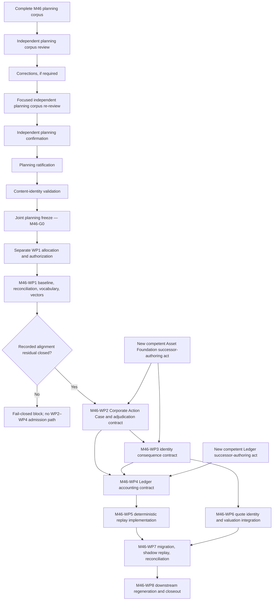

# M46 — Work-Package Decomposition and Roadmap

**Artifact class:** Work-package roadmap planning candidate
**Lifecycle stage:** Correction after Independent Planning Corpus Review
**Status:** `CORRECTED PLANNING CORPUS — PENDING FOCUSED INDEPENDENT RE-REVIEW`
**Planning mandate:** [M46 Planning Allocation / Commissioning Record](../governance/M46_CORPORATE_ACTION_PORTFOLIO_ACCOUNTING_PLANNING_ALLOCATION_RECORD.md)
**Paired architecture candidate:** [M46 Architecture and Implementation Plan](M46_ARCHITECTURE_AND_IMPLEMENTATION_PLAN.md)
**Architecture correction record:** [M46 Architecture Corrections Response](M46_ARCHITECTURE_CORRECTIONS_RESPONSE.md)
**Planning corpus correction response:** [M46 Planning Corpus Corrections Response](M46_PLANNING_CORPUS_CORRECTIONS_RESPONSE.md)
**Implementation authority:** `NONE`
**Runtime, schema, migration, cutover, and release authority:** `NONE`
**Work-package allocation or authorization:** `NONE`

This document is the separately intended second M46 planning artifact named by
the allocation record. It turns the paired architecture candidate's exact
eight-package decomposition into a reviewable dependency and lifecycle
roadmap. It does not approve or redefine that architecture, perform a review,
confirm or freeze either planning artifact, allocate or authorize a package,
or permit implementation or production action.

Every work package below is **proposed, unallocated, and unauthorized**.
Description, order, readiness, or a passed checkpoint is not allocation.
Allocation is not authorization. Authorization is not implementation.

---

## 1. Purpose

The purpose of this roadmap is to make future M46 work independently
governable and executable only after all applicable constitutional acts exist.
It defines:

1. the exact package inventory inherited from the paired architecture;
2. predecessor artifacts and one-way dependencies;
3. milestone, entry, exit, review, confirmation, freeze, allocation, and
   authorization checkpoints;
4. expected deliverables and acceptance-vector coverage; and
5. fail-closed stops for missing authority, ownership, evidence, contract, or
   correctness.

"Executable" in this planning artifact means sufficiently decomposed for a
future competent authority to consider allocating and authorizing bounded
work. It does not mean executable code or present permission to act.

## 2. Constitutional scope

This roadmap derives its M46 planning authority solely from the [allocation
record](../governance/M46_CORPORATE_ACTION_PORTFOLIO_ACCOUNTING_PLANNING_ALLOCATION_RECORD.md),
especially §§6–10. It preserves without amendment:

- [Platform Architecture](../architecture/platform_architecture.md), including
  Laws 1–15, the ingestion gate, human sovereignty, permanent identity,
  immutable history, derived holdings, deterministic replay, one-way domain
  dependencies, loud failure, and correctness over convenience;
- [Corporate Action Domain](../architecture/CORPORATE_ACTION_DOMAIN.md), whose
  interior discipline remains binding under the structural-event homing
  recorded by [Asset Foundation §§3 and 9](../architecture/asset_foundation.md)
  and Platform Architecture §5, §6.1, and §11 G2/G4, subject to the remaining
  ratification/textual-conformance residual;
- [Asset Foundation architecture](ASSET_FOUNDATION_CANONICAL_OWNER_DOMAIN_ARCHITECTURE_AND_IMPLEMENTATION_PLAN.md),
  the frozen AF-WP1/AF-WP2 form-and-annex supply, the frozen AF-WP3 Owner
  Evidence Manifest and Conformance-Annex Index under its
  [freeze](../governance/ASSET_FOUNDATION_AF_WP3_FREEZE_RECORD.md) and
  [closeout](../governance/ASSET_FOUNDATION_AF_WP3_CLOSEOUT_RECORD.md), and the
  AF-WP4 release profile under its
  [freeze](../governance/ASSET_FOUNDATION_AF_WP4_FREEZE_RECORD.md),
  [release attestation](../governance/ASSET_FOUNDATION_AF_WP4_RELEASE_ATTESTATION.md),
  and [closeout](../governance/ASSET_FOUNDATION_AF_WP4_CLOSEOUT_RECORD.md);
  AF-WP3/AF-WP4 evidence supplies no downstream, intake, runtime, or successor
  authority;
- the frozen [Ledger & Accounting planning plan](LEDGER_ACCOUNTING_CANONICAL_OWNER_DOMAIN_ARCHITECTURE_AND_IMPLEMENTATION_PLAN.md),
  [roadmap](LEDGER_ACCOUNTING_CANONICAL_OWNER_DOMAIN_WORK_PACKAGE_DECOMPOSITION_AND_ROADMAP.md),
  and [owner-domain final state](../governance/LEDGER_ACCOUNTING_OWNER_DOMAIN_FINAL_STATE.md);
- [Market Data Platform](../architecture/MARKET_DATA_PLATFORM.md), the frozen
  M39/M41 Market Intelligence contracts cited by the paired architecture, and
  exact quote-subject and adjustment-basis ownership;
- [Portfolio Domain Model](../architecture/PORTFOLIO_DOMAIN_MODEL.md), the
  [Accounting Scope](../GLOSSARY.md#accounting-scope), the frozen
  [Portfolio Calculation Rules](../investment/PORTFOLIO_CALCULATION_RULES.md),
  and the frozen Portfolio Intelligence contracts cited by the paired
  architecture; and
- the [AI Rules](../handbook/AI_RULES.md), [Architecture Handbook](../handbook/ARCHITECTURE_HANDBOOK.md),
  [Governance Handbook](../handbook/GOVERNANCE_HANDBOOK.md), and [Review
  Handbook](../handbook/REVIEW_HANDBOOK.md).

M46 remains a coordinating initiative, not a constitutional domain. Each
future package must obtain authority from every owner domain whose facts or
contracts are in its bounded scope. No M46 coordinator may author another
domain's fact, resolve an ownership conflict by convenience, or treat an
external dependency as an M46 deliverable.

## 3. Relationship to the Architecture Plan

The [paired architecture candidate](M46_ARCHITECTURE_AND_IMPLEMENTATION_PLAN.md)
is the sole source for M46 objectives, principles, domain and aggregate
boundaries, identity semantics, accounting-effect algebra, replay model,
cost-basis algorithm, quote model, failure model, migration phases, package
names, and package purposes. This roadmap adds scheduling and governance
detail only.

The relationship is constrained as follows:

| Question | Controlling artifact | Roadmap treatment |
| --- | --- | --- |
| What M46 is architecturally allowed to propose | Paired architecture §§1–14 and §§17–20 | Cited and sequenced; never redefined |
| Which packages exist | Paired architecture §15 | Exactly eight packages, with identical identifiers, names, purposes, dependencies, and exit-evidence direction |
| Which gates control progress | Paired architecture §16.3 | Preserved as `M46-G0` through `M46-G7` and expanded only into checkable roadmap checkpoints |
| Whether the planning corpus is complete | Allocation §7 and this artifact's existence | Candidate pair is now present; review, confirmation, ratification, identity validation, and freeze remain undone |
| Whether work may begin | Future allocation and authorization records | Always `NO` under this document |

If this roadmap conflicts with the paired architecture, the roadmap is
defective and must be corrected. It cannot supersede the architecture by
silence. An uncovered architecture question is recorded as a dependency or
block, not answered here.

## 4. Planning assumptions

The roadmap uses the following bounded assumptions:

1. The corrected architecture remains a candidate pending independent
   disposition; this roadmap does not describe it as confirmed, ratified, or
   frozen.
2. The planning pair must complete one independently evidenced corpus
   lifecycle before any M46 work-package allocation or authorization.
3. Every work package requires its own explicit allocation and its own
   explicit authorization; a combined record is permitted only if a future
   competent act expressly and separately performs both.
4. Documentary owner-domain contracts precede runtime realization.
5. A downstream package consumes only the exact reviewed, confirmed,
   content-identified, and frozen predecessor required by its future governing
   record, unless that record cites an already-governed equivalent boundary.
6. Platform Architecture G4 reconciliation is already recorded: structural-
   event interpretation and the both-or-neither guarantee are homed in Asset
   Foundation. WP2–WP4 remain blocked only until the recorded alignment's
   ratification/textual-conformance residual is competently closed.
7. The Asset Foundation owner-domain lifecycle is complete, frozen, and
   closed, with successor authority `NONE` under the
   [AF-WP4 Closeout Record](../governance/ASSET_FOUNDATION_AF_WP4_CLOSEOUT_RECORD.md).
   A new competent governance act
   must establish successor owner, role, scope, and documentary authority
   before WP2 or WP3 can be allocated or authorized; WP4 and WP6 remain
   blocked on the resulting WP3 contract.
8. The Ledger owner-domain final state supplies no present WP4 authoring path.
   A new competent governance act must establish successor owner, role, scope,
   and documentary authority before WP4 can be allocated or authorized.
9. Structural-event performance continuity has no currently governed
   corporate-action composition in the frozen return formula. Affected
   authoritative performance remains `UNCOMPUTABLE` until the named owners
   supply one.
10. The frozen single cash scalar and Portfolio Base Currency boundary remain
   in force. Any action requiring an ungoverned multi-denomination cash or FX
   representation fails closed.
11. Milestones are evidence-released, not calendar-promised. Parallelism is
    permitted only where the dependency graph and separate future
    authorizations expressly allow it.

## 5. Dependency graph

The `W2`–`W8` nodes each imply their own future allocation, authorization,
execution, review, confirmation, identity-validation, and freeze checkpoints;
the diagram does not perform those acts. The Asset Foundation and Ledger
successor-authoring acts and the recorded alignment's ratification/textual-
conformance residual are external constitutional supply, not additional M46
work packages.

## 6. Milestone sequencing

| Milestone | Prospective activity | Release evidence | Fail-closed outcome |
| --- | --- | --- | --- |
| `M0 — Planning corpus` | Review the complete candidate pair; correct if required; confirm, ratify, content-identify, and jointly freeze through separate competent acts | Exact frozen two-artifact M46 planning corpus | No package may be allocated or authorized |
| `M1 — Foundation and alignment disposition` | Separately allocate/authorize WP1; reconcile baseline, vocabulary, vectors, and the recorded alignment residual | Frozen WP1 output with competent ratification/textual-conformance evidence | Record exact block; WP2–WP4 remain stopped |
| `M2 — Adjudication contract` | Separately allocate/authorize WP2 after M1 | Frozen owner-preserving Corporate Action Case, consequence-manifest, ingestion, and confirmation contract | No identity or accounting consequence contract proceeds |
| `M3 — Owner consequence contracts` | Separately allocate/authorize WP3 only after Asset Foundation successor authority exists and WP4 only after Ledger successor authority also exists | Frozen compatible Asset Foundation and Ledger contracts; M46-G3 identity/accounting gate evidence | Block the affected branch; do not substitute M46 semantics |
| `M4 — Projection and valuation realization` | Separately allocate/authorize WP5 after WP4 and WP6 after WP3; execute within exact owner contracts | Reviewed and accepted deterministic replay and quote-binding evidence; M46-G4 gate evidence | No migration or authoritative performance path |
| `M5 — Shadow adoption` | Separately allocate/authorize WP7; perform no-write rehearsal first; seek distinct migration/cutover authority only after evidence | Accepted parity and explained-difference evidence; M46-G5, then separately authorized M46-G6 evidence | No production write, promotion, cutover, or release |
| `M6 — Downstream and closeout` | Separately allocate/authorize WP8 only after accepted WP7 cutover evidence and downstream owner authority | Reconciled downstream lineage and separately governed M46-G7 closeout | Downstream remains stale/degraded; no false milestone completion |

Milestones do not allocate their packages. Passing a milestone readiness test
only permits a competent authority to consider the next bounded act.

## 7. Work-package dependency matrix

| Package | Direct M46 predecessors | External or constitutional predecessors | May overlap | Cannot start when |
| --- | --- | --- | --- | --- |
| `M46-WP1` | Frozen M46 planning corpus | Complete AF-WP1–AF-WP4 inventory; current repository evidence; ratification/textual-conformance supply may arrive during bounded work | No substantive successor package | M46-G0 is not frozen or WP1 lacks allocation/authorization |
| `M46-WP2` | Frozen WP1 with the recorded alignment residual closed | New competent Asset Foundation successor-authoring act; Connectivity & Ingestion and M39 evidence boundaries | None unless its authorization explicitly permits bounded preparation that cannot pre-judge WP3/WP4 | The alignment residual, Asset Foundation successor act, or exact predecessor supply is absent |
| `M46-WP3` | Frozen WP1 and WP2 | Frozen AF-WP1–AF-WP4 supply; new competent Asset Foundation successor-authoring act | Early WP4 documentary coordination only under stable frozen handoffs and separate authority | Asset Foundation successor act, owner authority, or exact predecessor supply is absent |
| `M46-WP4` | Frozen WP1, WP2, and WP3 | WP3 contract under competent Asset Foundation successor authority; frozen Ledger semantics; new competent Ledger successor-authoring act | WP6 may proceed independently after WP3; early WP3/WP4 coordination only as above | Either successor act, Ledger authority, or compatible identity inputs are absent |
| `M46-WP5` | Frozen and authorized WP3/WP4 outputs | Separate implementation authority; exact accounting/replay dependencies | WP6 | WP4 contract or implementation authority is absent |
| `M46-WP6` | Frozen WP3 | WP3 contract under competent Asset Foundation successor authority; frozen M39/M41 contracts; Market Intelligence authority | WP4 and WP5 where their own dependencies are satisfied | Exact identity, quote-basis contracts, Asset Foundation successor supply, or implementation authority are absent |
| `M46-WP7` | Accepted WP5 and WP6 outputs | Exact baseline and migration specifications; separate WP7 allocation and documentary/no-write authorization; explicit migration authority for any write; later distinct cutover authority | No production cutover with unresolved shadow work | M46-G4 evidence, exact WP5/WP6 identities, or the baseline is incomplete; or WP7 documentary/no-write scope lacks separate allocation or authorization. Any write or cutover remains separately blocked without its distinct authority |
| `M46-WP8` | Accepted WP7 cutover evidence | Downstream owner authority; separate closeout authority | No earlier incomplete package | Cutover evidence, lineage, downstream authority, or M46-G7 closeout authority is absent |

## 8. Detailed work-package decomposition

### 8.1 M46-WP1 — Baseline, constitutional reconciliation, vocabulary, and acceptance-vector contract

**Objective.** Establish the exact M46 execution baseline, verify the recorded
Asset Foundation ownership alignment, close or truthfully block on its
ratification/textual-conformance residual, disposition candidate vocabulary
through its owners, and lock generic acceptance vectors.

**Scope.** Repository/current-state inventory; frozen-predecessor identity
verification including AF-WP1 through AF-WP4; recorded-alignment and residual
evidence intake; vocabulary ownership register;
generic positive, boundary, negative, correction, and migration vectors; BANPU
fixture parameters as evidence slots only.

**Explicit exclusions.** No corporate-action adjudication contract; no real
action adjudication; no Asset or Ledger fact; no runtime inventory mutation;
no glossary admission by M46; no BANPU terms, ratio, alias, or correction.

**Dependencies and required predecessor artifacts.** Frozen M46 planning pair;
the allocation record; corrected architecture and correction chain; the exact
AF-WP1/AF-WP2 frozen supply, the
[AF-WP3 freeze](../governance/ASSET_FOUNDATION_AF_WP3_FREEZE_RECORD.md) and
[closeout](../governance/ASSET_FOUNDATION_AF_WP3_CLOSEOUT_RECORD.md), the
[AF-WP4 freeze](../governance/ASSET_FOUNDATION_AF_WP4_FREEZE_RECORD.md),
[release attestation](../governance/ASSET_FOUNDATION_AF_WP4_RELEASE_ATTESTATION.md),
and [closeout](../governance/ASSET_FOUNDATION_AF_WP4_CLOSEOUT_RECORD.md); exact
current repository evidence; competent ratification/textual-conformance supply
if the intended branch is to proceed.

**Expected deliverables.** Authority and frozen-baseline register; current-state
and gap inventory including the exact AF-WP1–AF-WP4 frozen outputs and their
non-authority boundaries; alignment-residual closure citation or explicit block;
candidate vocabulary ownership/disposition register; acceptance-vector
contract and coverage matrix; risk and open-dependency register.

**Entry criteria.** M46-G0 is frozen; WP1 is separately allocated and authorized;
the authorization names exact documentary outputs, sources, and prohibited
acts; no frozen identity mismatch is unresolved.

**Exit criteria.** Baseline and vector corpus are complete and exact; every
candidate term has an owner/disposition; the already recorded owner alignment
is accurately cited and its ratification/textual-conformance residual is
competently closed for the intended path, or WP1 records a fail-closed block;
no incident-specific logic is introduced.

**Review requirements.** Independent constitutional, ownership, vocabulary,
vector-coverage, and non-authority review. Any correction requires author
revision and focused independent re-review.

**Confirmation and freeze requirements.** An independent confirmer verifies
the reviewed result and exact finding chain. Content identity is validated,
then the WP1 baseline/vector corpus is frozen by a competent freeze act. A
blocked output may be frozen as truthful evidence but is not successor supply.

### 8.2 M46-WP2 — Corporate Action Case and adjudication contract

**Objective.** Define the exact, owner-preserving contract from normalized
evidence through complete consequence proposal, ingestion review, and explicit
standing-policy or human confirmation.

**Scope.** Action identity and co-reference; evidence/provenance; immutable
revision lifecycle; timeline roles; generic family classification; participant
roles; complete identity/accounting proposal manifest; conflict, quarantine,
correction, cancellation, deduplication, approval, ingestion-gate, delegation,
and human-confirmation semantics.

**Explicit exclusions.** No standalone Corporate Action domain or fresh owner
decision; no identity minting or identifier verdict; no Ledger semantics; no
privileged write path; no standing policy created by this roadmap; no action-
specific market rule or production admission.

**Dependencies and required predecessor artifacts.** Frozen WP1 intended-path
output with the alignment residual closed; ratified or textually conformed
owner architecture; a new competent Asset Foundation successor-authoring act;
Connectivity & Ingestion admission boundary; M39 evidence/observation identity
boundary; generic vector corpus.

**Expected deliverables.** Corporate Action Case contract; action identity and
timeline specification; immutable lifecycle/correction contract; consequence
manifest contract; ingestion and confirmation decision contract; adjudication,
conflict, quarantine, and delegation vectors.

**Entry criteria.** M46-G1 is satisfied; the new Asset Foundation successor act
exists; WP2 is separately allocated and authorized under that act; exact WP1
identity and alignment-residual disposition are verified.

**Exit criteria.** One action story produces one complete proposal manifest;
all evidence and time roles are explicit; externally derived consequences can
reach truth only through ingestion review and exact delegation/human
confirmation; uncertainty stays inert; owner boundaries remain intact.

**Review requirements.** Independent review by an actor outside authorship,
covering the recorded owner alignment and residual, successor authority,
evidence completeness, lifecycle, confirmation sovereignty, deduplication,
correction, and genericity.

**Confirmation and freeze requirements.** Independent confirmation follows
resolved review findings. The exact contract and local vectors are
content-identified and frozen together. Freeze grants no admission or runtime
authority.

### 8.3 M46-WP3 — Asset identity consequence and effective-identifier contract

**Objective.** Define Asset Foundation-owned structural identity consequences
and effective-dated identifier resolution without rewriting historical facts.

**Scope.** Permanent-identity continuity; identifier interval semantics;
rename/symbol-change treatment; predecessor, successor, distribution,
conversion, and related-asset relationships; successor nomination; lifecycle
facts; historical resolution; unresolved/conflicting identity states.

**Explicit exclusions.** No merge of distinct listings; no current-symbol
fallback; no historical Transaction rewrite; no accounting effect, quote
selection, provider routing, or corporate-action ownership expansion; no
AF-WP1, AF-WP2, AF-WP3, or AF-WP4 amendment.

**Dependencies and required predecessor artifacts.** Frozen WP1 and WP2;
frozen AF-WP1/AF-WP2 form-and-annex contracts; frozen AF-WP3 Owner Evidence
Manifest and Conformance-Annex Index identified by its
[freeze](../governance/ASSET_FOUNDATION_AF_WP3_FREEZE_RECORD.md) and
[closeout](../governance/ASSET_FOUNDATION_AF_WP3_CLOSEOUT_RECORD.md); frozen
AF-WP4 release-profile evidence identified by its
[freeze](../governance/ASSET_FOUNDATION_AF_WP4_FREEZE_RECORD.md),
[release attestation](../governance/ASSET_FOUNDATION_AF_WP4_RELEASE_ATTESTATION.md),
and [closeout](../governance/ASSET_FOUNDATION_AF_WP4_CLOSEOUT_RECORD.md);
Asset Registry and Asset Foundation architecture; a new competent governance
act establishing Asset Foundation successor owner, role, scope, and documentary
authority; separate WP3 allocation and authorization under that act.

**Expected deliverables.** Effective Identifier Binding contract; identity
consequence-set contract; continuity/replacement and relationship rules;
historical-resolution and interval-overlap vectors; owner-domain block record
if exact representation cannot be supplied.

**Entry criteria.** M46-G2 is satisfied; the new Asset Foundation successor act
exists; WP3 has separate allocation and authorization under that act; exact WP2
action roles and every required frozen AF-WP1–AF-WP4 identity are available.

**Exit criteria.** Every identity consequence resolves to permanent references
and exact effective boundaries; rename preserves identity; transformations
use explicit relationships; ambiguity fails closed; WP4/WP6 handoffs are exact.

**Review requirements.** Independent Asset Foundation boundary, temporal
identity, historical-resolution, relationship, and non-amendment review.

**Confirmation and freeze requirements.** Independent confirmation and content
identity validation precede freeze of the exact WP3 contract and vectors. A
block is frozen only as a block and cannot be interpreted as identity supply.

### 8.4 M46-WP4 — Ledger accounting-effect and total-cost-basis contract

**Objective.** Define Ledger-owned canonical Transaction semantics for
structural consequences, exact total-cost-basis state, corrections, and the
performance-continuity handoff within the one-stream replay boundary.

**Scope.** Normalized accounting-effect algebra; canonical Transaction
representation; atomic grouping and ordering coordinates; entitlement facts;
quantity, cash, conversion, basis transfer/adjustment, reversal, compensation,
allocation, residue, conservation, and idempotency rules; structural-event
performance classification/handoff.

**Explicit exclusions.** No second corporate-action replay stream; no replay
classification branch; no tax opinion; no guessed basis; no FX or
multi-denomination cash redesign; no reuse of unrelated return strips; no
Ledger work under the terminated LA lifecycle; no production Transaction.

**Dependencies and required predecessor artifacts.** Frozen WP1–WP3; frozen
Ledger/accounting semantics; exact Accounting Scope and Base Currency
contracts; a new competent governance act establishing successor Ledger owner,
role, scope, and documentary authoring authority; compatible identity and
adjudication contracts.

**Expected deliverables.** Ledger-owned structural Transaction contract;
atomic-group/order specification; entitlement contract; total-basis and exact
allocation contract; correction/idempotency contract; performance-continuity
handoff contract or explicit `UNCOMPUTABLE` boundary; conservation and negative
vectors.

**Entry criteria.** M46-G3 predecessors are available; the Asset Foundation
successor act and frozen WP3 identity handoff are verified; the new Ledger
successor act exists; WP4 is separately allocated and authorized under that
act; frozen Ledger sources are verified.

**Exit criteria.** All supported event stories normalize to canonical
Transactions; quantity and basis close exactly; average cost remains derived;
replay needs no action story; correction is append-only; missing performance,
cash, currency, or basis semantics fail closed.

**Review requirements.** Independent Ledger/accounting, exact-arithmetic,
one-stream replay, atomicity, scope, correction, and performance-boundary
review. Lack of competent Ledger ownership is a blocking finding.

**Confirmation and freeze requirements.** Independent confirmation follows the
complete review chain. The contract and conformance vectors are
content-identified and frozen under the new Ledger governance path. Freeze is
not implementation or Transaction-admission authority.

### 8.5 M46-WP5 — Deterministic replay and holding-projection implementation

**Objective.** Realize deterministic single-Transaction-stream replay and
holding projection from the exact WP3/WP4 contracts.

**Scope.** Canonical ordering; exact Transaction application; quantity, single
cash scalar, entitlement, total-basis, realized-result, and lineage state;
derived average cost; cutoffs; diagnostics; deterministic canonical output;
legacy parity interfaces; unit, property, invariant, and golden-vector tests.

**Explicit exclusions.** No Corporate Action Case or announcement input; no
live symbol, provider, clock, holding, snapshot, or quote lookup; no second
stream; no historical rewrite; no migration, authoritative read-path switch,
performance-method invention, or production activation.

**Dependencies and required predecessor artifacts.** Frozen and separately
authorized WP3/WP4 outputs; exact Transaction and projection method versions;
separate implementation allocation and authorization; approved technical
design bounded by those contracts.

**Expected deliverables.** Pure replay implementation; canonical ordering and
effect application; projection result/diagnostics; deterministic golden-vector
corpus; unit, property, invariant, and replay-parity tests; implementation
lineage and dependency manifest.

**Entry criteria.** M46-G3 is satisfied; WP5 is separately allocated and authorized
for named code/test paths; exact WP3/WP4 identities are frozen and verified;
no unresolved accounting or performance behavior is left to coder discretion.

**Exit criteria.** Repeated runs over identical inputs are identical; all
structural consequences are ordinary canonical Transactions; exact quantity
and total basis close; average cost is derived; failure is scoped and loud;
all required vectors pass without BANPU-specific behavior.

**Review requirements.** Independent implementation and architecture-conformance
review, including determinism, arithmetic, ordering, scope isolation, forbidden
dependencies, diagnostics, regression, and performance-continuity failure.

**Confirmation and freeze requirements.** The future authorization must name
the exact normative contract, implementation, test, and golden-vector freeze
boundary. Independent confirmation and content-identity validation precede any
required freeze. This roadmap does not decide a general source-code freeze
policy and grants no runtime authority.

### 8.6 M46-WP6 — Quote identity and valuation-basis integration

**Objective.** Realize exact holding-to-observation binding and identity-aware
valuation without provider leakage, related-security substitution, or double
adjustment.

**Scope.** Valuation request coordinates; asset/listing/time/kind/unit/scale/
currency/adjustment-basis predicate; immutable quote binding; raw versus
adjusted compatibility; stale/unavailable/mismatch outcomes; valuation and P/L
inputs; integration and negative vectors.

**Explicit exclusions.** No symbol-only mapping; no provider response inside
replay; no related-security fallback; no implicit FX; no new market measure,
price kind, return formula, or portfolio performance method; no production
quote-route or read-path activation.

**Dependencies and required predecessor artifacts.** Frozen WP3 authored under
the new competent Asset Foundation successor act; frozen M39 and M41 contracts
cited by the architecture; Market Intelligence authority; separate
implementation allocation/authorization; exact holding projection interface
for final integration.

**Expected deliverables.** Quote-binding contract/implementation; valuation
request/result integration; adjustment-basis guard; mismatch and degradation
diagnostics; identity, provider-replacement, raw/adjusted, unit, currency, and
freshness vector suites.

**Entry criteria.** The Asset Foundation successor act exists and the WP3
identity contract authored under it is frozen; WP6 is separately
allocated and authorized by the applicable Market/Portfolio owners; exact M39/
M41 dependencies and technical boundary are verified.

**Exit criteria.** Only an exact compatible observation binds; provider symbol
is routing evidence only; structural effects cannot be double-applied through
price adjustment; missing inputs remain explicitly unvalued; valuation and P/L
inputs carry complete lineage.

**Review requirements.** Independent Market Intelligence and Portfolio
Intelligence boundary review plus implementation review of identity, unit,
currency, time, kind, basis, provenance, failure, and double-adjustment tests.

**Confirmation and freeze requirements.** Independent confirmation and exact
content-identity validation precede the future authorization-defined freeze of
contract, implementation evidence, and vectors. Freeze grants no provider,
runtime, or production authority.

### 8.7 M46-WP7 — Migration, shadow replay, and reconciliation

**Objective.** Prove additive migration and target-engine correctness in
isolated shadow lineage before any separately authorized production change.

**Scope.** Immutable baseline inventory; additive historical identity
associations; ordinary-path action backfill; no-write rehearsal; target shadow
replay; unaffected parity; affected explained differences; unresolved cohort
quarantine; downstream shadow lineage; cohort gates; observability; rollback
plan; reconciliation evidence.

**Explicit exclusions.** No historical Transaction rewrite; no migration
shortcut; no shadow overwrite; no implicit waiver of ADR-005 baseline defects;
no production write, cutover, rollback execution, release, or global flag from
this roadmap or from no-write rehearsal authority.

**Dependencies and required predecessor artifacts.** Accepted WP5 and WP6
outputs; exact baseline and migration specifications; separate WP7 allocation
and authorization; explicit migration authorization for any write; later,
distinct cutover authorization with cohort, backup, rollback, and observability
evidence.

**Expected deliverables.** Baseline/inventory manifest; additive mapping and
backfill plan; no-write rehearsal report; shadow replay outputs; parity and
explained-difference manifests; quarantine register; downstream shadow lineage;
cohort/cutover proposal and rollback plan; authorized migration evidence only
if later authority exists.

**Entry criteria.** M46-G4 is satisfied; WP7 documentary/no-write scope is
separately allocated and authorized; exact WP5/WP6 identities and baseline are
verified. Any write requires an additional explicit migration authorization.

**Exit criteria.** M46-G5 parity and explained-difference rules pass; all unresolved
subjects remain quarantined; no shadow artifact contaminated production; every
result has exact lineage. Production cutover evidence exists only if a separate
M46-G6 authorization was later granted and completed.

**Review requirements.** Independent migration, data-integrity, replay,
reconciliation, observability, rollback, security/privacy, and no-write-boundary
review. Cutover readiness is reviewed separately from rehearsal correctness.

**Confirmation and freeze requirements.** Plans, manifests, vector expectations,
and reviewed shadow evidence require independent confirmation, content identity,
and an authorization-defined freeze before promotion consideration. Run records
remain immutable evidence. No freeze itself authorizes migration or cutover.

### 8.8 M46-WP8 — Downstream regeneration and milestone closeout

**Objective.** Regenerate affected derived intelligence under exact lineage,
reconcile repository and production evidence, and present a truthful M46
closeout disposition.

**Scope.** Authorized regeneration of snapshots, valuation, performance,
attribution, exposure, risk, optimization inputs, signals, and Trust &
Evaluation artifacts; stale-state clearance; lineage verification; acceptance
evidence aggregation; documentation reconciliation; closeout candidate.

**Explicit exclusions.** No upstream identity, Ledger, or Observation repair;
no regeneration before cutover evidence and downstream authority; no invented
performance result where continuity is unresolved; no release or closeout by
authorship; no successor allocation.

**Dependencies and required predecessor artifacts.** Accepted WP7 cutover
evidence; exact production replay/quote identities; downstream owner
authorization; M46-G6 operational evidence; separate WP8 allocation/authorization;
separate closeout authority for the final act.

**Expected deliverables.** Downstream impact and regeneration manifest;
authorized regeneration evidence; stale/degraded-state reconciliation;
end-to-end acceptance report; repository/documentation reconciliation; risk and
residual-block register; milestone closeout candidate.

**Entry criteria.** M46-G6 is satisfied; WP8 is separately allocated and authorized;
downstream owners approve exact bounded consumers; authoritative performance is
either governed and computable or explicitly remains blocked.

**Exit criteria.** Every regenerated artifact traces to exact admitted truth
and market evidence; stale state is reconciled honestly; acceptance criteria
and production evidence are independently reviewed; a competent actor issues a
separate M46-G7 closeout disposition.

**Review requirements.** Independent end-to-end correctness, lineage,
downstream-owner, performance, stale-state, repository-reconciliation, and
closeout-readiness review.

**Confirmation and freeze requirements.** Regeneration evidence and the
closeout candidate follow independent confirmation and exact identity controls
required by their future authorization. Only a separate competent closeout act
may close M46; freeze or successful regeneration cannot do so.

## 9. Universal entry criteria

No M46 package may enter substantive work unless all applicable conditions are
evidenced:

1. the M46 planning pair has completed independent review, corrections and
   focused re-review if needed, independent confirmation, ratification,
   content-identity validation, and joint freeze;
2. the package has a distinct competent allocation identifying owner, bounded
   objective, paths/artifact class, and exclusions;
3. the package has a distinct competent authorization identifying the exact
   permitted act and validation boundary;
4. every predecessor listed in §7 is frozen or otherwise exact and admissible
   under the package's governing record;
5. every external owner has supplied its own authority and artifact; M46 has
   not manufactured or repaired it;
6. no unresolved finding, identity mismatch, working-tree conflict, or frozen
   predecessor change affects the scope;
7. open architecture questions needed by the package have been resolved by the
   named owner or converted into an explicit fail-closed path; and
8. the future author, reviewer, confirmer, identity validator, and freeze
   authority boundaries are identified without self-review or self-confirmation.

Entry failure records the exact blocker. It does not release a narrower
unrecorded implementation lane.

## 10. Universal exit criteria

A package reaches its intended exit only when:

- every expected deliverable exists at the exact authorized path and scope;
- all positive, boundary, negative, correction, determinism, and failure
  vectors assigned to the package have passed or have an accepted explicit
  blocked result;
- every dependency and cross-domain handoff is exact and traceable;
- independent review findings have a complete correction/re-review chain;
- independent confirmation covers the exact reviewed candidate;
- required content-identity validation and freeze have occurred;
- no Critical or Major correctness, ownership, identity, accounting, replay,
  quote-basis, migration, or authority finding remains unresolved; and
- the terminal disposition states what it does not authorize.

A truthful blocked result may be a package lifecycle terminal state, but it is
not intended-path supply and cannot release a dependent package.

## 11. Deliverable catalogue

| Package | Minimum deliverable group | Principal downstream consumer |
| --- | --- | --- |
| WP1 | Baseline, recorded-alignment residual disposition, complete AF-WP1–AF-WP4 inventory, vocabulary register, vector contract, risk/dependency register | WP2–WP4 governance and every later vector suite |
| WP2 | Action Case, lifecycle/timeline, consequence manifest, ingestion/confirmation contracts and vectors | WP3 and WP4 |
| WP3 | Effective identifiers, identity consequences, relationships, historical resolution, identity vectors | WP4 and WP6 |
| WP4 | Canonical structural Transactions, atomicity/order, entitlements, total basis, corrections, performance handoff, vectors | WP5 and performance eligibility |
| WP5 | Deterministic replay implementation, projection/diagnostics, golden and property tests | WP7 and Portfolio Intelligence |
| WP6 | Quote binding and valuation integration, mismatch/degradation evidence | WP7 and Portfolio Intelligence |
| WP7 | Baseline, no-write rehearsal, shadow parity/difference evidence, quarantine, migration/cutover proposals and authorized evidence | WP8 and operational authority |
| WP8 | Downstream regeneration lineage, acceptance evidence, repository reconciliation, closeout candidate | Competent M46 closeout authority |

## 12. Required independent reviews

The planning pair now requires a **Focused Independent Planning Corpus
Re-review** by a competent actor independent of candidate and correction
authorship. That re-review must evaluate:

1. the corrected architecture finding chain, including whether the accepted
   corrections remain present;
2. exact WP1–WP8 parity between the architecture and this roadmap;
3. acyclic dependencies and constitutional sequencing;
4. the Platform Architecture G4 alignment residual and both Asset Foundation
   and Ledger successor-authority stops;
5. ingestion, human/standing-policy confirmation, one-stream replay,
   performance transparency, cash/Base Currency, quote basis, migration, and
   fail-closed boundaries; and
6. absence of work-package, implementation, runtime, schema, migration,
   cutover, or release authority.

Each future package also requires the package-specific independent review in
§8. Review records evaluate and record findings only. They do not edit the
subject, accept their own corrections, confirm, freeze, allocate, authorize,
release, or close out.

## 13. Confirmation checkpoints

| Checkpoint | Subject | Required condition | Non-effect |
| --- | --- | --- | --- |
| Planning confirmation | Exact reviewed two-file M46 planning corpus and complete review/correction chain | Confirmer is independent under allocation §8 and records a bounded disposition | No ratification, freeze, WP allocation, or implementation authority |
| Package confirmation | Exact reviewed package deliverables and finding chain | Confirmer is distinct from author and reviewer; all blocking findings have independently reviewed dispositions | No content-identity validation, freeze, downstream release, or runtime authority |
| Migration/cutover evidence confirmation | Exact rehearsal, parity, explained-difference, cohort, rollback, and observability evidence | Independent bounded confirmation after review | No migration, cutover, or release permission |
| Closeout evidence confirmation | Exact WP8 evidence and residual blockers | Independent confirmation within future closeout corpus | No closeout by implication |

## 14. Freeze checkpoints

1. **Planning freeze:** after planning review, correction/re-review,
   confirmation, ratification, and content-identity validation, a competent
   freeze authority may freeze the exact architecture/roadmap pair.
2. **Owner-contract freezes:** WP1–WP4 contract and vector artifacts freeze at
   their separate package boundaries after review and confirmation.
3. **Implementation-evidence freezes:** WP5–WP6 use the exact freeze boundary
   named by their future authorizations; the normative contract and golden
   evidence may not drift from the reviewed implementation.
4. **Migration-evidence freeze:** WP7 plans, manifests, expected differences,
   and readiness evidence are fixed before promotion consideration. Operational
   execution remains a separately authorized act.
5. **Closeout-evidence freeze:** WP8's exact reviewed evidence is fixed before a
   separate closeout disposition.

Every freeze records exact identities and supersession. Freeze never grants
allocation, authorization, implementation, migration, runtime, release,
downstream, or closeout authority.

## 15. Allocation checkpoints

No allocation is performed here. A future allocation checkpoint for each
package must verify:

- the planning corpus is frozen and the package exists in both planning files;
- direct and external predecessors are available at exact identities;
- the bounded owner and cross-domain participation are competent;
- objective, scope, exclusions, outputs, and terminal block are explicit;
- no package is bundled with another merely to bypass a dependency or
  independence boundary; and
- the allocation states that authorization has not occurred unless a competent
  record separately and explicitly performs both acts.

For every owner domain, a closed or terminal final state with successor
authority `NONE` is a hard stop, not an ordinary request for participation. A
new competent governance act must establish successor owner, role, scope, and
documentary authority before a dependent package can pass allocation readiness.

WP2–WP4 cannot pass allocation readiness before the recorded alignment's
ratification/textual-conformance residual closes. WP2/WP3 also cannot pass
before a new Asset Foundation successor-authoring path exists; WP4 cannot pass
before both the WP3 handoff and a new Ledger successor-authoring path exist;
WP6 cannot pass without the authorized WP3 handoff. WP7 and WP8 allocation
cannot carry migration, cutover, regeneration, or closeout permission.

## 16. Authorization checkpoints

No authorization is performed here. Every future authorization must identify:

1. its preceding allocation and exact frozen planning source;
2. the permitted act, actor/role, artifact or code paths, and validation;
3. the exact predecessor identities and open conditions;
4. prohibited runtime, schema, data, migration, cutover, release, or other
   owner-domain actions not expressly in scope;
5. independent review, confirmation, identity, and freeze requirements; and
6. a fail-closed terminal path.

Documentary authorization for WP1–WP4 does not authorize code. Implementation
authorization for WP5/WP6 does not authorize runtime activation. WP7 no-write
or planning authorization does not authorize migration; migration does not
authorize cutover; cutover does not authorize release. WP8 regeneration
authorization does not perform closeout.

## 17. Acceptance vectors

### 17.1 Generic action-family vectors

The corpus must cover stock and ETF splits; reverse splits with and without
fractional cash in lieu; symbol/name changes; bonus shares and stock dividends;
cash dividends and explicit return of capital; rights grant, exercise, sale,
transfer, lapse, and cancellation; stock, cash, and mixed mergers or
amalgamations; one- and multi-child spin-offs; mutual-fund mergers and class
conversions; corrections, postponements, cancellations, and a future event
story that maps to the existing algebra without an engine branch.

Each vector fixes evidence, identities, time roles, exact terms, entitlement,
confirmation path, canonical Transactions, total-basis instruction, quote
basis, expected projection, expected performance-continuity or fail-closed
state, lineage, and expected failures.

### 17.2 Cross-cutting acceptance vectors

- current, historical, recycled, overlapping, and ambiguous identifier
  intervals;
- exact rational quantities, allocations, residues, fractions, and reversals;
- same-time ordering, economic/knowledge cutoffs, idempotency, and scope
  isolation;
- exact standing-policy, absent/out-of-scope delegation, and required-human
  confirmation;
- one canonical Transaction stream and no announcement/action classification
  in replay;
- raw, source-adjusted, and normalized quote bases; unit, currency, listing,
  kind, freshness, and related-security mismatch;
- pure structural-event zero return, separately classified economic legs, and
  explicit `UNCOMPUTABLE` performance where the governed composition is absent;
- unaffected parity, affected explained difference, unresolved quarantine,
  interrupted shadow resume, and rollback-read-path behavior; and
- downstream stale detection and exact-lineage regeneration.

### 17.3 BANPU acceptance vector

BANPU is one parameterized real-incident vector. Its identities, family,
timeline, ratio, consideration, fractional treatment, basis instruction, and
confirmation path must come from approved fixtures. Acceptance is exactly the
paired architecture §17.5 criteria: original Transactions unchanged; correct
permanent-identity treatment; exact quantity and one-time basis allocation;
derived average cost; exact successor quote binding; correct valuation/P&L;
zero structural return or fail-closed performance; gated confirmation;
deterministic replay; and no `BANPU` conditional, ratio, exception, or alias in
code or configuration.

## 18. Risks

| Risk | Roadmap control | Blocking checkpoint |
| --- | --- | --- |
| Roadmap silently redesigns architecture | Exact §3 control and WP parity validation | Planning review |
| Recorded Platform Architecture G4 alignment is treated as absent or fully effective without evidence | WP1 verifies the recorded alignment and closes its narrower residual; WP2–WP4 hard stop meanwhile | M46-G1 |
| Closed Asset Foundation lifecycle is reused | New competent Asset Foundation successor act required | WP2/WP3 entry |
| Terminated Ledger lifecycle is reused | New competent successor act required | WP4 entry |
| Planning is mistaken for authority | Repeated allocation/authorization non-effects | Every stage |
| Cross-domain package writes another owner's facts | Owner-specific allocation, authorization, review, and freeze | WP2–WP8 entry/review |
| Symbol remains identity | WP3 temporal identity and negative vectors | M46-G3 |
| Partial action lands | WP2 manifest plus WP4 atomic canonical Transactions | M46-G2/M46-G3 |
| Replay grows a second stream or story branches | WP4/WP5 one-stream contracts and forbidden-dependency tests | M46-G4 |
| Average cost becomes mutable state | WP4 total-basis invariants and WP5 projection tests | M46-G4 |
| Basis or residue is guessed | Exact instruction/closure vectors | M46-G3/M46-G4 |
| Structural event creates phantom return | Governed continuity composition or explicit fail-closed state | M46-G4 |
| Quote mismatch or double adjustment | WP6 exact binding and negative vectors | M46-G4 |
| Migration rewrites or contaminates production | Additive backfill, no-write rehearsal, isolated lineage | M46-G5/M46-G6 |
| Legacy parity preserves known defect | ADR-005 baseline and predeclared explained differences | M46-G5 |
| Downstream stale results appear current | WP8 input identity and stale-state reconciliation | M46-G7 |
| Calendar pressure bypasses evidence | Evidence-released milestones; no dates | All gates |

## 19. Deferred work and explicit planning dependencies

The following remain deferred to their named competent owners or future acts:

1. Ratification of the recorded Asset Foundation structural-event alignment
   and/or textual conformance of the level-4 Corporate Action design —
   competent governance before WP2–WP4; no fresh ownership decision.
2. Exact candidate vocabulary admission — WP1 with every semantic owner.
3. Action identity/co-reference, timeline, and confirmation contract — WP2.
4. Identifier interval convention and runtime AF-1 interoperability — WP3 and
   Asset Foundation.
5. A new competent Asset Foundation successor-authoring act for WP2/WP3; no
   current closed lifecycle supplies that authority.
6. Canonical structural Transaction vocabulary, book-basis method classes,
   entitlements, fractional precision, and same-session accounting order — WP4
   under a new Ledger successor-authoring act.
7. Structural-event performance composition — Ledger & Accounting and
   Portfolio Intelligence; fail closed meanwhile.
8. Historical quote-basis policy and provider-series inventory — WP6 with
   Market Intelligence.
9. Multi-denomination cash, FX, and Base Currency expansion — separately
   governed Ledger/Portfolio work outside present M46 architecture.
10. Scoped degraded-valuation product behavior — Portfolio Intelligence.
11. BANPU incident containment or correction — separate operational authority,
    never this planning corpus.
12. Schema, storage, API, transaction mechanism, deployment, cohort, cutover,
    and release details — future authorized technical/operational acts.

Absence of any required deferred supply is a visible block. It is not
implementation discretion and does not invite a local substitute.

## 20. Explicit non-goals

This roadmap does not:

- confirm, ratify, content-identify, or freeze the M46 planning corpus;
- perform independent review or focused re-review;
- allocate or authorize WP1–WP8;
- authorize or implement production code, tests, schemas, persistence, APIs,
  providers, configuration, jobs, feature flags, or UI;
- authorize runtime changes, Transaction admission, identity facts, portfolio
  mutation, migration, backfill, production replay, cutover, rollback,
  regeneration, release, or closeout;
- modify the paired architecture, frozen predecessor, Glossary, Decision Log,
  Implementation Index, or architecture roadmap;
- adjudicate any real action or infer terms from portfolio symptoms;
- create BANPU-, issuer-, market-, provider-, broker-, jurisdiction-, or
  symbol-specific behavior;
- reopen the recorded Platform Architecture G4 ownership alignment, close its
  residual by assertion, or create Asset Foundation or Ledger successor
  authority;
- redefine permanent identity, accounting effects, replay, total cost basis,
  average cost, cash, Base Currency, quote basis, valuation, performance, or
  migration architecture; or
- promise dates, staffing, deployment topology, storage mechanics, or a global
  cutover strategy.

## 21. Planning-corpus completeness and present boundary

The allocation record's intended planning candidate pair is now present:

1. [M46 Architecture and Implementation Plan](M46_ARCHITECTURE_AND_IMPLEMENTATION_PLAN.md)
2. [M46 Work-Package Decomposition and Roadmap](M46_WORK_PACKAGE_DECOMPOSITION_AND_ROADMAP.md)

This resolves only the prior artifact-absence condition. Independent Planning
Corpus Review is complete with disposition `REQUIRES CORRECTION`; this author
correction does not resolve its findings by declaration, approve either file,
or satisfy focused re-review, confirmation, ratification, identity-validation,
or freeze gates.

**Current disposition:** `CORRECTED PLANNING CORPUS — PENDING FOCUSED INDEPENDENT RE-REVIEW`

**Implementation, runtime, schema, migration, cutover, release, work-package
allocation, and authorization authority:** `NONE`

**Next constitutional act:** Focused Independent Planning Corpus Re-review by a
competent actor independent of candidate and correction authorship, limited to
findings `M46-IPCR-F1` through `M46-IPCR-F6` and their propagated corrections.
This document does not perform or pre-approve that re-review.
